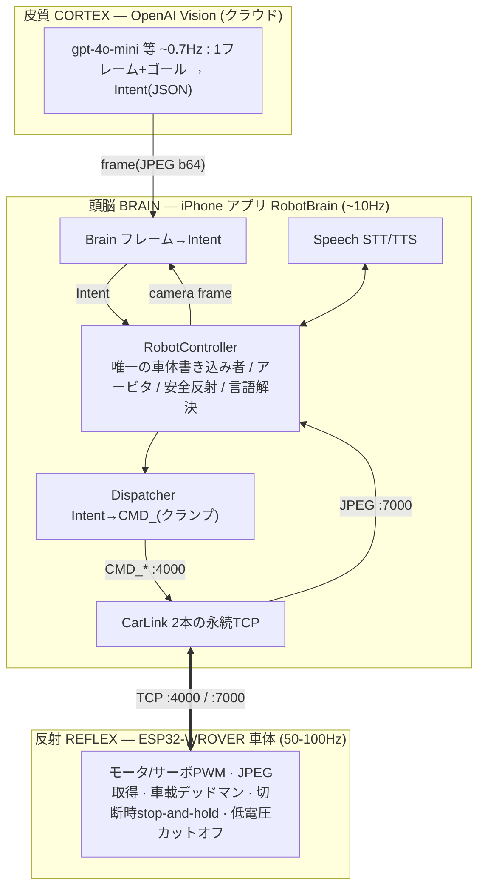
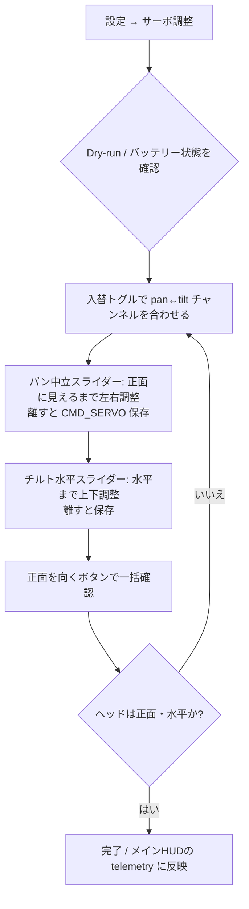
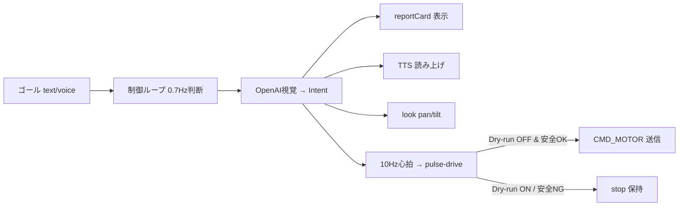

> **Note.** The ESP32 firmware is a not-included Freenove derivative; any `firmware/…` path in this doc is *descriptive* (see the [README](README.md) license note).

# RobotBrain 設計書

- 文書バージョン: 1.1（現行実装・品質受入条件反映）
- 対象アプリ: RobotBrain（iOS ネイティブ / SwiftUI）
- バンドル ID: `com.example.robotbrainai`
- ビルド環境: Xcode 26 / iOS 26 SDK（デプロイメントターゲット iOS 17.0、XcodeGen 管理）
- 作成日: 2026-07-24
- 位置づけ: 本書は RobotBrain の**設計仕様**である。既存 `ios_app/` / `host_brain/` / `relay/` / `firmware/AI_Car_Firmware` を正とし、現行実装の挙動と残る honest gap を明記する。コードトークン（`CMD_MOTOR` 等）・クラス名は原文表記のまま扱う。
- 構成: 第 I 部にアーキテクチャ・技術設計、第 II 部に UX・画面・多言語設計を置く。

---

# 第 I 部　アーキテクチャ・技術設計

RobotBrain は、自然言語のゴール（テキストまたは音声）を与えると OpenAI のビジョンモデルが計画し、Freenove 4WD ESP32 車体（FNK0053, ESP32-WROVER）が AI ローバーとして動作する iOS ネイティブアプリである。「見る → 判断する → 少し動かす → また見る」という熟慮的ループを、レイテンシを許容する前提で回す。

---

## 1. 全体アーキテクチャ — 3層(身体・反射／頭脳／皮質)

責務を「速さ」で三層に分離する。判断は遅くてよい(レイテンシ許容)、しかし**停止は速くなければならない**——この非対称性が層分割の根拠である。

### 1.1 テキスト／ASCII アーキテクチャ図

```
        ┌───────────────────────────────────────────────────────────────┐
        │  皮質 CORTEX — OpenAI Vision(クラウド)   ~0.7Hz               │
        │  1フレーム(JPEG b64) + ゴール  →  Intent(JSON)                │
        │  生モータ値は決して出さない(意味動詞のみ)                     │
        └──────────▲────────────────────────────────────┬───────────────┘
                   │ Intent                              │ frame(JPEG b64)
        ┌──────────┴────────────────────────────────────▼───────────────┐
        │  頭脳 BRAIN — iPhone アプリ RobotBrain      ~10Hz(心拍)        │
        │  ┌──────────────────────────────────────────────────────────┐ │
        │  │ RobotController — 唯一の車体書き込み者 / アービタ /        │ │
        │  │                   安全反射 / 言語解決 / 設定永続化         │ │
        │  └──┬──────────────┬──────────────┬────────────────┬─────────┘ │
        │   Brain        Dispatcher       Speech           CarLink        │
        │  frame→Intent  Intent→CMD_文字列 STT/TTS       2本の永続TCP    │
        │               (クランプの砦)                                   │
        └───────────────────────────────────┬────────────────────────────┘
                    CMD_* :4000  │           │  JPEG :7000
        ┌────────────────────────▼───────────▼───────────────────────────┐
        │  反射 REFLEX — ESP32-WROVER 車体            50-100Hz            │
        │  モータ/サーボ PWM · JPEG 取得 · 車載デッドマン停止 ·           │
        │  切断時 stop-and-hold · 低電圧カットオフ                        │
        └─────────────────────────────────────────────────────────────────┘
```

### 1.2 詳細フロー(mermaid)



### 1.3 各層の役割

- **反射層(ESP32-WROVER)**: 身体と反射のみ。オンデバイス ML 推論は不可(GPU/NPU なし、実効 RAM 数 MB)。フレームは「処理」せず「転送」するだけ。パッチ済みファーム `AI_Car_Firmware` は (1) **車載デッドマン**(一定時間 `CMD_MOTOR` が来なければ `Motor_Move(0,0,0,0)`)、(2) **切断時 stop-and-hold**(`ESP.restart()` を廃し、停止して再接続待ち)を持つ。モータのデッドゾーンは `|speed|<1600 ⇒ 0`。
- **頭脳層(iPhone アプリ)**: ブローカ兼アービタ。**車体への唯一の書き込み者**。ソケットを開き続け、クラウドの遅延・失敗を吸収し、意味動詞を `CMD_` 文字列へ降ろし、ホスト側安全反射を回す。判断のカデンスと心拍のカデンスを分離する。実行時に Mac を必要としない。
- **皮質層(OpenAI)**: 1 フレーム + ゴールを見て構造化 `Intent` を返すのみ。生のモータ値は決して出さない(不正・危険な指令を構造的に出せない)。

### 1.4 非交渉の設計前提(ファーム実測に基づく)

- 頭脳がソケットを保持し続ける。AI 呼び出しがソケットを握ってはならない。
- モータはラッチする(自己満了パルスで必ず期限切れさせる)。
- クラウド頭脳のため車体は **STA モード**(家庭ルータ参加、DHCP・IP はドリフトする)。SoftAP(`Sunshine`)はクラウド到達不可のため運用対象外。

---

## 2. モジュール設計(モジュールマップ)

| モジュール | ファイル | 責務 |
|---|---|---|
| **CarLink** | `CarLink.swift` | :4000 コマンド + :7000 カメラの永続 TCP(`Network.framework`) |
| **Brain** | `Brain.swift` | OpenAI Vision 呼び出し → `Intent` へパース |
| **Speech** | `Speech.swift` | 端末側 STT/TTS(車体にはマイク/スピーカ無し) |
| **RobotController** | `RobotController.swift` | アービタ制御ループ + 安全 + 言語解決 + 設定永続化 |
| **Dispatcher** | `Dispatcher.swift` | 意味動作 → 正確な `CMD_` ワイヤ文字列(クランプ) |
| **ContentView / MainView / ConfigView** | `ContentView.swift` | Liquid Glass UI + 設定 |
| **RobotBrainApp** | `RobotBrainApp.swift` | `@main` エントリ |

### 2.1 CarLink — TCP :4000 + :7000(Network.framework)

`@MainActor final class ... ObservableObject`。`NWConnection`(TCP)を 2 本保持:

- **コマンド(:4000)**: `send(_ line:)` が `line + "\n"` を UTF-8 送信。`stateUpdateHandler` で `.ready`→`cmdConnected=true`、`.failed`→1 秒後に `retryCommand()`。`.cancelled` は再接続しない(意図的停止)。
- **カメラ(:7000)**: `.ready` で `readFrame` 開始。`readExact(n:)` が `minimumIncompleteLength` で確実に n バイト受信。フレーム形式は **4 バイト LE 長 + JPEG**。長さは `0 < len < 4_000_000` でサニティチェック、`UIImage(data:)` 復号後 `image` / `lastFrameAt` を更新し次フレームへ再帰。
- 公開状態: `image`, `lastFrameAt`, `cmdConnected`, `camConnected`, `voltage`, `distance`(すべて `@Published`)。コマンドチャネルは `CMD_POWER#<voltage>` と `CMD_SONIC#<cm>` を解析する。専用 `DispatchQueue("carlink")` 上で動作、UI 更新は `Task { @MainActor }` で戻す。

### 2.2 Brain — OpenAI Vision → Intent

`Intent` 構造体: `throttle`, `steer`(±1)、`durationMs`、`pan?`, `tilt?`、`face?`、`observation`、`taskState`(`searching|approaching|done|blocked`)。`.hold` は全ゼロ既定。
`decide(image:goal:memory:apiKey:model:lang:)` は `chat/completions` に `image_url`(base64 JPEG, `detail:"low"` = 低トークン)+ システムプロンプト + ゴール + 直近メモリ 4 件を送る。言語行(`langLine`)で observation の出力言語を切替。`parse(_:)` は最初の `{` と最後の `}` を切り出して JSON 復元、失敗時は `.hold`(安全側)。**モデルは意味動詞のみ、生モータ値は出力しない。**

### 2.3 Speech — STT/TTS

`SFSpeechRecognizer` + `AVAudioEngine` で聞き取り(`transcript` を publish)、`AVSpeechSynthesizer` で読み上げ。`langCode`(BCP-47, `en-US`/`ja-JP`)は RobotController が言語解決結果から設定。STT ロケール・TTS ボイス・AI 返答テキストがすべて選択言語に追随する。

### 2.4 RobotController — アービタ / 安全 / 言語

全体を束ね制御ループを回す `@MainActor ObservableObject`。設定(`carIP`/`apiKey`/`model`/`lang`/`speedCap`/`linkMode`/`controlMode`/サーボ校正/`panInvert`/`motorTrim`)は `didSet` で UserDefaults へ即時永続化する。`dryRun` は安全のため毎起動 ON。言語解決: `resolvedLang`(auto なら端末ロケールから ja/en)→ `uiLocale`(環境ロケール上書き)/ `voiceCode`(TTS/STT)。ライフサイクル: `start()`(接続+`CMD_VIDEO#1`+ループ起動)、`stopAll()`、`emergencyStop()`、`setGoal(_:)`。詳細は §3。

### 2.5 Dispatcher — CMD_ マッピング(クランプの砦)

純粋関数群。`clampMotor` が `±min(cap,4095)` にクランプし、ゼロ以外は `≥1600` へスナップ(デッドゾーン回避)。`drive(throttle:steer:speedCap:trim:)` は tank ペアへ:`left=(t+s)·cap`, `right=(t-s)·cap` → `CMD_MOTOR#left#0#right`。`stop()`=`CMD_MOTOR#0#0#0`。`look` は `CMD_SERVO` 2 発で pan/tilt の入替・中立・pan 反転を解決する。`servo`, `face`, `bodyLeds`, `buzzer`, `video`, `powerQuery`, `sonicQuery`、`faceModes` 辞書を持つ。

### 2.6 ContentView — Liquid Glass UI + 設定

詳細は第 II 部。カメラ全画面 + `.ultraThinMaterial`(iOS 26 では `.glassEffect()`)の frosted-glass HUD、`.preferredColorScheme(.dark)`。`ConfigView`(sheet)で接続・AI・サーボ校正・言語を編集。全テキストは `LocalizedStringKey` + `en.lproj`/`ja.lproj`、`.environment(\.locale, ctl.uiLocale)` で切替。

### 2.7 RobotBrainApp

`@main` エントリ。ルートに `ContentView` を配置し、環境ロケールを注入する。

---

## 3. 制御ループ

`RobotController.run()` は `while !Task.isCancelled` の単一ループ。**判断カデンスと心拍カデンスを分離**する。

- **心拍(heartbeat)≈10Hz**: `heartbeatHz=10.0` → `tick=100ms`。毎ティック、アービタが車体へちょうど 1 行(駆動 or 停止)を送る。
- **判断カデンス(decision)≈0.7Hz**: `decisionHz=0.7` → 約 1.43 秒毎。`!estop && !goal.isEmpty && 経過≥1/decisionHz && car.image` のとき Brain を呼び、`Intent` を更新。同時に `look`(§4)/`face` を送り、`observation` を TTS 読み上げ、`memory`(最大 12 件)へ追記、`taskState==done` でゴールをクリアする。`blocked` は 3 回連続でのみ終了扱い。
- **自己満了ドライブパルス**: 判断ごとに `pulseUntil = now + durationMs/1000`。アービタは `now < pulseUntil` の間だけ駆動を送る。遅延・失敗ティックは「既に停止済み」を意味する——ラッチするモータへの根幹的安全策。

### 3.1 安全反射と優先度(SAFETY > TELEOP > PLANNER)

概念優先度は **SAFETY > TELEOP > PLANNER**。本アプリはゴール駆動で明示的 TELEOP を持たないため、E-STOP を SAFETY 直下・PLANNER(パルス駆動)より上に置く。ループの実効判定:

| 優先 | 反射 | 現状の判定源 | 結果 |
|---|---|---|---|
| 1 SAFETY | **E-STOP** | `estop`(STOP ボタン → `emergencyStop()`) | `CMD_MOTOR#0#0#0` / `status.estop` |
| 2 SAFETY | **link-down** | `!car.cmdConnected` | 停止 / `safety.linkDown` |
| 2 SAFETY | **vision-stale** | `lastFrameAt` 経過 > `visionStaleMs=800` | 停止 / `safety.visionStale` |
| 2 SAFETY | **deadman** | `lastIntentAt` 経過 > `deadmanMs=500` | 停止 / `safety.deadman` |
| 3 SAFETY | **low-battery** | `voltage < 6.6V` | 停止 / `safety.lowBattery` + バナー |
| 4 SAFETY | **collision-escape** | 前進意図 + fresh sonar < 25cm（暗所 32cm） | 後退→ピボット |
| 5 —(dry-run) | **dry-run** | `dryRun`(既定 ON) | 駆動値を送らない(計画/ログのみ) |
| 6 TELEOP | **direct/manual pulse** | 直接移動コマンド / Manual pad | 自己満了パルス |
| 7 PLANNER | **AI pulse-drive** | `reason==nil && now<pulseUntil` | `Dispatcher.drive(...)` |
| 8 — | **hold** | 上記いずれでもない | `CMD_MOTOR#0#0#0` / `status.hold` |

`safetyReason() -> String?` が nil 以外(ローカライズキー)を返すと駆動をブロック。`driving = !estop && reason==nil && now<pulseUntil`。**モーションはバッテリ時のみ**、かつ dry-run OFF 時のみ実送信。dry-run は既定 ON で計画とログを行い、運動指令を絶対に送らない。停止はネットワーク往復や AI 判断に依存せず、アプリ内で即時完結する。

### 3.2 低バッテリ反射(実装済)

RobotController は約 3 秒ごとに `CMD_POWER` を送信し、CarLink が `CMD_POWER#<voltage>\n` を解析して `voltage` を publish する。`safetyReason()` は `voltage < 6.6` で `safety.lowBattery` を返し、アービタは停止を出す。ContentView は電圧バッジと赤い低電圧バナーで理由を見せる。

最終防衛線は車載側の低電圧検知であり、ホスト側は早期警告と自主停止を担う。

### 3.3 探索状態機械（スキャン＆リロケート, FR-54〜56）— 2026-07-26

**問題**: 探索の構造を VLM プロンプト任せにすると、実車で「止まって首を振る」だけで新地点へ移動して探し直さない（gpt-4o-mini が屋内で衝突を恐れ RELOCATE を選ばない）。**衝突回避とは別軸**の欠落だった。

**方針**: 衝突脱出（§3.4 相当の `collisionEscape`）と同じく、探索の骨格を**ホスト側の決定論的状態機械**で保証する。VLM の役割は「ゴールが視界にあるか」の**知覚判断のみ**へ縮小。`applyIntent` 内で `task_state` を見て分岐:

- `task_state == approaching|done` → 探索機械を解除、VLM の `Intent`（throttle/steer/pan/tilt）をそのまま適用（接近・到達は VLM 担当）。`searchPhase` をリセット。
- それ以外（`searching|blocked`）→ **ホストが `Intent` を上書き**（VLM の駆動値は破棄、`observation/taskState` のみ利用）。

状態（判断カデンス＝約1.43秒毎に1ステップ進む）:

| phase | 動作 | 遷移 |
|---|---|---|
| **scan** | 停止（throttle 0）、頭部 pan/tilt を `scanArc[i]` へ。VLM が各角度で視認判定。 | `i` を進める。アーク一巡（`i` 一周）で **relocate** へ |
| **relocate** | 頭部を正面（`fwdPan`/`driveTilt`）へ。①首がまだ正面でなければ（`!headForward`）停止のまま首を正面へ向け、次tickで測距。②正面確定後、前方 `≥ relocateClearCm(45cm)` なら短い前進パルス（throttle 0.45, 350ms）で新地点へ。③塞がっていればその場ピボット（steer, throttle 0, 350ms）で進行方向を変える。 | 1アクション後 **scan** へ |

- `scanArc` は本個体の**可動半球内**の pan 数点＋tilt 上下（例 `[(90,88),(70,92),(115,92),(90,80)]`、実車で要調整）。頭部は 360° 回れないので、届かない方位は relocate のピボットで body ごと向き直してカバーする。
- **安全従属（FR-56）**: 探索機械は `Intent` を作るだけで、最終的な motor 行は §3.1 のアービタが決める。E-STOP/link/vision/deadman/低電圧/dry-run はすべて上位。RELOCATE の前進はファーム前進 veto（<20cm）＋ホスト `collisionEscape`（<25cm でラッチ後退→旋回）に守られる。`relocateClearCm(45)` を `collisionEscape` engage(25) より大きく取り、通常は探索側で先に止まる。
- **明け渡し/リセット（FR-55）**: `setGoal`/`stopAll`/`emergencyStop`/モード切替/`start` で `searchPhase=.scan, scanIndex=0`。
- **プロンプト**: 「ホストが首振りと移動を担う。`searching` の間あなたの throttle/steer/pan は無視される。ゴールが**見えたら** `approaching` にして向き、**見えなければ** `searching` のまま所見を述べよ」に縮小（`Brain.swift`）。これにより VLM の判断が単純化し安定する。

### 3.4 衝突脱出・低照度モード・物理限界

- **HC-SR04**: ファームは `CMD_SONIC#<cm>` を返し、20cm 未満の前進を車載側で拒否する。アプリは約 3Hz で距離を取得し、鮮度 1.5 秒以内の値だけを使う。
- **ホスト衝突脱出**: 前進意図かつ fresh sonar < 25cm（低照度時 32cm）で 10Hz アービタが `collisionEscape` をラッチする。後退は 40cm 超または 1.4 秒で終え、0.65 秒のその場ピボットで向きを変える。後退中は後方センサがないため最大時間を必ず持つ。
- **低照度**: フレーム平均輝度 `luma < 55` で低照度。白 LED を headlight として点灯し、探索リロケートは `clear=65cm`、`throttle=0.30`、`duration=250ms` へ落とす。
- **限界**: HC-SR04 はヘッド正面のみで、後方・側方・床端・階段・低い/柔らかい/細い/斜め/ガラス/布/no echo 障害物を保証しない。no echo は安全を意味しない。運用は低速・短パルス・監視付きが前提。

---

## 4. サーボキャリブレーションモデル(swap フラグ + pan/tilt ニュートラル)

**再フラッシュではなくアプリ内で調整可能**であることが必須。本機固有の実測事実(`PROGRESS.md` 2026-07-24):

- **pan/tilt サーボがファーム想定と入替**: `servo1(ch0)=TILT(上下)`、`servo2(ch1)=PAN(左右)`(servo2 を 80→180 にすると頭が 90° 左へ回り、上下は不変)。
- **ニュートラル**: pan(前方)≈ 90、tilt(水平)≈ 95。意味空間では tilt 90 が水平、90 超が上、90 未満が下。
- 古い `tiltNeutral=18` は床向きに寄りすぎ、走行時に sonar が床を見る原因になったため、現行アプリは `tiltCalV<3` を 95 へ移行する。

現行 `Dispatcher.look()` は `CMD_CAMERA` を使わず、**個別サーボ指令 `CMD_SERVO#index#angle`** 2 本で降ろす。Servo_2 の pan 側はファーム再フラッシュで 0〜180 全域になっている。

### 4.1 キャリブレーション状態(データモデル・永続化)

| プロパティ | 型 | 既定(本機) | 意味 |
|---|---|---|---|
| `servoSwap` | Bool | `true` | true=pan は ch1・tilt は ch0(本機)/ false=ファーム既定 |
| `panNeutral` | Int | `90` | 前方を向く物理角 |
| `tiltNeutral` | Int | `95` | 水平を向く物理角 |
| `panInvert` | Bool | `false` | pan 方向反転 |
| `motorTrim` | Double | `0` | 直進補正 |

いずれも `carIP` と同じ `didSet` パターンで UserDefaults へ永続化する(§5)。

### 4.2 チャネル解決

```
panChannel  = servoSwap ? 1 : 0   // 本機: pan は ch1(servo2)
tiltChannel = servoSwap ? 0 : 1   // 本機: tilt は ch0(servo1)
```

### 4.3 意味角 → 物理角(ニュートラル中心・90=中立)

皮質(Brain)の意味空間はハード癖から切り離し、**pan/tilt とも 90 を中立**とする。ニュートラルからのオフセットとして写像:

```
physPan  = clamp(panNeutral  + (semPan  - 90), 0, 180)   // panInvert 時は -(semPan-90)
physTilt = clamp(tiltNeutral + (semTilt - 90), 0, 180)   // 小=下/大=上、方向はそのまま
```

これにより AI は通常の 90 中心空間で考え、`tiltNeutral=95` を通して物理的な水平に着地でき、`CMD_CAMERA` の固定軸割り当てに依存しない。

### 4.4 `look(pan,tilt)` の降下(2 指令発行)

```swift
static func look(pan semPan: Int, tilt semTilt: Int,
                 swap: Bool, panNeutral: Int, tiltNeutral: Int) -> [String] {
    let panCh  = swap ? 1 : 0
    let tiltCh = swap ? 0 : 1
    let physPan  = max(0, min(180, panNeutral  + (semPan  - 90)))
    let physTilt = max(0, min(180, tiltNeutral + (semTilt - 90)))
    return ["CMD_SERVO#\(panCh)#\(physPan)", "CMD_SERVO#\(tiltCh)#\(physTilt)"]
}
```

RobotController は判断ティックで両行を送出(現行の単一 `CMD_CAMERA` を置換)。ライブ調整 UI(スライダ・入替トグル・正面ボタン)の詳細は第 II 部 §11.3 を参照。

---

## 5. 状態と永続化(UserDefaults)

| キー | 型 | 既定 | 現状 |
|---|---|---|---|
| `carIP` | String | `robotbrain.local` | ✅ `didSet` で永続化(mDNS。数値 IP も可) |
| `apiKey` | String | `""` | ✅ 永続化(平文・§8) |
| `model` | String | `gpt-4o-mini` | ✅ 永続化 |
| `lang` | String | `auto` | ✅ 永続化、`speech.langCode` を追随更新 |
| `dryRun` | Bool | `true` | 非永続。毎起動 ON（安全側） |
| `speedCap` | Int | `2000` | ✅ 永続化 |
| `linkMode` | `lan/remote` | `lan` | ✅ 永続化 |
| `controlMode` | `ai/manual` | `ai` | ✅ 永続化 |
| `servoSwap` | Bool | `true` | ✅ 永続化 |
| `panNeutral` | Int | `90` | ✅ 永続化 |
| `tiltNeutral` | Int | `95` | ✅ 永続化 + 旧値移行 |
| `panInvert` | Bool | `false` | ✅ 永続化 |
| `motorTrim` | Double | `0` | ✅ 永続化 |

ライブ状態(`goal`, `running`, `estop`, `report`, `taskState`, `statusKey`, `memory`)は非永続で正しい。

---

## 6. ワイヤープロトコル参照

### 6.1 コマンドチャネル TCP :4000 — CMD_ プロトコル表

テキスト行、`#` 区切り(`INTERVAL_CHAR '#'`)、`\n`(`ENTER`)終端。CarLink が末尾 `\n` を付与。通常は fire-and-forget だが、`CMD_POWER` と `CMD_SONIC` は応答行を返す。

| 意味動作(Dispatcher) | ワイヤ文字列 | クランプ / 備考 |
|---|---|---|
| `drive(throttle,steer,speedCap)` | `CMD_MOTOR#<L>#0#<R>` | tank ペア。±min(cap,4095)、非零は ≥1600 へスナップ。中央フィールドは 0 |
| `stop()` | `CMD_MOTOR#0#0#0` | 停止(安全既定) |
| `servo(index,angle)` | `CMD_SERVO#<index>#<angle>` | index 0=ch0(servo1), 1=ch1(servo2)。angle 0–180。**look の降下先** |
| `look(...)`(現行) | `CMD_CAMERA#<pan>#<tilt>` | tilt 80–180 クランプ。**本機では §4 の CMD_SERVO 2 発に置換** |
| `face(mode)` | `CMD_MATRIX_MOD#<mode>` | 0=off,1=rotate,2=cry,3=smile,4=wheel_r,5=wheel_l,6=blink, ≥7=random |
| `bodyLeds(mode)` | `CMD_LED_MOD#<mode>` | 0–5 |
| `buzzer(on,freq)` | `CMD_BUZZER#<0/1>#<freq>` | freq 0–10000(非ブロッキング可変音のみ。`Buzzer_Alert` は不使用) |
| `video(on)` | `CMD_VIDEO#<0/1>` | :7000 ストリームを gate |
| `powerQuery()` | `CMD_POWER` | 応答: `CMD_POWER#<voltage>\n` |
| `sonicQuery()` | `CMD_SONIC` | 応答: `CMD_SONIC#<cm>\n` |

`faceModes` 辞書: `off:0, rotate:1, cry:2, smile:3, wheel_r:4, wheel_l:5, blink:6, random:7`。

### 6.2 カメラチャネル TCP :7000 — フレーム形式

`CMD_VIDEO#1` で gate。1 フレーム = **4 バイトリトルエンディアン長プレフィクス + 生 JPEG バイト**。受信は 4 バイト読み→長さ確定→ちょうどその長さを読む(`readExact`)。HQVGA 240×176、~10–15 fps。長さは `0 < len < 4,000,000` でサニティチェック。

### 6.3 ハードウェア制約(参照)

- ESP32-WROVER、オンデバイス ML 不可。知覚・認知はすべてオフボード。
- モータ 4 輪だが `CMD_MOTOR` は左右タンクペア駆動。各値 ±4095、`|値|<1600` は 0(デッドゾーン)。
- サーボは PCA9685 経由(`Servo_1`=ch0 / `Servo_2`=ch1)。本個体は pan/tilt がスワップ。
- HC-SR04 前方距離センサは増設済み。ただしヘッド正面の単一センサであり、no echo や後方/側方/床端/柔軟物は保証しない。
- GPIO 32 に `WS2812_PIN` と `PIN_BATTERY` の重複記載あり。ボディ LED とバッテリテレメトリの同時利用は要ハード確認(アプリはこの不確実性に依存しない)。
- モーション・サーボ・ボディ LED はバッテリ(18650×2)搭載時のみ。低電圧目安 `LOW_VOLTAGE_VALUE 2100`。

---

## 7. 再接続とエラーハンドリング

- **CarLink 自動再接続**: `.failed` で 1 秒後に `retryCommand()`/`retryCamera()`。`.cancelled`(明示停止)は再接続しない。両チャネル独立。
- **ファーム stop-and-hold**: パッチ済み `AI_Car_Firmware` は切断時に `ESP.restart()` せず停止保持。WiFi 瞬断で車体が再起動しない → 頭脳側は落ち着いて再接続でき、モーション途中の暴走を防ぐ。
- **IP ドリフト**: STA/DHCP のため IP が変わる。ConfigView で手入力・再接続。
- **視覚失効 / デッドマン**: フレーム 800ms 途絶で `visionStale`、意図 500ms 途絶で `deadman` として即停止(§3)。
- **状態リセット**: STOP / stopAll / モード切替 / AI↔Manual 切替は `haltMotionState()` でパルス、テレオペ、衝突脱出、探索、接近ラッチ、古い taskState を消し、再開後に古い判断で再駆動しない。
- **Brain のフェイルセーフ**: ネットワーク/JSON パース失敗はすべて `.hold` を返す。頭脳が黙れば車体は自己満了パルスで自然停止。
- **UI 反映**: `cmdConnected`/`camConnected` を接続ドット、`statusKey` を状態ピルで可視化。

---

## 8. セキュリティ

- **OpenAI API キー**: UserDefaults に**平文**保存(個人利用の割り切り)。ハードコードしない(現状も未ハードコード、SecureField 入力)。より強固にするなら Keychain 移行が推奨(現行仕様は UserDefaults を明示採用)。
- **LAN 通信**: :4000/:7000 は平文 TCP、TLS/認証なし。家庭内 LAN 前提。信頼できないネットワークでは使わない。
- **URL/クエリに秘匿情報を載せない**: API キーは HTTP ヘッダ(`Authorization: Bearer`)のみ。画像は base64 で本文送信。
- **運用ガード**: dry-run 既定 ON、常時利用可能な緊急 STOP、速度ガバナ(`speedCap`)、屋内・階段なし・人の監視下での運用。モーションはバッテリ接続時のみ物理的に発生。

---

# 第 II 部　UX・画面・多言語設計

現行 `ContentView.swift` の構造(`glass()` モディファイア、`MainView` の各パネル、`ConfigView` の `Form`)と `en.lproj`/`ja.lproj` を土台に、第 I 部 §4 のサーボキャリブレーションを含めて拡張する設計として記述する。

---

## 9. 設計原則

- **カメラが世界、ガラスが操縦席。** 画面全体は車体の一人称視点。操作系は `.ultraThinMaterial`(iOS 26 では `.glassEffect()`)のフローティングパネルとして最小限だけ浮かべる。映像を隠さない。
- **脳はアプリ側。** ESP32 は身体＋反射のみ。UI はゴールを与える／AI の思考(observation)を読む・聞く／即座に止める、の 3 点に集約。レイテンシは許容。
- **安全が UI の最上位。** Dry-run 既定 ON、常設 STOP、ステータスに安全理由(`safety.*`)を必ず可視化。動作はバッテリ接続時のみ。「今できない／確認できない」ことは UI 上でも正直に表示する(例: `safety.linkDown` を隠さない)。
- **完全バイリンガル。** UI・AI 返答テキスト・TTS 音声・STT 認識ロケールがすべて同一の選択言語(Auto/EN/JA)に追従する。ハードコード文言ゼロ。

---

## 10. 画面インベントリ

| 画面 | 役割 | 現状 |
|---|---|---|
| **メイン HUD**(`MainView`) | 常時表示の操縦画面 | 実装済み |
| **設定シート**(`ConfigView`, `.sheet`) | 接続・Remote/LAN・AI・言語・**サーボ調整** | 実装済み |
| **キャリブレーション領域**(設定内 Section) | パン/チルト中立・入替・pan反転・motorTrimをライブ調整 | LAN モードで実装済み |
| 権限プロンプト(OS 標準) | ローカルネット／マイク／音声認識 | OS 標準ダイアログ |

### 10.1 メイン Liquid-Glass HUD

`ZStack` で最背面にカメラ、`GridOverlay`(3×3, opacity 0.35)、その上に `VStack(spacing: 12)`。上から下へ視線動線を作る。

```
┌─────────────────────────────────────┐
│ ● cmd  ● cam  status  [DRY]   ⚙︎     │ ← statusPill(上端・接続と安全状態)
│ 240×176 · pan 90° · tilt 100°       │ ← telemetry(左寄せ・小さく)
│                                     │
│            (ライブカメラ)             │
│         3×3 グリッド薄く重畳           │
│                                     │
│ ┌─ SEARCHING ──────────────────┐    │
│ │ 前方に赤いブロックが見えます…    │    │ ← reportCard(AIの思考＋状態)
│ └──────────────────────────────┘    │
│ [ ロボットに指示を…      ] [🎤] [送信]│ ← inputBar(text + mic + send)
│ [ ■ 停止 ]                          │ ← stopButton(大・赤・常設)
└─────────────────────────────────────┘
```

- **statusPill**(上端 `glass(20)`): `cmd`/`cam` の緑赤ドット、`ctl.statusKey`(`status.*` / `safety.*`)を monospaced 表示、Dry-run 時は黄 `DRY` バッジ、右端に歯車(`a11y.settings`)。**接続・安全・モードの一目確認器**。
- **telemetry**(`glass(12)`, 左寄せ): 解像度、現在の pan/tilt 角、前方距離（cm / no echo / 不明）を表示する。値は LAN/Remote の現在トランスポートからミラーする。
- **reportCard**(`glass()`, 下寄せ): タスク状態ラベル(`state.searching/approaching/done/blocked/idle`)＋ `ctl.report`(AI の `observation`)。**AI が「今なにを見て、なにをしようとしているか」の主説明面**。空なら `…`。
- **inputBar**: `TextField`(`goal.placeholder`, `axis: .vertical` で複数行)＋ マイクボタン(`mic`/`mic.fill`, 聴取中は赤)＋ 送信ボタン(青ガラス、空文字で `disabled`)。テキストと音声の**入力二経路を同一バーに統合**。
- **stopButton**: 画面下端いっぱいの赤ガラス(高さ 56)。`stop.fill` + `btn.stop`。**親指の届く常設・最大タップ域**。押下＝ `emergencyStop()`(estop フラグ＋即 `CMD_MOTOR#0#0#0`＋`status.estop`)。

### 10.2 設定シート(`ConfigView`)

`NavigationStack > Form`。接続、Remote/LAN、AI、言語、LAN 限定のキャリブレーションセクションを持つ。

1. **車体**(`settings.section.car`): Link mode、Car IP（LAN 時）、車を探す、速度上限 `Stepper`(1600〜4095, ステップ 100)、Dry-run トグル。Remote で dry-run OFF にする時は確認ダイアログを出す。
2. **AI**(`settings.section.ai`): API キー(`SecureField`)、モデル。フッターに「UserDefaults 保存・非暗号化・個人利用限定」の注記を追加。
3. **サーボ調整**(`settings.section.calib`) — LAN 時のみ表示。§11.3。
4. **言語**(`settings.section.language`): `Picker` Auto/English/日本語。
5. アクション: 再接続 / すべて停止(destructive)／ 完了。

---

## 11. Liquid Glass ビジュアルシステム

- **マテリアル**: パネルは `.ultraThinMaterial`(iOS 26 実機では `.glassEffect()` へ差し替え可)。角丸は `RoundedRectangle(style: .continuous)`。半径はパネル役割で階層化: telemetry `12` < pill `20` < inputBar/reportCard `22` < STOP `26`(重要度＝大きさ＝角丸)。
- **ボーダー**: 全ガラスに `strokeBorder(.white.opacity(0.25), lineWidth: 0.5)`。青送信ボタン/赤 STOP は `opacity(0.3〜0.35)` の白縁。
- **レイアウト**: 外周 `.padding()`、パネル間 `spacing: 12`。上(状態)→中央(映像)→下(思考・入力・停止)の縦動線。`Spacer()` で reportCard 以下を下端集約＝親指操作圏に。カメラは `ignoresSafeArea()` で全面。
- **暗い世界**: アプリ全体 `.preferredColorScheme(.dark)` 固定。文字は基本 `.white`、副次情報は `opacity(0.8〜0.9)`。無映像時は黒地＋`video.none`。**ライト/ダーク切替は行わない**(映像上ガラスの一貫した暗い操縦席として意図的に単一デザイン)。
- **タイポグラフィ**: 状態値は `.monospaced()`(pill・telemetry)。reportCard は状態ラベル `caption2.bold`＋本文 `subheadline`、送信 `subheadline.weight(.semibold)`、STOP `title3.bold`。
- **オーバーレイ**: `GridOverlay`(白 0.5pt・3×3・opacity 0.35)で第三分割ガイド。AI の視覚判断(左右/中央)を人が追いやすくする。将来はキャリブレーション中に中心十字を強調する拡張余地あり。
- **アイコン**: App Icon はロボットのレンダー(`Assets.xcassets/AppIcon`, 1024²)。暗い世界観と一致。

### 11.1 テキストでゴールを与える

`TextField` に入力 → 送信タップ → `ctl.setGoal(goalText)`(trim→空でなければ `goal` 設定・estop 解除・memory クリア・未起動なら `start()`)→ `goalText=""`。以降ループが decisionHz(0.7Hz) で判断開始。

### 11.2 音声でゴールを与える

マイクタップ → 初回は `requestPermissions()`(音声認識＋マイク)→ `startListening()`(選択言語ロケール `langCode` の `SFSpeechRecognizer`)。部分認識が `speech.transcript` に流れ、`onChange` で `goalText` にライブ反映(口述→画面で確認→送信 or 修正)。最終結果 or エラーで自動 `stopListening()`。聴取中はマイク赤(`mic.fill`)。

### 11.3 サーボ調整領域(新規・本設計の核)

**背景**: 本個体はパン/チルトがファーム想定と入れ替わっている(§4)。servo1(ch0)=チルト(上下)、servo2(ch1)=パン(左右)。パン中立(正面)≈90、チルト水平≈95。再フラッシュせず**アプリ内で**補正する。

**UI 構成(`Form` の 1 セクション)**:

- **入替トグル** `calib.swap`(`a11y.calib.swap`): 意味的 pan/tilt を物理チャンネル 0/1 のどちらへ送るかを反転。本個体では ON。
- **pan 反転トグル** `calib.panInvert`: 左右の意味と物理角度の増減が逆に感じる場合に pan 軸だけ反転する。
- **パン中立スライダ** `calib.pan`(0〜180, 既定 90): つまみを動かすと**その場で** `CMD_SERVO#<panCh>#<angle>` をライブ送信し、実機ヘッドが左右に動く。指を離した値を中立として保存。
- **チルト水平スライダ** `calib.tilt`(0〜180、既定 ≈95): ライブ送信で上下確認。キャリブレーション経路は `look()` のクランプを経由せず**生角度で `Dispatcher.servo(index,angle)` を送る**(§4)。
- **直進補正スライダ** `calib.trim`: 左右モータ差を小さくするための `motorTrim` を調整する。
- **正面を向くボタン** `calib.center`(`a11y.calib.center`): 保存済み中立値でパン・チルト両方を一括送信し、ヘッドをホームへ。
- 補足フッター `calib.hint`: 「動作はバッテリ接続時のみ実機が動きます。スライダは離した位置で保存されます」。

**永続化**: `panNeutral` / `tiltNeutral` / `swapPanTilt` を UserDefaults に保存(§5)。`look()` はこの 3 値を毎回参照。

**キャリブレーションフロー**:



---

## 12. インタラクションフロー

### 12.1 AI の行動を見る・聞く

ループが `car.image` を OpenAI 視覚モデルへ(`Brain.decide(..., lang:)`)→ 構造化 `Intent`(throttle/steer/pan/tilt/face/observation/taskState)。反映:

- **見る**: reportCard に `observation`＋`state.*` ラベル。カメラ実映像で行動確認。
- **聞く**: `observation` を `speech.speak()` が選択言語音声で読み上げ。
- **首**: `pan/tilt` は `look()`(キャリブレーション補正込み)でヘッドが動く。
- **顔 LED**: `face` は `CMD_MATRIX_MOD`。
- `done` でゴール自動クリア。`blocked` は 3 回連続のみ終了。心拍(10Hz)で `intent` をパルス走行に展開(Dry-run 中は送信せずログ/読み上げのみ)。



### 12.2 STOP

下端はアイドル時 START、車体が動きうる時 STOP。STOP タップ＝ `emergencyStop()`: `estop=true`・`goal` クリア・即 `CMD_MOTOR#0#0#0`・`status.estop`。`haltMotionState()` により直接テレオペ、衝突脱出、探索、接近ラッチ、古い Vision 判断を失効させる。ホスト側反射(deadman 500ms / vision-stale 800ms / link-down / low-battery / collision escape)が STOP とは別に自動でも停止をかけ、理由を statusPill に出す。

### 12.3 サーボをライブ調整

設定→サーボ調整でスライダを動かすと**指の動きに追従して実機ヘッドが動く**(`CMD_SERVO#index#angle` 連続送信)。入替トグルで pan/tilt のチャンネルを一致させ、中立を合わせ、正面ボタンで確認。値は即保存され、以降のメイン運用(`look()`)とメイン telemetry 表示に反映。STT/AI ループとは独立に手早く回せる導線にする。

---

## 13. 多言語 EN/JA 設計

- **UI 文言**: すべて `LocalizedStringKey`(`Text("btn.stop")` 等)＋ `en.lproj`/`ja.lproj` の `Localizable.strings`。動的文字列(IP・角度・話者テキスト)以外にハードコードを置かない。書式付きは `NSLocalizedString(...)`＋`String(format:)`(既存 `settings.speedCap` 方式)。
- **言語解決の単一ソース**: `RobotController.resolvedLang`(Auto は `Locale.current` が ja なら ja、他は en)。これが UI・AI・音声すべての親。
- **UI ロケール注入**: `.environment(\.locale, ctl.uiLocale)` をルート(`ContentView`)と `ConfigView` 両方に付与し、端末言語に依存させずアプリ内選択で上書き。
- **言語ピッカー**: 設定の `Picker`(`lang.auto`／verbatim "English"／"日本語")。`lang` の `didSet` が UserDefaults 保存＋ `speech.langCode = voiceCode` を即時反映。
- **AI 返答**: `Brain.decide(..., lang: resolvedLang)`。日本語選択時はプロンプトで `observation` を自然な日本語で書かせる。reportCard 表示は言語一致。
- **TTS**: `speech.speak()` が `AVSpeechSynthesisVoice(language: langCode)`(ja-JP/en-US)で読み上げ。
- **STT**: `SFSpeechRecognizer(locale: langCode)` で口述言語も追従。

### 13.1 キャリブレーション新規ローカライズキー(両 `.strings` に対で追加)

| キー | en | ja |
|---|---|---|
| `settings.section.calib` | `Servo calibration` | `サーボ調整` |
| `calib.swap` | `Swap pan / tilt` | `パン/チルトを入替` |
| `calib.pan` | `Pan neutral (forward)` | `パン中立（正面）` |
| `calib.tilt` | `Tilt neutral (level)` | `チルト水平` |
| `calib.center` | `Center head` | `正面を向く` |
| `calib.hint` | `Moves the real head only with batteries connected. Saved on release.` | `実機はバッテリー接続時のみ動きます。指を離すと保存されます。` |
| `a11y.calib.swap` | `Swap pan and tilt servos` | `パンとチルトの入替` |
| `a11y.calib.pan` | `Pan neutral angle` | `パン中立角` |
| `a11y.calib.tilt` | `Tilt level angle` | `チルト水平角` |
| `a11y.calib.center` | `Center the head` | `ヘッドを正面へ` |

(既存キー `settings.apiKey` / `settings.carIP` のフッター注記キーも同様に追加推奨。)

---

## 14. アクセシビリティ

- **VoiceOver ラベル**: 既存 `a11y.voice`(マイク)／`a11y.settings`(歯車)を踏襲。追加:
  - STOP: 明示ラベル `btn.stop`＋`.accessibilityAddTraits(.isButton)`、可能なら「二重確認不要の即時停止」を hint に。
  - 送信ボタン: `btn.send`、`disabled` 時は VoiceOver でも無効を通知。
  - 状態ドット: 色だけに依存させず、`cmd`/`cam` ドットへ `.accessibilityLabel` で「接続済み/未接続」を付与。
  - reportCard: 状態ラベル＋本文を 1 読み上げ単位に `.accessibilityElement(children: .combine)`。TTS と二重にならないよう配慮。
  - キャリブレーションスライダ: `a11y.calib.pan/tilt` ラベル＋ `.accessibilityValue`(現在角度)＋調整可能トレイト。入替トグル・正面ボタンに各 a11y ラベル。
- **コントラスト**: 暗い映像上の白文字＋ガラス地。明るいシーンでも各パネルの `.ultraThinMaterial` 背景を必須(テキスト直置き禁止)。副次情報の `opacity` は 0.8 未満に下げない。黄 `DRY`・赤 STOP・緑/赤ドットは形/ラベルと併用し色単独の意味付けを避ける。
- **タップ域**: 主要操作は 44pt 以上(mic/send 44、STOP 56)。
- **Dynamic Type**: システムフォント基準で追従。reportCard 等は複数行折返し(`axis: .vertical`)で拡大時も切れない。

---

## 15. 現行実装サマリと残る確認

1. **実装済み**: `CMD_SERVO` 2 発のサーボ入替補正、tiltNeutral 95 移行、pan 反転、motorTrim、低電圧停止、`CMD_SONIC`、ファーム 20cm 前進 veto、ホスト衝突脱出、低照度モード、Manual/Remote/START-STOP 状態遷移。
2. **実装済み**: Remote は thin client として WSS リレーへ接続し、ブリッジ側が脳・安全・車体書き込みを担う。アプリは ~2Hz heartbeat、Remote arm 確認、REMOTE/DRY 表示、ローカル STOP ラッチを持つ。
3. **残る確認**: リリース前に `QUALITY_ACCEPTANCE.md` の実車ログ欄を埋める。特に低照度、柔らかい/no echo 障害物、後進救済、Remote 切断時 disarm、TTS/演出割り込みは手元環境の実機確認が必要。

`QUALITY_ACCEPTANCE.md` は、設計上の安全・状態遷移・Remote 運用を実装箇所と実機確認へ結びつけるリリース前チェックリストである。

---

## 追補 v1.1 (2026-07-24): mDNS/Bonjour 自動発見 設計

**ファーム (`AI_Car_Firmware`)**
- `#include <ESPmDNS.h>`。WiFi STA 接続確立後（`WiFi_Setup(0)` の後）に:
  ```cpp
  if (MDNS.begin("robotbrain")) { MDNS.addService("robotbrain", "tcp", 4000); }
  ```
- 効果: 車体が `robotbrain.local` で名前解決可能になり、`_robotbrain._tcp`（ポート 4000）を広告。IP が変わってもホスト名は不変。

**アプリ**
- 既定 `carIP = "robotbrain.local"`。`NWConnection(host: "robotbrain.local", ...)` は mDNS で解決（ローカルネットワーク権限下）。コマンド :4000／カメラ :7000 とも同一ホストへ接続。
- `Discovery`（`NWBrowser`, `.bonjour(type:"_robotbrain._tcp")`）で明示探索。発見時に `carIP` を設定し再接続。5 秒でタイムアウト。
- `ConfigView` の車体セクションに「車を探す」ボタン＋探索状態表示。
- `project.yml` の Info.plist に `NSBonjourServices = ["_robotbrain._tcp"]` を追加（未宣言だと `NWBrowser` が発見できない）。

**データフロー**: ファーム広告 → アプリ既定ホスト解決 or 明示ブラウズ → `robotbrain.local` を両ポートに接続。数値 IP は手入力フォールバック。

---

# 第 III 部　融合探索（カメラ×距離センサーのセンサーフュージョン）

## 16. 空間認識探索 設計書（2026-07-27）

> 対応要件: FR-66〜FR-71（REQUIREMENTS.md §5.4.2）。実装対象は LAN(Swift `RobotController`/`Brain`) を主とし、Remote(Python `main.py`/`brain.py`/`bridge_main.py`) に同一挙動を移植（LAN==Remote 不変条件）。

### 16.1 動機と背景
現行の決定論的探索（§3.3 FR-54〜56）は **超音波1本の前方ビームだけ**で relocate 方向を決めており、カメラが撮っている豊富なシーン情報を使っていない。結果、屋内で前方が塞がると**盲目的にその場ピボット**するだけで賢く動けない。一方、VLM 単独の判断も不安定（暗所で幻視、距離が測れない）。→ **カメラ（意味・広視野・柔軟障害物）と超音波（正確な距離・近距離安全）を融合**して探索方向を選ぶ。

### 16.2 ハードウェア前提（不変の制約）
- 超音波 HC-SR04 は **カメラと同じ pan/tilt 首に同架**。首を振れば**各 pan 角の距離を測れる**（＝距離ファンを無料で取得できる）。現状これを使っていない（首振り中に sonar を読んでいない）。
- pan は Servo_2 [0,180] 再フラッシュ済みで**左右両半球**可動。tilt 実水平 ≈ semantic 90（tiltNeutral=95）。
- **オドメトリ/IMU 無し** → 自己位置・向きを追えない → **永続的な metric マップ(SLAM)は作れない**。
- カメラは 240×176 の単眼2D、深度なし。
- 超音波は 1 本の細いビーム、**柔らかい/薄い/斜め/低い物を素通り**（no-echo=300）。

### 16.3 データモデル（すべて一時メモリ、非永続）
永続保存はしない。**現在地点のローカル・スナップショットのみ** RAM に保持し、relocate したら破棄。
```
struct DirSample {            // 1 つの走査方向
  semanticPan: Int            // 首の pan（90=正面, <90 右 / >90 左 はキャリブ依存）
  sonarCm: Double?            // その向きの超音波距離（nil=未取得, 300=no-echo/遠い）
  vlmOpen: Double             // VLM が見た「開放度」 0..1（0=塞がり,1=開けた床/通路）
  vlmNote: String             // 任意の所見（"doorway" 等, デバッグ/anti-loop 用）
}
var spotFan: [DirSample]      // 今の地点の走査結果（scan で埋め、relocate で使い捨て）
```
- `spotFan` は `RobotController`（LAN）/ brain 状態（Remote）に持つ。地点を離れたらクリア。
- 既存の `memory`（テキスト所見, anti-loop）は継続。座標なしの「来た道メモ」として併用。

### 16.4 制御フロー（applySearch を融合版へ）
探索は 2 相の状態機械（§3.3 を拡張）:

**(A) SCAN_FUSE — その場で距離ファン＋意味を集める**
- 首を `scanArc` の各 pan 角へ順に向ける（既存）。**各角で頭が settle したら sonar を読む**（`Get_Sonar` 相当）→ `spotFan[i].sonarCm`。
  - 実装注意: sonar poll の `headForward` ゲートは「正面のみ」だが、SCAN では**各 pan 角で首が settle していれば読む**よう拡張（poll 条件に「scan で settle 済み」を追加）。読んだ距離はその pan 角に帰属させる。
- 各フレームで VLM に**その向きの開放度 `vlmOpen`（0..1）**と goal 視認を判定させる（§16.6 プロンプト）。
- goal 視認（approaching/done）を返したら即 §3.3 の approach へ明け渡し（暗所ガードは維持）。
- アークを一巡したら **(B) RELOCATE_FUSE** へ。

**(B) RELOCATE_FUSE — 融合スコアで最良方向へ移動**
1. 各 `DirSample` に**融合スコア**を付ける:
   ```
   score(d) = w_sonar * norm(d.sonarCm) * gate_soft(d) + w_vlm * d.vlmOpen
   norm(cm)   = clamp(cm/DIST_NORM_CM(150), 0, 1)   // 遠いほど高い
   gate_soft  = d.vlmOpen < OPEN_MIN(0.3) ? 0.2 : 1  // カメラが「塞がり」なら sonar が空きでも減点（柔軟障害物）
   w_sonar=0.6, w_vlm=0.4（要チューニング）
   ```
2. **相互チェック（フュージョンの肝）**:
   - sonar 近い（<FWD_BLOCK_CM 30）→ その方向は除外（実障害物）。
   - sonar は clear だが VLM open 低い（カーテン等）→ `gate_soft` で減点。
   - VLM open 高いが sonar 近い → sonar 優先で除外。
3. 最良スコアの方向を選ぶ:
   - その pan が正面近く（|pan-90|≤PAN_TOL）→ そのまま **前進パルス**。
   - 横 → **body を pivot して正面へ入れてから前進**（pivot 量は pan 差から算出）。
4. 前進は短パルス（throttle 0.45 / lowLight 0.30, 350/250ms）。移動後 `spotFan` クリア → (A) へ。
5. **全方向が閉/低スコア**（どこも行けない）→ 段階的縮退: (i) 最も遠い方向へ pivot して 1 歩、(ii) それでも N 周ダメなら `blocked` を検討（FR-25, ただし数回連続のみ）。

### 16.5 安全従属（不変）
- 融合はあくまで `Intent` を作るだけ。最終 motor 行は §3.1 アービタが決定 → **E-STOP / dry-run / deadman / 低電圧 / collisionEscape / firmware<20cm veto がすべて上位**。
- RELOCATE の前進は firmware veto(20cm)＋host collisionEscape(25cm) に守られる。融合スコアの除外閾値 `FWD_BLOCK_CM(30)` をそれらより大きく取り、通常は融合側で先に避ける。
- **暗所ガード（v1.1.38）維持**: lowLight では goal 視認/done を信用しない。加えて lowLight では `vlmOpen` の信頼度を下げ（`w_vlm` を縮小 or 0）、sonar 主体＋クリープ＋ヘッドライトへフォールバック。

### 16.6 VLM 出力の追加（Brain）
JSON スキーマに探索用フィールドを追加（approach 時は従来通り throttle/steer/pan/tilt を使う）:
```json
{ "task_state":"searching|approaching|done|blocked",
  "observation":"...",
  "forward_open": 0.0..1.0,     // ★追加: 今首が向いている方向の開放度（0=塞がり,1=開けた床/通路/戸口）
  "hazard": "none|soft|ledge|wall",  // ★追加: 超音波が見落とす種類（curtain/段差/壁）
  ...従来の pan/tilt/throttle/steer は approach 用 }
```
- プロンプト方針: 「探索中(searching)は**その向きの開放度 forward_open と hazard を毎フレーム報告**。開けた床/通路/戸口=高、壁/家具/散らかり/段差=低。ホストが距離センサーと合わせて進む方向を決める。goal が見えたら approaching。」
- ユーザーが v1.1.37 で削った「throttle 前方安全信号」は、この `forward_open`（0..1 の連続値）に置き換え・強化する形。

### 16.7 定数（初期値・すべて要実車チューニング）
```
DIST_NORM_CM = 150     // これ以上遠ければ距離スコア満点
OPEN_MIN     = 0.3     // VLM 開放度がこれ未満 = カメラが塞がり判定
FWD_BLOCK_CM = 30      // これ未満は実障害物として方向除外（>escapeEngage25>veto20）
W_SONAR=0.6  W_VLM=0.4 // 融合重み（lowLight は W_VLM→0 付近へ）
SCAN 各角の sonar settle 待ち = servoSettleMs(400) 準拠
```

### 16.8 LAN / Remote パリティ
- LAN: `RobotController.applySearch` を SCAN_FUSE / RELOCATE_FUSE に拡張。sonar は `CarLink` を各 scan 角で読む。`Brain` の JSON に forward_open/hazard を追加しパース。
- Remote: `host_brain/main.py`(または brain 部)＋`bridge_main.py` に同一ロジック。`car_link.sonar()` を scan 角で読む。`brain.py` プロンプト同期。
- 共通述語は `safety.py`（Python）/ `RobotController` 定数（Swift）に定義し、両者で同じ閾値。

### 16.9 受け入れ基準（実車で確認）
1. 前方が塞がった地点で、**開けた方向（左/右）を選んで body を向け→前進**する（盲目ピボットにならない）。
2. カーテン等の柔軟障害物: sonar が no-echo でも VLM hazard=soft で**突っ込まず回避**。
3. sonar が近距離を返す実障害物: VLM open が高くても**除外して別方向**へ。
4. 暗所: 偽の approaching/done を出さず、sonar 主体＋ヘッドライトでクリープ。全方向不明なら安全に縮退。
5. E-STOP/dry-run/低電圧/衝突脱出がすべて融合より優先で機能。
6. LAN と Remote で同一挙動。

### 16.10 実装スコープ（チーム分担の目安）
- P1: `Brain` JSON 拡張（forward_open/hazard）＋プロンプト（Swift/Python）。
- P2: SCAN_FUSE（各 scan 角で sonar 読取→`spotFan` 構築）。poll 条件拡張。
- P3: RELOCATE_FUSE（融合スコア＋相互チェック＋方向選択＋pivot→drive）。
- P4: 縮退/暗所フォールバック、安全従属の確認。
- P5: 敵対レビュー（要件 FR-66〜71 照合、回帰なし）→ build/install。
