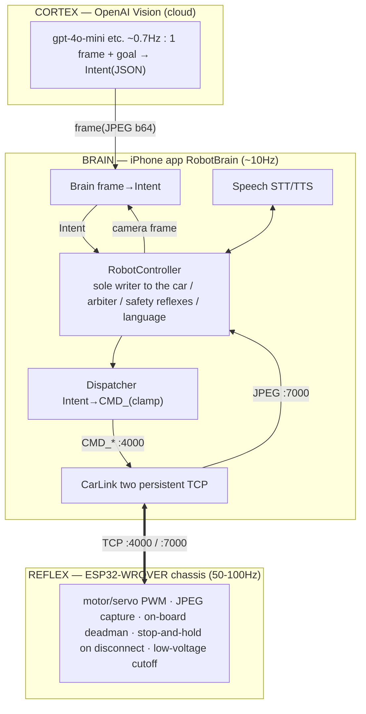
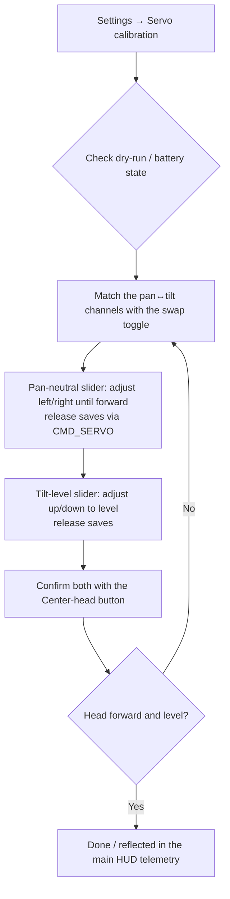
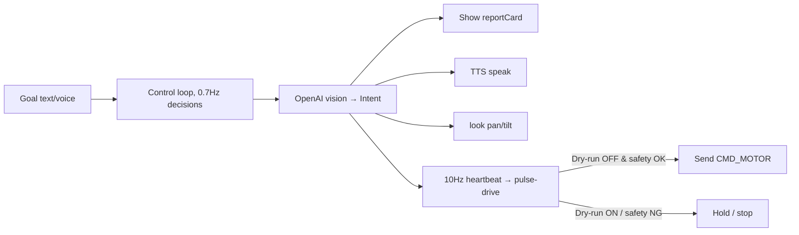

> **Note.** The ESP32 firmware is a not-included Freenove derivative; any `firmware/…` path in this document is *descriptive* (see the [README](README.md) license note).

# RobotBrain Design Document

- Document version: 1.1 (reflects the current implementation and the quality-acceptance criteria)
- Target app: RobotBrain (native iOS / SwiftUI)
- Bundle ID: `com.example.robotbrainai`
- Build environment: Xcode 26 / iOS 26 SDK (deployment target iOS 17.0, managed with XcodeGen)
- Created: 2026-07-24
- Scope: This is the **design specification** for RobotBrain. It treats the existing `ios_app/` / `host_brain/` / `relay/` and the (not-included, Freenove-derivative) `AI_Car_Firmware` as ground truth, and states both the behavior of the current implementation and the honest gaps that remain. Code tokens (`CMD_MOTOR`, etc.) and class names are kept verbatim.
- Structure: Part I covers the architecture and technical design; Part II covers the UX, screens, and localization design.

---

# Part I — Architecture and Technical Design

RobotBrain is a native iOS app: give it a natural-language goal (text or voice) and an OpenAI vision model plans while a Freenove 4WD ESP32 chassis (FNK0053, ESP32-WROVER) acts as an AI rover. It runs a deliberative "look → decide → move a little → look again" loop, on the premise that latency is acceptable.

---

## 1. Overall Architecture — Three Layers (Body/Reflex, Brain, Cortex)

Responsibilities are split into three layers by "speed." Decisions may be slow (latency is tolerated), but **stopping must be fast** — this asymmetry is the rationale for the layer split.

### 1.1 Text / ASCII architecture diagram

```
        ┌───────────────────────────────────────────────────────────────┐
        │  CORTEX — OpenAI Vision (cloud)               ~0.7 Hz          │
        │  1 frame (JPEG b64) + goal  →  Intent (JSON)                   │
        │  never emits raw motor values (semantic verbs only)           │
        └──────────▲────────────────────────────────────┬───────────────┘
                   │ Intent                              │ frame (JPEG b64)
        ┌──────────┴────────────────────────────────────▼───────────────┐
        │  BRAIN — iPhone app RobotBrain              ~10 Hz (heartbeat) │
        │  ┌──────────────────────────────────────────────────────────┐ │
        │  │ RobotController — the sole writer to the car / arbiter /  │ │
        │  │                   safety reflexes / language / settings   │ │
        │  └──┬──────────────┬──────────────┬────────────────┬─────────┘ │
        │   Brain        Dispatcher       Speech           CarLink       │
        │  frame→Intent  Intent→CMD_ str  STT/TTS       two persistent   │
        │               (clamp fortress)                    TCP links    │
        └───────────────────────────────────┬────────────────────────────┘
                    CMD_* :4000  │           │  JPEG :7000
        ┌────────────────────────▼───────────▼───────────────────────────┐
        │  REFLEX — ESP32-WROVER chassis                50-100 Hz        │
        │  motor/servo PWM · JPEG capture · on-board deadman stop ·      │
        │  stop-and-hold on disconnect · low-voltage cutoff             │
        └─────────────────────────────────────────────────────────────────┘
```

### 1.2 Detailed flow (mermaid)



### 1.3 Role of each layer

- **Reflex layer (ESP32-WROVER)**: body and reflexes only. On-device ML inference is impossible (no GPU/NPU, a few MB of usable RAM). It does not "process" frames — it merely "forwards" them. The patched firmware (a not-included Freenove derivative), `AI_Car_Firmware`, adds (1) an **on-board deadman** (if no `CMD_MOTOR` arrives within a fixed window, it runs `Motor_Move(0,0,0,0)`), and (2) **stop-and-hold on disconnect** (instead of `ESP.restart()`, it stops and waits for reconnection). The motor dead-zone is `|speed| < 1600 ⇒ 0`.
- **Brain layer (iPhone app)**: broker and arbiter. The **sole writer to the car**. It keeps the sockets open, absorbs cloud latency and failures, lowers semantic verbs into `CMD_` strings, and runs the host-side safety reflexes. It decouples the decision cadence from the heartbeat cadence. No Mac is required at run time.
- **Cortex layer (OpenAI)**: it only looks at 1 frame + the goal and returns a structured `Intent`. It never emits raw motor values (it is structurally incapable of issuing an invalid or dangerous motor command).

### 1.4 Non-negotiable design assumptions (based on measured firmware behavior)

- The brain holds the sockets open. An AI call must never own a socket.
- Motors latch (they must always be expired by a self-terminating pulse).
- Because the brain is in the cloud, the chassis runs in **STA mode** (it joins the home router; its DHCP/IP will drift). SoftAP mode (the on-board setup AP) cannot reach the cloud and is therefore out of scope for operation.

---

## 2. Module Design (module map)

| Module | File | Responsibility |
|---|---|---|
| **CarLink** | `CarLink.swift` | Persistent TCP for the :4000 command channel + the :7000 camera channel (`Network.framework`) |
| **Brain** | `Brain.swift` | Calls the OpenAI vision model → parses into `Intent` |
| **Speech** | `Speech.swift` | On-device STT/TTS (the chassis has no mic/speaker) |
| **RobotController** | `RobotController.swift` | Arbiter control loop + safety + language resolution + settings persistence |
| **Dispatcher** | `Dispatcher.swift` | Semantic actions → exact `CMD_` wire strings (clamps) |
| **ContentView / MainView / ConfigView** | `ContentView.swift` | Liquid Glass UI + settings |
| **RobotBrainApp** | `RobotBrainApp.swift` | `@main` entry point |

### 2.1 CarLink — TCP :4000 + :7000 (Network.framework)

`@MainActor final class ... ObservableObject`. It holds two `NWConnection` (TCP) links:

- **Command (:4000)**: `send(_ line:)` transmits `line + "\n"` as UTF-8. In `stateUpdateHandler`, `.ready` → `cmdConnected=true`, and `.failed` → `retryCommand()` after 1 second. `.cancelled` does not reconnect (an intentional stop).
- **Camera (:7000)**: on `.ready` it starts `readFrame`. `readExact(n:)` uses `minimumIncompleteLength` to reliably receive exactly n bytes. The frame format is a **4-byte little-endian length + JPEG**. The length is sanity-checked with `0 < len < 4_000_000`; after decoding with `UIImage(data:)` it updates `image` / `lastFrameAt` and recurses to the next frame.
- Published state: `image`, `lastFrameAt`, `cmdConnected`, `camConnected`, `voltage`, `distance` (all `@Published`). The command channel also parses `CMD_POWER#<voltage>` and `CMD_SONIC#<cm>` reply lines. Everything runs on a dedicated `DispatchQueue("carlink")`; UI updates are hopped back with `Task { @MainActor }`.

### 2.2 Brain — OpenAI Vision → Intent

`Intent` struct: `throttle`, `steer` (±1), `durationMs`, `pan?`, `tilt?`, `observation`, `taskState` (`searching | approaching | done | blocked`), plus the fused-exploration perception fields `forwardOpen?` (0..1 openness of the direction the head currently faces) and `hazard` (`none | soft | ledge | wall`). A `face?` field is retained on the struct for wire compatibility, but the live loop does not act on it (the model's JSON schema no longer requests it). `.hold` is the all-stop default.
`decide(image:goal:memory:apiKey:model:lang:distanceCm:)` posts to `chat/completions` with an `image_url` (base64 JPEG, `detail:"low"` = low token cost) plus the system prompt, the goal, the current forward distance (used when the model is driving an approach), and the **12 most recent memory entries** (`memory.suffix(12)`). A language line (`langLine`) switches the output language of the observation. `parse(_:)` extracts from the first `{` to the last `}` and reconstructs the JSON; on failure it returns `.hold` (fail-safe). **The model only emits semantic verbs and never outputs raw motor values.**

### 2.3 Speech — STT/TTS

Listens via `SFSpeechRecognizer` + `AVAudioEngine` (publishing `transcript`) and speaks via `AVSpeechSynthesizer`. `langCode` (BCP-47, `en-US` / `ja-JP`) is set by RobotController from the resolved language. The STT locale, the TTS voice, and the AI reply text all follow the selected language.

### 2.4 RobotController — arbiter / safety / language

The `@MainActor ObservableObject` that ties everything together and runs the control loop. Settings (`carIP` / `apiKey` / `model` / `lang` / `speedCap` / `linkMode` / `controlMode` / servo calibration / `panInvert` / `motorTrim`) are persisted to UserDefaults immediately via `didSet`. `dryRun` is forced ON on every launch for safety. Language resolution: `resolvedLang` (with `auto`, ja/en from the device locale) → `uiLocale` (environment-locale override) / `voiceCode` (TTS/STT). Lifecycle: `start()` (connect + `CMD_VIDEO#1` + start the loop), `stopAll()`, `emergencyStop()`, `setGoal(_:)`. See §3 for details.

### 2.5 Dispatcher — CMD_ mapping (the clamp fortress)

A set of pure functions. `clampMotor` clamps to `±min(cap, 4095)` and snaps any non-zero value up to `≥ 1600` (avoiding the dead-zone). `drive(throttle:steer:speedCap:trim:)` lowers to a tank pair: `left = (t+s)·cap`, `right = (t-s)·cap` (with a straightness `trim` factor) → `CMD_MOTOR#left#0#right`. `stop()` = `CMD_MOTOR#0#0#0`. `look` resolves the pan/tilt swap, neutrals, and pan inversion with two `CMD_SERVO` commands. It also has `servo`, `led`, `bodyLeds`, `buzzer`, `video`, `powerQuery`, `sonicQuery`, `wifiForget`, `face`, and a `faceModes` dictionary. (`face`/`faceModes` still exist but are not driven by the live loop; see §12.1.)

### 2.6 ContentView — Liquid Glass UI + settings

See Part II for details. A full-screen camera with a frosted-glass HUD built from `.ultraThinMaterial` (on iOS 26, `.glassEffect()`), and `.preferredColorScheme(.dark)`. `ConfigView` (a sheet) edits connection, AI, servo calibration, and language. All text is `LocalizedStringKey` + `en.lproj` / `ja.lproj`, switched via `.environment(\.locale, ctl.uiLocale)`.

### 2.7 RobotBrainApp

The `@main` entry point. It places `ContentView` at the root and injects the environment locale.

---

## 3. Control Loop

`RobotController.run()` is a single loop of `while !Task.isCancelled`. It **decouples the decision cadence from the heartbeat cadence**.

- **Heartbeat ≈ 10 Hz**: `heartbeatHz=10.0` → `tick=100ms`. Every tick, the arbiter sends the car exactly one line (drive or stop).
- **Decision cadence ≈ 0.7 Hz**: `decisionHz=0.7` → roughly every 1.43 s. When `!estop && !goal.isEmpty && elapsed ≥ 1/decisionHz && car.image`, it calls Brain and updates the `Intent`. At the same time it sends `look` (§4), aims the head, updates the body-LED cue, speaks the `observation` via TTS, appends to `memory` (up to 12 entries), and clears the goal when `taskState==done`. A `blocked` state is treated as terminal only after 3 in a row.
- **Self-terminating drive pulse**: at each decision, `pulseUntil = now + durationMs/1000`. The arbiter sends drive only while `now < pulseUntil`. A late or failed tick therefore means "already stopped" — the fundamental safety measure for latching motors.

### 3.1 Safety reflexes and priority (SAFETY > TELEOP > PLANNER)

The conceptual priority is **SAFETY > TELEOP > PLANNER**. Because this app is goal-driven and has no explicit TELEOP, E-STOP sits directly under SAFETY and above PLANNER (pulse-drive). The loop's effective decisions:

| Priority | Reflex | Current decision source | Result |
|---|---|---|---|
| 1 SAFETY | **E-STOP** | `estop` (STOP button → `emergencyStop()`) | `CMD_MOTOR#0#0#0` / `status.estop` |
| 2 SAFETY | **link-down** | `!car.cmdConnected` | stop / `safety.linkDown` |
| 2 SAFETY | **vision-stale** | `lastFrameAt` elapsed > `visionStaleMs=800` | stop / `safety.visionStale` |
| 2 SAFETY | **deadman** | `lastIntentAt` elapsed > `deadmanMs=500` | stop / `safety.deadman` |
| 3 SAFETY | **low-battery** | `voltage < 6.6V` | stop / `safety.lowBattery` + banner |
| 4 SAFETY | **collision-escape** | forward intent + fresh sonar < 25 cm (32 cm in the dark) | reverse → pivot |
| 5 — (dry-run) | **dry-run** | `dryRun` (default ON) | do not send drive values (plan/log only) |
| 6 TELEOP | **direct/manual pulse** | direct move command / Manual pad | self-terminating pulse |
| 7 PLANNER | **AI pulse-drive** | `reason==nil && now<pulseUntil` | `Dispatcher.drive(...)` |
| 8 — | **hold** | none of the above | `CMD_MOTOR#0#0#0` / `status.hold` |

`safetyReason() -> String?` blocks driving whenever it returns non-nil (a localization key). `driving = !estop && reason==nil && now<pulseUntil`. **Motion happens only when on battery**, and only when dry-run is OFF is it actually transmitted. Dry-run defaults ON: it plans and logs but never sends a motion command. Stopping does not depend on a network round-trip or an AI decision — it completes immediately inside the app.

### 3.2 Low-battery reflex (implemented)

RobotController sends `CMD_POWER` roughly every 3 seconds; CarLink parses `CMD_POWER#<voltage>\n` and publishes `voltage`. `safetyReason()` returns `safety.lowBattery` when `voltage < 6.6`, and the arbiter emits a stop. ContentView shows the reason with a voltage badge and a red low-voltage banner.

The last line of defense is the on-board low-voltage detection; the host side handles early warning and voluntary stop.

### 3.3 Search state machine (scan & relocate, FR-54–56) — 2026-07-26

**Problem**: If the structure of the search is left to the VLM prompt, on the real car it just "stops and sweeps the head" and never moves to a new spot to search again (gpt-4o-mini fears collisions indoors and won't choose to RELOCATE). This is a missing axis, **separate from collision avoidance**.

**Approach**: Just like collision escape (`collisionEscape`, roughly §3.4), guarantee the skeleton of the search with a **deterministic, host-side state machine**. The VLM's role is narrowed to a **pure perceptual judgment**: "is the goal in view?" Inside `applyIntent`, it branches on `task_state`:

- `task_state == approaching|done` → release the search machine and apply the VLM's `Intent` (throttle/steer/pan/tilt) directly (the VLM owns approach and arrival). Reset `searchPhase`.
- otherwise (`searching|blocked`) → **the host overrides the `Intent`** (the VLM's drive values are discarded; only `observation/taskState` are used).

States (one step advances per decision cadence ≈ every 1.43 s):

| phase | action | transition |
|---|---|---|
| **scan** | Stop (throttle 0), aim the head pan/tilt to `scanArc[i]`. The VLM judges visibility at each angle. | Advance `i`. When the arc is fully covered (`i` wraps), go to **relocate** |
| **relocate** | Face the head forward (`fwdPan`/`driveTilt`). ① If the head is not yet forward (`!headForward`), stay stopped and turn the head forward, measuring distance on the next tick. ② Once forward is confirmed, if the path ahead is `≥ relocateClearCm(45 cm)`, drive a short forward pulse (throttle 0.45, 350 ms) to a new spot. ③ If blocked, pivot in place (steer, throttle 0, 350 ms) to change heading. | After 1 action, go to **scan** |

- `scanArc` is a few pan points plus tilt up/down **within this unit's reachable hemisphere** (e.g. `[(90,130),(45,88),(90,45),(135,88),(90,83)]`, to be tuned on the real car). The head cannot turn 360°, so headings it cannot reach are covered by turning the whole body during a relocate pivot.
- **Safety subordination (FR-56)**: the search machine only builds an `Intent`; the final motor line is decided by the §3.1 arbiter. E-STOP / link / vision / deadman / low-voltage / dry-run all sit above it. A RELOCATE forward pulse is protected by the firmware forward veto (< 20 cm) plus the host `collisionEscape` (latched reverse → turn below 25 cm). `relocateClearCm(45)` is set larger than `collisionEscape`'s engage point (25) so the search side normally stops first.
- **Yield / reset (FR-55)**: `setGoal` / `stopAll` / `emergencyStop` / mode switch / `start` set `searchPhase=.scan, scanIndex=0`.
- **Prompt**: narrowed to "the host handles head-sweeping and movement; while `searching`, your throttle/steer/pan are ignored; if you **can see** the goal set `approaching` and aim toward it, and if you **cannot** keep `searching` and describe what you see" (`Brain.swift`). This simplifies and stabilizes the VLM's decisions.

### 3.4 Collision escape, low-light mode, physical limits

- **HC-SR04**: the firmware returns `CMD_SONIC#<cm>` and vetoes forward drive under 20 cm on the chassis side. The app polls distance at about 3 Hz and only uses values fresher than 1.5 s.
- **Host collision escape**: on forward intent with a fresh sonar reading < 25 cm (32 cm in low light), the 10 Hz arbiter latches `collisionEscape`. The reverse ends past 40 cm or at 1.4 s, followed by a 0.65 s in-place pivot to change heading. Because there is no rear sensor while reversing, there is always a maximum time cap.
- **Low light**: the frame is "dark" when the average luma `luma < 55`. A white LED is turned on as a headlight, and the search relocate is dialed down to `clear=65 cm`, `throttle=0.30`, `duration=250 ms`.
- **Limits**: the HC-SR04 covers only straight ahead of the head; it does not guarantee anything behind, to the sides, at floor edges, on stairs, or for low/soft/thin/angled/glass/cloth/no-echo obstacles. "No echo" does not mean safe. Operation assumes low speed, short pulses, and human supervision.

---

## 4. Servo Calibration Model (swap flag + pan/tilt neutrals)

It is a hard requirement that this be **adjustable in-app rather than by reflashing**. Facts measured on this specific unit:

- **The pan/tilt servos are swapped relative to the firmware's assumption**: `servo1(ch0)=TILT (up/down)`, `servo2(ch1)=PAN (left/right)` (setting servo2 from 80→180 rotates the head 90° to the left with no change in up/down).
- **Neutrals**: pan (forward) ≈ 90, tilt (level) ≈ 95. In the semantic space, tilt 90 is level, above 90 is up, below 90 is down.
- The old `tiltNeutral=18` pointed too far toward the floor and caused the sonar to look at the ground while driving, so the current app migrates any `tiltCalV < 3` to 95.

The current `Dispatcher.look()` does not use `CMD_CAMERA`; it lowers to two **individual servo commands `CMD_SERVO#index#angle`**. On this car's firmware the servo2 pan axis has been reflashed to span the full 0–180 range.

### 4.1 Calibration state (data model, persistence)

| Property | Type | Default (this unit) | Meaning |
|---|---|---|---|
| `servoSwap` | Bool | `true` | true = pan on ch1, tilt on ch0 (this unit) / false = firmware default |
| `panNeutral` | Int | `90` | physical angle that faces forward |
| `tiltNeutral` | Int | `95` | physical angle that is level |
| `panInvert` | Bool | `false` | invert the pan direction |
| `motorTrim` | Double | `0` | straight-line correction |

All are persisted to UserDefaults with the same `didSet` pattern as `carIP` (§5).

### 4.2 Channel resolution

```
panChannel  = servoSwap ? 1 : 0   // this unit: pan on ch1 (servo2)
tiltChannel = servoSwap ? 0 : 1   // this unit: tilt on ch0 (servo1)
```

### 4.3 Semantic angle → physical angle (centered on neutral; 90 = neutral)

The cortex's (Brain's) semantic space is decoupled from the hardware quirks: **90 is neutral for both pan and tilt**. The mapping is an offset from neutral:

```
physPan  = clamp(panNeutral  + (semPan  - 90), 0, 180)   // -(semPan-90) when panInvert
physTilt = clamp(tiltNeutral + (semTilt - 90), 0, 180)   // smaller = down / larger = up, no flip
```

This lets the AI think in a normal 90-centered space, land on physical level through `tiltNeutral=95`, and not depend on `CMD_CAMERA`'s fixed axis assignment.

### 4.4 Lowering `look(pan,tilt)` (emits 2 commands)

```swift
static func look(pan semPan: Int, tilt semTilt: Int,
                 swap: Bool, panNeutral: Int, tiltNeutral: Int,
                 panInvert: Bool = false) -> [String] {
    let panCh  = swap ? 1 : 0
    let tiltCh = swap ? 0 : 1
    let panDelta = panInvert ? -(semPan - 90) : (semPan - 90)   // flip pan direction for this car
    let physPan  = max(0, min(180, panNeutral  + panDelta))
    let physTilt = max(0, min(180, tiltNeutral + (semTilt - 90)))
    return [servo(panCh, physPan), servo(tiltCh, physTilt)]
}
```

RobotController emits both lines on a decision tick (replacing the older single `CMD_CAMERA`). See Part II §11.3 for the live-adjustment UI (sliders, swap toggle, forward button).

---

## 5. State and Persistence (UserDefaults)

| Key | Type | Default | Current |
|---|---|---|---|
| `carIP` | String | `robotbrain.local` | ✅ persisted via `didSet` (mDNS; a numeric IP also works) |
| `apiKey` | String | `""` | ✅ persisted (plaintext, §8) |
| `model` | String | `gpt-4o-mini` | ✅ persisted |
| `lang` | String | `auto` | ✅ persisted; keeps `speech.langCode` in sync |
| `dryRun` | Bool | `true` | not persisted; ON every launch (fail-safe) |
| `speedCap` | Int | `2000` | ✅ persisted |
| `linkMode` | `lan/remote` | `lan` | ✅ persisted |
| `controlMode` | `ai/manual` | `ai` | ✅ persisted |
| `servoSwap` | Bool | `true` | ✅ persisted |
| `panNeutral` | Int | `90` | ✅ persisted |
| `tiltNeutral` | Int | `95` | ✅ persisted + migration of the old value |
| `panInvert` | Bool | `false` | ✅ persisted |
| `motorTrim` | Double | `0` | ✅ persisted |

Live state (`goal`, `running`, `estop`, `report`, `taskState`, `statusKey`, `memory`) is correctly non-persistent.

---

## 6. Wire Protocol Reference

### 6.1 Command channel TCP :4000 — the CMD_ protocol table

Text lines, `#`-delimited (`INTERVAL_CHAR '#'`), `\n`-terminated (`ENTER`). CarLink appends the trailing `\n`. Normally fire-and-forget, but `CMD_POWER` and `CMD_SONIC` return a reply line.

| Semantic action (Dispatcher) | Wire string | Clamp / notes |
|---|---|---|
| `drive(throttle,steer,speedCap)` | `CMD_MOTOR#<L>#0#<R>` | Tank pair. ±min(cap,4095), non-zero snaps up to ≥1600. Middle field is 0 |
| `stop()` | `CMD_MOTOR#0#0#0` | Stop (safe default) |
| `servo(index,angle)` | `CMD_SERVO#<index>#<angle>` | index 0=ch0(servo1), 1=ch1(servo2). angle 0–180. **The lowering target of `look`** |
| `look(pan,tilt)` | two `CMD_SERVO` (see §4) | The lowering emits two `CMD_SERVO`; the older single `CMD_CAMERA#<pan>#<tilt>` firmware command is not used by this build |
| `led(mask,r,g,b)` | `CMD_LED#<mask>#<r>#<g>#<b>` | Set color_1 of the LEDs picked by a 12-bit corner bitmask (rendered by modes 1/3/4) |
| `bodyLeds(mode)` | `CMD_LED_MOD#<mode>` | 0 off, 1 static, 3 blink, 4 breathe, 5 rainbow |
| `buzzer(on,freq)` | `CMD_BUZZER#<0/1>#<freq>` | freq 0–10000 (non-blocking variable tone only; `Buzzer_Alert` is unused) |
| `video(on)` | `CMD_VIDEO#<0/1>` | Gates the :7000 stream |
| `powerQuery()` | `CMD_POWER` | Reply: `CMD_POWER#<voltage>\n` |
| `sonicQuery()` | `CMD_SONIC` | Reply: `CMD_SONIC#<cm>\n` |
| `wifiForget()` | `CMD_WIFI_FORGET` | Clear credentials + reboot into SoftAP setup mode |
| `face(mode)` | `CMD_MATRIX_MOD#<mode>` | 0=off,1=rotate,2=cry,3=smile,4=wheel_r,5=wheel_l,6=blink, ≥7=random. The command exists in Dispatcher but the live control loop no longer drives the LED-matrix face (HRI is the body-LED cues; see §12.1) |

`faceModes` dictionary: `off:0, rotate:1, cry:2, smile:3, wheel_r:4, wheel_l:5, blink:6, random:7`.

### 6.2 Camera channel TCP :7000 — frame format

Gated by `CMD_VIDEO#1`. One frame = a **4-byte little-endian length prefix + raw JPEG bytes**. Reception reads 4 bytes → determines the length → reads exactly that many (`readExact`). HQVGA 240×176, ~10–15 fps. The length is sanity-checked with `0 < len < 4,000,000`.

### 6.3 Hardware constraints (reference)

- ESP32-WROVER; no on-device ML. All perception and cognition are off-board.
- Four motorized wheels, but `CMD_MOTOR` drives a left/right tank pair. Each value is ±4095; `|value| < 1600` is 0 (dead-zone).
- Servos via a PCA9685 (`Servo_1`=ch0 / `Servo_2`=ch1). On this unit the pan/tilt are swapped.
- The forward HC-SR04 distance sensor is an add-on. It is a single sensor facing straight ahead of the head and does not guarantee no-echo, rear, side, floor-edge, or soft-object detection.
- There is an overlap in the docs between `WS2812_PIN` and `PIN_BATTERY` on GPIO 32. Using the body LEDs and battery telemetry at the same time needs hardware verification (the app does not rely on that uncertainty).
- Motion, servos, and body LEDs only work when the battery (2× 18650) is fitted. Low-voltage reference `LOW_VOLTAGE_VALUE 2100`.

---

## 7. Reconnection and Error Handling

- **CarLink auto-reconnect**: on `.failed`, `retryCommand()` / `retryCamera()` after 1 second. `.cancelled` (an explicit stop) does not reconnect. The two channels are independent.
- **Firmware stop-and-hold**: the patched `AI_Car_Firmware` does not `ESP.restart()` on disconnect; it holds a stop. A brief WiFi drop does not reboot the chassis → the brain can calmly reconnect, preventing a runaway mid-motion.
- **IP drift**: with STA/DHCP the IP changes. Enter it manually in ConfigView and reconnect.
- **Vision-stale / deadman**: a frame gap of 800 ms is `visionStale`, an intent gap of 500 ms is `deadman`, and each triggers an immediate stop (§3).
- **State reset**: STOP / stopAll / mode switch / AI↔Manual switch call `haltMotionState()` to clear the pulse, teleop, collision escape, search, approach latch, and stale taskState, so nothing re-drives on an old decision after resuming.
- **Brain fail-safe**: any network or JSON-parse failure returns `.hold`. If the brain goes silent, the car naturally stops via the self-terminating pulse.
- **UI reflection**: `cmdConnected` / `camConnected` show as connection dots, and `statusKey` as a status pill.

---

## 8. Security

- **OpenAI API key**: stored in UserDefaults **in plaintext** (a pragmatic choice for personal use). It is not hard-coded (it currently is not; it is entered via a SecureField). For stronger protection, migrating to the Keychain is recommended (the current spec explicitly chooses UserDefaults).
- **LAN traffic**: :4000/:7000 are plaintext TCP with no TLS/auth. Assumes a home LAN. Do not use on an untrusted network.
- **Never put secrets in the URL/query**: the API key is only in an HTTP header (`Authorization: Bearer`). Images are sent as base64 in the request body.
- **Operational guards**: dry-run defaults ON, an always-available emergency STOP, a speed governor (`speedCap`), and operation indoors, without stairs, under human supervision. Motion physically occurs only when the battery is connected.

---

# Part II — UX, Screens, and Localization Design

This is written as a design that builds on the structure of the current `ContentView.swift` (the `glass()` modifier, `MainView`'s panels, `ConfigView`'s `Form`) and `en.lproj` / `ja.lproj`, extending it to include the servo calibration of Part I §4.

---

## 9. Design Principles

- **The camera is the world; the glass is the cockpit.** The whole screen is the car's first-person view. Controls float minimally as `.ultraThinMaterial` (on iOS 26, `.glassEffect()`) panels. Do not hide the video.
- **The brain is in the app.** The ESP32 is body and reflexes only. The UI reduces to three things: give a goal / read and hear the AI's thinking (observation) / stop instantly. Latency is tolerated.
- **Safety is the top of the UI.** Dry-run defaults ON, STOP is permanent, and the status always surfaces the safety reason (`safety.*`). Motion happens only when the battery is connected. Be honest in the UI about what "can't be done / can't be verified" right now (e.g. never hide `safety.linkDown`).
- **Fully bilingual.** The UI, AI reply text, TTS voice, and STT recognition locale all follow the same selected language (Auto/EN/JA). Zero hard-coded strings.

---

## 10. Screen Inventory

| Screen | Role | Current |
|---|---|---|
| **Main HUD** (`MainView`) | Always-on driving screen | Implemented |
| **Settings sheet** (`ConfigView`, `.sheet`) | Connection · Remote/LAN · AI · language · **servo calibration** | Implemented |
| **Calibration area** (a Section in Settings) | Live-adjust pan/tilt neutrals, swap, pan-invert, motorTrim | Implemented in LAN mode |
| Permission prompts (OS standard) | Local network / mic / speech recognition | OS standard dialogs |

### 10.1 Main Liquid-Glass HUD

A `ZStack` with the camera at the back, `GridOverlay` (3×3, opacity 0.35), and a `VStack(spacing: 12)` on top. It creates a top-to-bottom gaze flow.

```
┌─────────────────────────────────────┐
│ ● cmd  ● cam  status  6.4V  [DRY]  ⚙︎│ ← statusPill (top; connection + safety state)
│ 240×176 · pan 90° · tilt 100° · 42cm │ ← telemetry (left-aligned, small)
│ [  AI  |  Manual  ]                  │ ← modeToggle (AI / Manual segmented)
│            (live camera)            │
│         3×3 grid faintly overlaid    │
│                                     │
│ ┌─ SEARCHING ──────────────────┐    │
│ │ A red block is visible ahead…│    │ ← reportCard (AI thinking + state)
│ └──────────────────────────────┘    │
│ [ Tell the robot…       ] [🎤] [Send]│ ← inputBar (text + mic + send)
│ [ ■ STOP ]                          │ ← stopButton (large, red, permanent)
└─────────────────────────────────────┘
```

- **statusPill** (top, `glass(20)`): green/red `cmd`/`cam` dots, `ctl.statusKey` (`status.*` / `safety.*`) in monospaced, a cyan `REMOTE` badge in Remote mode, a voltage badge (red when low), a yellow `DRY` badge in dry-run, and a gear at the right (`a11y.settings`). **The at-a-glance indicator of connection, safety, and mode.**
- **telemetry** (`glass(12)`, left-aligned): resolution, current pan/tilt angles, and the forward distance (cm / no echo / unknown). Values mirror the current transport (LAN or Remote).
- **modeToggle** (`glass(14)`): a segmented AI / Manual `Picker`. In Manual mode it replaces the goal input with drive/camera pads.
- **reportCard** (`glass()`, bottom-aligned): a task-state label (`state.searching/approaching/done/blocked/idle`) plus `ctl.report` (the AI's `observation`). **The primary surface for "what the AI sees and intends now."** Shows `…` when empty.
- **inputBar**: a `TextField` (`goal.placeholder`, multiline via `axis: .vertical`) + a mic button (`mic`/`mic.fill`, red while listening) + a send button (blue glass, `disabled` on empty). **Unifies the two input paths — text and voice — into one bar.**
- **stopButton**: full-width red glass at the bottom (height 56). `stop.fill` + `btn.stop`. **A permanent, maximal tap target within thumb reach.** Pressing it = `emergencyStop()` (estop flag + immediate `CMD_MOTOR#0#0#0` + `status.estop`).

### 10.2 Settings sheet (`ConfigView`)

`NavigationStack > Form`. It has sections for connection, Remote/LAN, AI, language, and a LAN-only calibration section.

1. **Car** (`settings.section.car`): Link mode, Car IP (in LAN), Find car, a speed-cap `Stepper` (1600–4095, step 100), and a Dry-run toggle. Turning dry-run OFF in Remote raises a confirmation dialog.
2. **AI** (`settings.section.ai`): API key (`SecureField`), model. A footer note ("stored in UserDefaults, unencrypted, personal use only") is recommended.
3. **Servo calibration** (`settings.section.calib`) — shown only in LAN. See §11.3.
4. **Language** (`settings.section.language`): a `Picker` for Auto/English/日本語.
5. Actions: Reconnect / Stop all (destructive) / Done.

---

## 11. Liquid Glass Visual System

- **Material**: panels are `.ultraThinMaterial` (on iOS 26 hardware, swappable for `.glassEffect()`). Corners use `RoundedRectangle(style: .continuous)`. Radii are tiered by panel role: telemetry `12` < pill `20` < inputBar/reportCard `22` < STOP `26` (importance = size = radius).
- **Border**: all glass uses `strokeBorder(.white.opacity(0.3), lineWidth: 0.5)`. The blue send button and red STOP use a white border at `opacity(0.3–0.35)`. Under the frosted material there is also a dark scrim (`Color.black.opacity(0.42)`) so white text stays legible over any frame.
- **Layout**: outer `.padding()`, `spacing: 12` between panels. The vertical flow is top (state) → center (video) → bottom (thinking, input, stop). A `Spacer()` gathers the reportCard and below toward the bottom (into the thumb zone). The camera is full-bleed via `ignoresSafeArea()`.
- **A dark world**: the whole app is fixed to `.preferredColorScheme(.dark)`. Text is mostly `.white`, with secondary info at `opacity(0.8–0.9)`. With no video it shows a black field plus `video.none`. **There is no light/dark toggle** — it is deliberately a single design, a consistently dark cockpit of glass over video.
- **Typography**: status values are `.monospaced()` (pill, telemetry). The reportCard uses a `caption2.bold` state label plus a `subheadline` body; send is `subheadline.weight(.semibold)`; STOP is `title3.bold`.
- **Overlay**: `GridOverlay` (white 0.5pt, 3×3, opacity 0.35) as a rule-of-thirds guide, helping a person follow the AI's visual judgments (left/right/center). A future extension could emphasize a center crosshair during calibration.
- **Icon**: the App Icon is a render of the robot (`Assets.xcassets/AppIcon`, 1024²), matching the dark aesthetic.

### 11.1 Giving a goal by text

Type in the `TextField` → tap send → `ctl.setGoal(goalText)` (trim → if non-empty, set `goal`, clear estop, clear memory, and `start()` if not running) → `goalText=""`. From then on the loop begins deciding at `decisionHz` (0.7 Hz).

### 11.2 Giving a goal by voice

Tap the mic → on first use `requestPermissions()` (speech recognition + mic) → `startListening()` (an `SFSpeechRecognizer` with the selected-language locale `langCode`). Partial recognition streams into `speech.transcript`, mirrored live into `goalText` via `onChange` (dictate → verify on screen → send or edit). It auto-calls `stopListening()` on the final result or an error. While listening the mic is red (`mic.fill`).

### 11.3 Servo calibration area (new; the core of this design)

**Background**: on this unit the pan/tilt are swapped relative to the firmware's assumption (§4). servo1(ch0)=tilt (up/down), servo2(ch1)=pan (left/right). Pan neutral (forward) ≈ 90, tilt level ≈ 95. Correct it **in-app** without reflashing.

**UI (one Section of the `Form`)**:

- **Swap toggle** `calib.swap` (`a11y.calib.swap`): inverts which physical channel (0/1) the semantic pan/tilt is sent to. ON for this unit.
- **Pan-invert toggle** `calib.panInvert`: inverts only the pan axis when left/right and the physical-angle direction feel reversed.
- **Pan-neutral slider** `calib.pan` (0–180, default 90): dragging it **live-sends** `CMD_SERVO#<panCh>#<angle>` so the real head moves left/right. The value at release is saved as neutral.
- **Tilt-level slider** `calib.tilt` (0–180, default ≈95): live-sends to check up/down. The calibration path does not go through `look()`'s clamps; it sends the **raw angle via `Dispatcher.servo(index,angle)`** (§4).
- **Straight-line trim slider** `calib.trim`: adjusts `motorTrim` to reduce the left/right motor imbalance.
- **Center-head button** `calib.center` (`a11y.calib.center`): sends both pan and tilt at once using the saved neutrals, returning the head home.
- Footer `calib.hint`: "The real head only moves with the battery connected. The slider saves at the position where you release."

**Persistence**: `panNeutral` / `tiltNeutral` / `servoSwap` (plus `panInvert` / `motorTrim`) are saved to UserDefaults (§5). `look()` references these values every time.

**Calibration flow**:



---

## 12. Interaction Flows

### 12.1 Watching and hearing the AI act

The loop sends `car.image` to the OpenAI vision model (`Brain.decide(..., lang:)`) → a structured `Intent` (throttle/steer/pan/tilt/forward_open/hazard/observation/taskState). Reflected as:

- **See**: the reportCard shows `observation` + a `state.*` label. Confirm behavior against the live camera.
- **Hear**: `speech.speak()` reads the `observation` in the selected-language voice.
- **Head**: `pan/tilt` move the head via `look()` (with calibration correction).
- **Body-LED cues**: the car conveys its state through the corner WS2812 "light language" (`LedLanguage` / `updateLeds`) — a steady white "vision light" while scanning, directional forward/turn/reverse cues, a red blink on e-stop, etc. — plus a rainbow + victory jingle on done. (The LED-matrix face command `CMD_MATRIX_MOD` still exists in Dispatcher but is not driven by the live loop.)
- `done` auto-clears the goal. `blocked` is terminal only after 3 in a row. The 10 Hz heartbeat expands the `intent` into pulse-drive (during dry-run it logs/speaks only, without sending).



### 12.2 STOP

The bottom button is START when idle and STOP whenever the car might move. Tapping STOP = `emergencyStop()`: `estop=true`, clear `goal`, immediate `CMD_MOTOR#0#0#0`, `status.estop`. `haltMotionState()` invalidates direct teleop, collision escape, search, the approach latch, and stale vision decisions. Host-side reflexes (deadman 500 ms / vision-stale 800 ms / link-down / low-battery / collision escape) also stop the car automatically, independent of STOP, and surface the reason in the statusPill.

### 12.3 Live servo calibration

In Settings → Servo calibration, moving a slider **moves the real head in step with your finger** (continuous `CMD_SERVO#index#angle` sends). Match the pan/tilt channels with the swap toggle, set the neutrals, and confirm with the center button. Values are saved immediately and reflected in later main operation (`look()`) and the main telemetry. The path is designed to be quick and independent of the STT/AI loop.

---

## 13. Bilingual EN/JA Design

- **UI strings**: everything is a `LocalizedStringKey` (e.g. `Text("btn.stop")`) plus `Localizable.strings` in `en.lproj` / `ja.lproj`. No hard-coding except for dynamic strings (IP, angles, speaker text). Formatted strings use `NSLocalizedString(...)` + `String(format:)` (the existing `settings.speedCap` approach).
- **Single source of language resolution**: `RobotController.resolvedLang` (with Auto, ja if `Locale.current` is ja, else en). This is the parent of the UI, AI, and voice.
- **UI locale injection**: `.environment(\.locale, ctl.uiLocale)` is applied to both the root (`ContentView`) and `ConfigView`, overriding the device language with the in-app selection.
- **Language picker**: the Settings `Picker` (`lang.auto` / verbatim "English" / "日本語"). `lang`'s `didSet` saves to UserDefaults and immediately applies `speech.langCode = voiceCode`.
- **AI replies**: `Brain.decide(..., lang: resolvedLang)`. When Japanese is selected, the prompt asks for the `observation` in natural Japanese. The reportCard display matches the language.
- **TTS**: `speech.speak()` reads with `AVSpeechSynthesisVoice(language: langCode)` (ja-JP/en-US).
- **STT**: `SFSpeechRecognizer(locale: langCode)` follows the dictation language too.

### 13.1 New calibration localization keys (add as pairs to both `.strings`)

| Key | en | ja |
|---|---|---|
| `settings.section.calib` | `Servo calibration` | `サーボ調整` |
| `calib.swap` | `Swap pan / tilt` | `パン/チルトを入替` |
| `calib.pan` | `Pan neutral (forward)` | `パン中立（正面）` |
| `calib.tilt` | `Tilt neutral (level)` | `チルト水平` |
| `calib.center` | `Center head` | `正面を向く` |
| `calib.hint` | `Moves the real head only with batteries connected. Saved on release.` | `実機はバッテリー接続時のみ動きます。指を離すと保存されます。` |
| `a11y.calib.swap` | `Swap pan and tilt servos` | `パンとチルトの入替` |
| `a11y.calib.pan` | `Pan neutral angle` | `パン中立角` |
| `a11y.calib.tilt` | `Tilt level angle` | `チルト水平角` |
| `a11y.calib.center` | `Center the head` | `ヘッドを正面へ` |

(Adding footer-note keys for the existing `settings.apiKey` / `settings.carIP` is likewise recommended.)

---

## 14. Accessibility

- **VoiceOver labels**: follow the existing `a11y.voice` (mic) / `a11y.settings` (gear). Additions:
  - STOP: an explicit `btn.stop` label + `.accessibilityAddTraits(.isButton)`, and ideally a hint noting "immediate stop, no double confirmation."
  - Send button: `btn.send`; when `disabled`, VoiceOver should announce it as disabled.
  - Status dots: don't rely on color alone — add `.accessibilityLabel` "connected/disconnected" to the `cmd`/`cam` dots.
  - reportCard: combine the state label + body into one spoken unit with `.accessibilityElement(children: .combine)`, taking care not to double up with the TTS.
  - Calibration sliders: `a11y.calib.pan/tilt` labels + `.accessibilityValue` (current angle) + the adjustable trait. Individual a11y labels on the swap toggle and center button.
- **Contrast**: white text over dark video plus a glass ground. Even in bright scenes, each panel's `.ultraThinMaterial` background is required (no text placed directly on the frame). Don't drop secondary `opacity` below 0.8. The yellow `DRY`, red STOP, and green/red dots are paired with shape/labels so meaning is never conveyed by color alone.
- **Tap targets**: primary controls are ≥ 44pt (mic/send 44, STOP 56).
- **Dynamic Type**: follows the system font. The reportCard and similar wrap over multiple lines (`axis: .vertical`) so they don't clip when enlarged.

---

## 15. Current Implementation Summary and Remaining Checks

1. **Implemented**: the two-`CMD_SERVO` servo-swap correction, migration to tiltNeutral 95, pan inversion, motorTrim, low-voltage stop, `CMD_SONIC`, the firmware 20 cm forward veto, host collision escape, low-light mode, and the Manual/Remote/START-STOP state transitions.
2. **Implemented**: Remote connects as a thin client to the WSS relay, with the bridge side owning the brain, safety, and writes to the car. The app has a ~2 Hz heartbeat, Remote-arm confirmation, REMOTE/DRY indicators, and a local STOP latch.
3. **Remaining checks**: before release, fill in the real-car log fields in `QUALITY_ACCEPTANCE.md`. In particular, low light, soft/no-echo obstacles, reverse recovery, disarm on Remote disconnect, and TTS/effect interruption need real-hardware verification in the local environment.

`QUALITY_ACCEPTANCE.md` is the pre-release checklist that ties the design's safety, state transitions, and Remote operation to their implementation sites and to real-hardware verification.

---

## Addendum v1.1 (2026-07-24): mDNS/Bonjour auto-discovery design

**Firmware (`AI_Car_Firmware`, a not-included Freenove derivative — described here for reference)**
- `#include <ESPmDNS.h>`. After the WiFi STA connection is established (after `WiFi_Setup(0)`):
  ```cpp
  if (MDNS.begin("robotbrain")) { MDNS.addService("robotbrain", "tcp", 4000); }
  ```
- Effect: the chassis becomes resolvable as `robotbrain.local` and advertises `_robotbrain._tcp` (port 4000). The hostname stays fixed even when the IP changes.

**App**
- Default `carIP = "robotbrain.local"`. `NWConnection(host: "robotbrain.local", ...)` resolves via mDNS (under the local-network permission). Both the command :4000 and camera :7000 connect to the same host.
- `Discovery` (`NWBrowser`, `.bonjour(type:"_robotbrain._tcp")`) does explicit discovery. On a find it sets `carIP` and reconnects. It times out at 5 seconds.
- The Car section of `ConfigView` has a "Find car" button plus discovery-status text.
- The app's Info.plist declares `NSBonjourServices = ["_robotbrain._tcp"]` (without it, `NWBrowser` cannot discover).

**Data flow**: firmware advertises → the app resolves the default host or browses explicitly → connects `robotbrain.local` on both ports. A numeric IP is the manual-entry fallback.

---

# Part III — Fused Exploration (camera × distance-sensor fusion)

## 16. Spatial-awareness exploration design (2026-07-27)

> Requirements: FR-66–FR-71 (REQUIREMENTS.md §5.4.2). The primary implementation target is LAN (Swift `RobotController`/`Brain`), with the same behavior ported to Remote (Python `main.py`/`brain.py`/`bridge_main.py`) — the LAN==Remote invariant.

### 16.1 Motivation and background
The current deterministic search (§3.3, FR-54–56) decides the relocate direction from **only the forward ultrasonic beam**, ignoring the rich scene information the camera captures. As a result, when the path ahead is blocked indoors, it just **pivots blindly in place** instead of moving intelligently. On the other hand, VLM-only decisions are unstable (hallucinations in the dark, no distance). → **Fuse the camera (semantics, wide FOV, soft obstacles) with the ultrasonic (accurate distance, near-field safety)** to choose the exploration direction.

### 16.2 Hardware premises (invariant constraints)
- The ultrasonic HC-SR04 is **co-mounted on the same pan/tilt head as the camera**. Sweep the head and you **measure distance at each pan angle** (a distance fan comes for free). This is currently unused (the sonar isn't read during the sweep).
- Pan is reflashed to Servo_2 [0,180] so **both left/right hemispheres** are reachable. Physical level tilt ≈ semantic 90 (tiltNeutral=95).
- **No odometry / IMU** → position and heading cannot be tracked → **no persistent metric map (SLAM)**.
- The camera is a 240×176 monocular 2D image, no depth.
- The ultrasonic is a single narrow beam that **passes straight through soft/thin/angled/low objects** (no-echo=300).

### 16.3 Data model (all transient, non-persistent)
Nothing is persisted. Only a **local snapshot of the current spot** is held in RAM, discarded on relocate.
```
struct DirSample {            // one scanned direction
  semanticPan: Int            // head pan (90=forward, <90 right / >90 left is calibration-dependent)
  sonarCm: Double?            // ultrasonic distance for that heading (nil=not read, 300=no-echo/far)
  vlmOpen: Double             // openness the VLM sees, 0..1 (0=blocked, 1=open floor/hallway)
  vlmNote: String             // optional observation ("doorway", etc.; debug / anti-loop)
}
var spotFan: [DirSample]      // this spot's scan result (filled in scan, consumed in relocate)
```
- `spotFan` lives on `RobotController` (LAN) / the brain state (Remote). Cleared when leaving the spot.
- The existing `memory` (text observations, anti-loop) continues, used alongside as a coordinate-free "where I've been" note.

### 16.4 Control flow (fuse `applySearch`)
The search is a two-phase state machine (extending §3.3):

**(A) SCAN_FUSE — gather the distance fan + semantics in place**
- Aim the head to each pan angle of `scanArc` in turn (existing). **Once the head settles at each angle, read the sonar** (`Get_Sonar` equivalent) → `spotFan[i].sonarCm`.
  - Implementation note: the sonar-poll `headForward` gate is "forward only," but for SCAN it is widened to **read whenever the head has settled at each pan angle** (adding "settled during scan" to the poll condition). The reading is attributed to that pan angle.
- For each frame, have the VLM judge **that heading's openness `vlmOpen` (0..1)** and whether the goal is visible (§16.6 prompt).
- If it returns goal-visible (approaching/done), immediately hand off to the §3.3 approach (the low-light guard stays on).
- Once the arc is fully covered, go to **(B) RELOCATE_FUSE**.

**(B) RELOCATE_FUSE — move toward the best direction by a fused score**
1. Give each `DirSample` a **fused score**:
   ```
   score(d) = w_sonar * norm(d.sonarCm) * gate_soft(d) + w_vlm * d.vlmOpen
   norm(cm)   = clamp(cm/DIST_NORM_CM(150), 0, 1)   // farther = higher
   gate_soft  = d.vlmOpen < OPEN_MIN(0.3) ? 0.2 : 1  // if the camera says "blocked," penalize even if the sonar is clear (soft obstacles)
   w_sonar=0.6, w_vlm=0.4 (to be tuned)
   ```
2. **Cross-check (the heart of fusion)**:
   - sonar close (< FWD_BLOCK_CM 30) → exclude that direction (a real obstacle).
   - sonar clear but VLM open low (a curtain, etc.) → penalize via `gate_soft`.
   - VLM open high but sonar close → sonar wins, exclude.
3. Choose the best-scoring direction:
   - if its pan is near forward (|pan-90| ≤ PAN_TOL) → **drive forward** as-is.
   - if lateral → **pivot the body to bring it forward, then drive** (pivot amount from the pan difference).
4. The forward move is a short pulse (throttle 0.45 / lowLight 0.30, 350/250 ms). After moving, clear `spotFan` → back to (A).
5. **All directions closed / low-score** (nowhere to go) → graceful degrade: (i) pivot toward the farthest direction and take one step, (ii) if that fails for N cycles, consider `blocked` (FR-25, but only after several in a row).

### 16.5 Safety subordination (invariant)
- Fusion only builds an `Intent`. The final motor line is decided by the §3.1 arbiter → **E-STOP / dry-run / deadman / low-voltage / collisionEscape / firmware <20 cm veto all sit above it.**
- A RELOCATE forward move is protected by the firmware veto (20 cm) + the host collisionEscape (25 cm). The fusion exclusion threshold `FWD_BLOCK_CM(30)` is set larger than those, so fusion normally avoids first.
- **The low-light guard is retained**: in low light, do not trust goal-visible/done. Additionally, in low light lower the confidence of `vlmOpen` (shrink `w_vlm` toward 0), falling back to sonar-led + creep + headlight.

### 16.6 Added VLM output (Brain)
Add exploration fields to the JSON schema (throttle/steer/pan/tilt are still used during approach):
```json
{ "task_state":"searching|approaching|done|blocked",
  "observation":"...",
  "forward_open": 0.0..1.0,     // ★added: openness of the direction the head currently faces (0=blocked, 1=open floor/hallway/doorway)
  "hazard": "none|soft|ledge|wall",  // ★added: the kinds the ultrasonic misses (curtain/drop-off/wall)
  ...existing pan/tilt/throttle/steer are for approach }
```
- Prompt policy: "While searching, **report forward_open and hazard for that heading every frame**. Open floor/hallway/doorway = high; wall/furniture/clutter/drop-off = low. The host decides where to go by combining this with the distance sensor. Set approaching when the goal is visible."
- This replaces and strengthens the earlier "forward-safety throttle signal" with a continuous `forward_open` (0..1) value.

### 16.7 Constants (initial values; all to be tuned on the real car)
```
DIST_NORM_CM = 150     // farther than this = full distance score
OPEN_MIN     = 0.3     // VLM openness below this = the camera calls it blocked
FWD_BLOCK_CM = 30      // closer than this = a real obstacle, exclude the direction (>escapeEngage25>veto20)
W_SONAR=0.6  W_VLM=0.4 // fusion weights (in low light, W_VLM → near 0)
SCAN per-angle sonar settle wait = per servoSettleMs(400)
```

### 16.8 LAN / Remote parity
- LAN: extend `RobotController.applySearch` to SCAN_FUSE / RELOCATE_FUSE. Read the sonar via `CarLink` at each scan angle. Add forward_open/hazard to `Brain`'s JSON and parse them.
- Remote: the same logic in `host_brain/main.py` (or the brain part) + `bridge_main.py`. Read `car_link.sonar()` at each scan angle. Keep the `brain.py` prompt in sync.
- Define the shared predicates in `safety.py` (Python) / `RobotController` constants (Swift), with identical thresholds on both sides.

### 16.9 Acceptance criteria (verify on the real car)
1. At a spot blocked ahead, it **picks an open direction (left/right), turns the body, and drives** (no blind pivot).
2. Soft obstacles like a curtain: even with a sonar no-echo, VLM hazard=soft makes it **avoid rather than charge in**.
3. A real obstacle where the sonar returns a near distance: even with high VLM open, it **excludes that direction** and goes elsewhere.
4. Darkness: no false approaching/done; sonar-led + headlight creep. If all directions are unknown, degrade safely.
5. E-STOP / dry-run / low-voltage / collision escape all function above fusion.
6. Identical behavior on LAN and Remote.

### 16.10 Implementation scope (a rough team split)
- P1: `Brain` JSON extension (forward_open/hazard) + prompt (Swift/Python).
- P2: SCAN_FUSE (read sonar at each scan angle → build `spotFan`). Widen the poll condition.
- P3: RELOCATE_FUSE (fused score + cross-check + direction choice + pivot→drive).
- P4: degrade / low-light fallback, and verify safety subordination.
- P5: adversarial review (check against FR-66–71, no regressions) → build/install.
