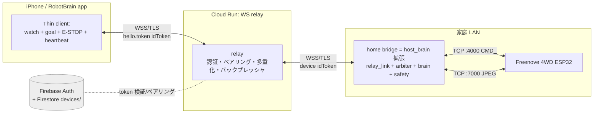

> **Note.** Some setup snippets below predate the shipped code. The authoritative implementation is [`relay/server.py`](relay/server.py) + [`host_brain/`](host_brain/): the relay gates on Firebase-token validity + a matching uid room (no email/password, no allowlist), the bridge authenticates with a **service-account custom token**, and the bridge entry point is `bridge_main.py`.

# クラウド遠隔操作 追補 (v1.2)

- **追補日**: 2026-07-24
- **対象**: 宅外(リモート)からの車体遠隔操作の追加。既存 LAN 動作(追補 v1.1)は一切壊さない。
- **位置づけ**: 本書は `REQUIREMENTS.md` および `DESIGN.md` への**Remote 専用追補**である。LAN 要件と番号衝突させないため、機能要件は `RFR-*`、非機能要件は `RNFR-*`、前提は `RAS-*`、対象外は `ROS-*` を用いる。
- **クラウド基盤**: GCP プロジェクト `YOUR-GCP-PROJECT`(番号 YOUR-PROJECT-NUMBER、アカウント you@example.com)+ Firebase Auth。推奨リージョン `asia-northeast1`(東京)。
- **基準コード**: `~/esp32-ai-robot/host_brain/` — `car_link.py`(`CommandLink`/`VideoLink`)、`safety.py`(`SafetyMonitor`)、`dispatcher.py`、`brain.py`(`Brain.decide`)、`main.py`(`brain_loop`/`goal_loop`/`arbiter_loop` アービタ)。これらは**そのまま再利用**でき、家ブリッジの土台になる。iOS 側の実装母体は `ios_app/`(`CarLink`/`RobotController`/`ContentView`/`Brain`/`Dispatcher`/`Discovery`、`project.yml`、`Info.plist`)。

## 採用トポロジ(前提)

`iPhone ⇔WSS(TLS)⇔ Cloud Run WebSocket リレー ⇔WSS(TLS)⇔ ホームブリッジ(host_brain 拡張・Python) ⇔LAN TCP⇔ 車体`。

**ESP32 は TLS/WS/カメラ処理が過負荷になるためクラウドへ直接接続しない。** TLS/WS の終端と既存 LAN コードの再利用は**家ブリッジ**が担う。リレーは Firebase Auth でフォンとブリッジ双方を認証し、**ペア済みの相手同士のみ**を中継する不透明フォワーダである。レイテンシは概念B(熟慮ループ)前提のため、リレー 1 ホップ分の追加遅延は許容範囲。

## 用語(本追補で追加)

- **ホームブリッジ(bridge)**: 宅内 LAN 上で常駐する `host_brain` 拡張プロセス。車体への LAN TCP を保持し、リレーへ WSS で常時接続する。車体への**唯一の書き込み者**(LAN 側 `RobotController` 相当の責務を引き継ぐ)。
- **リレー(relay)**: Cloud Run 上の WebSocket 中継。認証・ペアリング検証・フレーム転送のみを行い、`CMD_*` の意味は解さない不透明フォワーダ。
- **LAN モード / Remote モード**: アプリの接続方式。LAN=既存の直 TCP、Remote=リレー経由。**トグルは「トランスポート」と「脳の所在」を同時に切り替える**(§2-C 参照)。LAN=アプリ内 `Brain`(onDevice)+車に直結、Remote=ブリッジ経由(脳もブリッジ側、onBridge)。

---

# 1. 要件

## F1. 接続モードとトポロジ(機能)

- **RFR-1**: アプリは **LAN モード**(車体へ直 TCP／既存 `CarLink`・mDNS 経路)と **Remote モード**(リレー経由の WSS)の 2 方式を持ち、設定画面にモード切替トグルを設けること。選択したモードは永続化すること(`UserDefaults` キー `linkMode`、既定は `lan`)。切替時は既存接続を安全に閉じ(停止コマンド送出後にクローズ)てから新方式で再接続すること。
- **RFR-2**: Remote モードの経路は `iPhone ⇔WSS⇔ リレー ⇔WSS⇔ ブリッジ ⇔LAN TCP⇔ 車体` とすること。**ESP32 は一切クラウドへ直接接続しない**こと(TLS/WS/カメラ送出の負荷を車体に課さない)。`CMD_*`／カメラフレームはブリッジと車体の間の LAN TCP 上のみで直接授受し、リレーはその上位(ブリッジ⇔フォン間)を運ぶ。
- **RFR-3**: ホームブリッジは既存 `host_brain/`(LAN TCP で車体へ接続する CarLink 相当)を拡張して実装し、(a) 車体への LAN TCP :4000/:7000 を保持、(b) リレーへ Firebase トークンで認証した WSS を保持し自動再接続、(c) フォンからの遠隔コマンド／ゴールを LAN 側 `CMD_*` に落として車体へ送出、(d) 車体テレメトリ・映像プレビューをリレー経由でフォンへ返す、ことを担うこと。ブリッジは既存の LAN 側 `CMD_*` 変換・クランプ・安全反射ロジック(`dispatcher`／`safety`)を再利用すること。
- **RFR-4**: リレーは、Firebase Auth で認証され、かつ現行 MVP では同一 `uid` のフォンとブリッジのみを中継すること。未認証の接続に対して車体プロトコル(`CMD_*`／カメラ)を一切露出しないこと。Firestore `devices` による claim/unpair は Phase 2 とする。

## F2. ペアリング(アプリ ⇔ 1 台のホームブリッジ／車体)

- **RFR-5**: MVP では、アプリとホームブリッジは同一 Firebase `uid` で認証され、リレーの `uid -> {phone, bridge}` ルームで 1 台のブリッジ(＝ 1 台の車体)へ接続すること。
- **RFR-6**: claim / unpair / Firestore `devices/{deviceId}` / 複数端末閲覧や operator 排他ロックは Phase 2 の本番強化とし、MVP の必須受入から分離すること。

## F3. 遠隔ライブ映像・コマンド・AI ゴール

- **RFR-7**: Remote モードでも、LAN モードと同じ操縦 UX(全画面ライブ映像・所見表示・ゴール入力・STOP)を提供すること。映像はブリッジがリレー経由でフォンへ送るプレビューストリームとして表示すること(フレーム形式・解像度は §1-N の帯域予算に従い、必要に応じて LAN 実映像より低 fps／低画質に落としてよい)。
- **RFR-8**: Remote モードで、テキスト／音声によるゴール入力(FR-13〜17)と主要コマンド(頭部 `look`・表情・STOP・手動 `drive` 等)をリレー経由でブリッジへ送達し、ブリッジがそれを車体の `CMD_*` に変換して実行できること。生 `CMD_*` をフォンやリレーから直接送れない構造(意味コマンドのみを中継し、`CMD_*` への変換・クランプはブリッジが一手に担う)を維持すること。
- **RFR-9**: Remote モードにおける AI 頭脳(OpenAI Vision → `Intent` ループ)は**ホームブリッジ側で実行すること**(§2-C の設計判断)。この構成では認知ループ用の映像は宅内 LAN に留まり、フォンは「プレビューを見る／ゴールを与える／所見・状態・テレメトリを受け取る／即停止する」ためのシンクライアントとする。ブリッジが OpenAI を呼び、`observation`／`task_state`／実効 pan/tilt 等をリレー経由でフォンへ返すこと。

## F4. 遠隔緊急停止と「見えない走行」の安全

- **RFR-10**: Remote モードでも常時可視の STOP を提供し、押下でリレー経由の即時停止(ブリッジが `CMD_MOTOR#0#0#0` を送出)を実行すること。加えて、STOP はリレー往復や AI 判断に依存しない多重の安全網で担保すること: (a) ブリッジ側の**デッドマン**(フォンからのハートビート／意図更新が一定時間途絶したら車体を停止)、(b) 車体オンボードのデッドマン・切断時 stop-and-hold(HC-6)。リレー切断そのものがブリッジ側デッドマン発火→車体停止につながること。
- **RFR-11**: Remote モードではドライランを既定 ON とし、モーション実行には明示的な dry-run OFF/arm 確認を要すること。arm は「dry-run を OFF にする」だけであり、relay/operator/cmd/video/deadman/low-batt safety が引き続き上位で停止権限を持つこと。切断・STOP・モード切替・アプリ停止では自動 disarm（dry-run ON）へ戻すこと。

## F5. グレースフルフォールバックと再接続

- **RFR-12**: MVP の到達判定はユーザー選択の LAN/Remote トグルとする。自動 LAN 優先・宅外判定は Phase 2 とする。モード遷移は必ず一旦停止(現行駆動をクランプ／停止)を挟み、暴走なく行うこと。切替中・切替後の実効モードを UI に明示すること。
- **RFR-13**: リレー接続・ブリッジ接続・車体接続それぞれの状態(フォン⇔リレー、リレー⇔ブリッジ、ブリッジ⇔車体)を UI に可視化し、いずれかが切れた場合は自動再接続を試みること。フォン⇔リレー切断時はブリッジ側デッドマンにより車体が安全停止すること(RFR-10)。ブリッジ⇔車体切断時は車体のオンボード安全機構(HC-6)に委ね、アプリ／ブリッジは落ち着いて再接続すること。切断で駆動が継続しないことを設計要件とする。

## N1. 非機能要件(NFR)

### セキュリティ(必須)

- **RNFR-1**: フォン⇔リレー、リレー⇔ブリッジの全区間を **WSS/TLS** で暗号化すること。平文 WS／平文 TCP をクラウド経路に一切用いないこと。Cloud Run のマネージド証明書(HTTPS/WSS)を用い、証明書検証を無効化しないこと。
- **RNFR-2**: リレーはフォンとブリッジの**双方**を **Firebase Auth トークン**で認証すること。現行 MVP は WS 接続後の最初の JSON hello に `token` を含めて検証し、無効・失効トークンは close code 4003 で拒否する。将来強化では WS upgrade の `Authorization: Bearer` ヘッダへ移行してよい。
- **RNFR-3**: **ユーザー単位ペアリング**を強制し、MVP では同一 `uid` の相手にのみフレームを転送すること。未認証で車体プロトコルを露出しないこと。リレーは映像・コマンド等のメディアを永続化しない(透過中継のみ)こと。Firebase Auth トークン・ペアリング資格情報を URL クエリやログに出さないこと。
- **RNFR-4**: 車体への書き込みは**ブリッジのみ**(単一書き込み者)とし、リレーは `CMD_*` の意味を解さない不透明フォワーダに徹すること。リレー／ブリッジのサービスアカウント権限は最小権限(GCP プロジェクト `YOUR-GCP-PROJECT` 内、必要な Firebase/Run 権限のみ)とすること。

### 安全性(見えない走行)

- **RNFR-5**: 直接目視できない遠隔走行は LAN 監視付き運用より高リスクである前提に立ち、UI・既定値がその前提を損なわないこと(Remote 時ドライラン既定 ON、より保守的な速度上限、常時可視 STOP、映像途絶時停止)。停止はネットワーク往復や AI 判断に依存せず、車体オンボード＋ブリッジのデッドマンで最終担保すること(NFR-5 を遠隔多段構成へ拡張)。

### レイテンシと帯域

- **RNFR-6**: リレー経由プレビュー映像の帯域予算は **約 4 KB/フレーム × 12 fps ≈ 48 KB/s ≈ 384 kbps(下り、フォン方向)**を上限目安とすること。ゴール・コマンド・テレメトリ(上り／下りとも)はこれに比べ小さいこと。RFR-9(ブリッジ側 AI)により**認知ループのフレームはリレーを通さない**ため、リレーを流れる映像は人間監視用プレビューの 1 本に限定し、必要なら fps／画質を落として予算内に収めること(設計上は実測 2〜5 fps・0.1〜0.2 Mbps 程度までさらに間引く運用を推奨)。
- **RNFR-7**: 遠隔経路はリレー 1 ホップ分の追加遅延を許容する(熟慮的 concept-B ループのため許容範囲)こと。ただし STOP・デッドマンは往復遅延の影響を受けにくいよう、ブリッジ／車体側の局所安全機構で担保し(RNFR-5)、リレー遅延増大時も停止が遅延しない設計とすること。

### コスト

- **RNFR-8**: Cloud Run リレーは低コスト運用(小サイズ単一インスタンス、アイドル時スケールダウン、egress 最小化)とすること。個人利用 1 ペア前提で、常時接続 WSS を維持しつつ月額を最小化する構成(最小インスタンス数・並行数の適正化)を選ぶこと。RFR-9 により OpenAI 呼び出しの egress は宅内ブロードバンド側に寄せ、クラウド転送コストを抑えること。

### 可用性

- **RNFR-9**: リレーは単一リージョン運用でよい(個人利用前提)。リレーまたはブリッジが停止した場合、Remote 操作は不能となるが、(a) 同一 LAN 上では LAN モードが影響を受けず利用でき、(b) 遠隔経路喪失時は車体がブリッジ／オンボードのデッドマンで安全停止すること。可用性低下がフェイルセーフ(停止)側に倒れることを要件とする。

## 制約・前提(本追補)

- **RAS-1**: ホームブリッジは宅内 LAN 上で稼働(`host_brain` 拡張、Python)し、車体と同一 LAN・上流インターネットに接続していること。
- **RAS-2**: フォン・ブリッジは同一の Firebase `uid` で認証し、リレーは GCP プロジェクト `YOUR-GCP-PROJECT` にデプロイされていること。
- **ROS-1(対象外)**: 複数車体・複数ブリッジ・複数ユーザー共有、リレーのマルチリージョン冗長化、Remote 経路での高解像度／高 fps 映像は本追補の対象外。

---

# 2. アーキテクチャ(中継 ＋ 家ブリッジ)

## トポロジ(text/ASCII)

```
   ┌─────────────────────────────────────────────┐
   │  iPhone / RobotBrain app        （宅外・WWAN）│
   │  薄いクライアント:                            │
   │  watch(preview) + goal + E-STOP + heartbeat  │
   └───────────────────┬─────────────────────────┘
                       │  WSS / TLS
                       │  WSS + hello.token (Firebase ID token)
                       ▼
   ┌─────────────────────────────────────────────┐
   │  Cloud Run: WebSocket リレー (robot-relay)    │  asia-northeast1
   │  認証 / ペアリング検証 / 多重化 / 素通し       │  --max-instances 1
   │  → CMD_ を解釈しない不透明フォワーダ（土管）   │  --timeout 3600
   └───────────────────┬─────────────────────────┘
                       │  WSS / TLS
                       │  device ID token (Bearer)
                       ▼
   ┌─────────────────────────────────────────────┐
   │  家ブリッジ = host_brain 拡張 (Python)         │  （宅内 LAN）
   │  relay_link + arbiter + brain + safety         │
   │  ＝車体への唯一の書き込み者・脳の所在          │
   └───────────────────┬─────────────────────────┘
                       │  平文 TCP :4000 (CMD_)  ← LAN から出ない
                       │  平文 TCP :7000 (JPEG)  ← LAN から出ない
                       ▼
   ┌─────────────────────────────────────────────┐
   │  Freenove 4WD ESP32 車体                       │
   └─────────────────────────────────────────────┘

   Firebase Auth (+ Firestore devices/)
        └── token 検証 / ペアリング照合 ──▶ リレー
```

同じ構造を注記付きで示すと以下(mermaid):



## A. Cloud Run WebSocket 中継サーバ(relay)

役割は**土管**に徹する: 認証済みの同一オーナに属する 1 台の phone(群)と 1 台の bridge を突き合わせ、フレームを右から左へ流すだけ。車体プロトコル(`CMD_*`)を解釈しない・平文で露出しない。実装は Python(**FastAPI + `uvicorn`**、あるいは素の `websockets`)+ `firebase-admin`。理由: 家ブリッジと同一言語で保守を一本化でき、`verify_id_token` が Admin SDK で完結する。

### A.1 接続・認証ハンドシェイク(Firebase ID トークン検証)

- **現行 MVP のトークンの運び方**: WSS 接続後、最初の JSON フレームを hello として送り、`{"role":"phone"|"bridge","token":"<Firebase ID token>","room":"<dev room>"}` を含める。URL/クエリには**絶対に載せない**。`AUTH_DISABLED=1` のローカル検証時のみ `room` を使い、本番は検証済み `uid` を room とする。
  - phone: `RelayClient` が接続直後に fresh ID token を取得し、hello の `token` に入れる。
  - bridge: `relay_link.py` が `BridgeAuth.id_token()` から fresh ID token を取得し、hello の `token` に入れる。
- **検証**: relay は最初の hello 受信時に `auth.verify_id_token(token)` を実行する。失敗なら close code `4003` で拒否し、未認証を一切ブリッジしない。成功時、`uid` を取り出して `uid -> {phone, bridge}` に登録する。
- **将来強化**: WS upgrade の `Authorization: Bearer <Firebase ID token>` ヘッダ検証や、401/4401 での upgrade 拒否は Phase 2 の堅牢化として扱う。現行 MVP の受入基準は `hello.token` と close `4003`。
- **役割(role)**: `role="phone"` または `role="bridge"` を hello で宣言する。MVP では同一 `uid` がペアリングキー。本番では `deviceId` / `ownerUid` / `allowedUids` クレームへ拡張する。
- **トークン寿命**: Firebase ID トークンは約 1 時間で失効。phone は再接続ごとに fresh token を取得し、bridge は期限約 1 分前に更新する。55 分先回り再接続、指数バックオフ、ジッタは Phase 2 の堅牢化とする。

### A.2 ペアリングモデル(オーナ／部屋の対応付け)

段階に応じて 2 段構えとする(§6 実装計画で MVP→本番)。

**MVP(同一 uid ペアリング)**: ブリッジを**フォンと同一の Firebase アカウント**でサインインさせ、relay は同一 `uid` 同士を自動ペア。任意で `ALLOWED_UIDS` 許可リストを持つ。relay 内メモリレジストリは `uid -> {phone:ws, bridge:ws}`。

**本番(Firestore レジストリ)**: Firestore に最小のレジストリを持つ(relay 自体がステートフルなのは接続の間だけ)。

| コレクション/ドキュメント | フィールド | 用途 |
|---|---|---|
| `devices/{deviceId}` | `ownerUid`, `roomName`, `pairedAt`, `lastSeen`, `status`, `allowedUids[]`(任意で家族共有) | 1 ブリッジ = 1 デバイス。オーナと部屋名を保持 |
| `users/{uid}` | `defaultDeviceId` 等 | phone 側の既定ペア |

- **突き合わせ規則**: phone が `deviceId` を宣言 → relay は `devices/{deviceId}.ownerUid == phone.uid`(または `uid ∈ allowedUids`)を確認。bridge のクレーム `deviceId`/`ownerUid` と一致するときだけ両者を**同一ルームにブリッジ**。
- relay 内メモリレジストリ: `deviceId -> {bridgeConn, phoneConns:set}`。bridge は 1 本、phone は複数可(見るだけの家族端末を許すなら)。ただし**運動権限(goal/intent/heartbeat)は 1 端末に排他ロック**("operator" トークン)し、他は閲覧専用にする(二重操縦の暴走防止)。
- **部屋(room) = ペアリングキー**。将来の複数拠点は deviceId 単位ルーティングで自然にスケール(OS-9)。

### A.3 メッセージ多重化とフレーミング仕様(WebSocket)

1 本の WS 上で、WebSocket ネイティブの**テキスト/バイナリ両フレーム型**を使い分けて多重化する。

**テキストフレーム = 制御／コマンド／テレメトリ(JSON、小)**。type タグ付き(本仕様の正準キーは `t`。アプリ側コードで用いる `type` は同一フィールドの別名):

| `t` (=`type`) | 向き | ペイロード | 備考 |
|---|---|---|---|
| `hello` | phone→relay | `{deviceId, kind}` | 接続直後の宣言(本番の deviceId ルーティング用。MVP は同一 uid のため省略可) |
| `goal` | phone→…→bridge | `{text}` | 概念B のゴール(音声はアプリで STT 済みテキスト) |
| `intent` | phone→…→bridge | `{throttle, steer, duration_ms, look?}` | 任意の手動ナッジ。**意味値のみ**(生 `CMD_` は送らせない) |
| `estop` | phone→…→bridge | `{on?}` | リモート緊急停止(最優先)。`on` 省略時は即停止 |
| `arm` / `disarm` | phone→…→bridge | — | dry-run 解除／再武装(セッション毎、既定 disarm)。`dryrun {on:false/true}` と等価 |
| `dryrun` | phone→…→bridge | `{on}` | dry-run フラグ切替(`arm`/`disarm` の明示形) |
| `speedcap` | phone→…→bridge | `{v}` | リモート速度上限(LAN より低い既定) |
| `heartbeat` (別名 `deadman`) | phone→…→bridge | `{seq}` または `{ts}` | 操作者デッドマン。~2〜10 Hz(アプリは ~2 Hz 監督送出。仕様上 5〜10 Hz まで許容)。途絶で bridge が STOP |
| `telemetry` | bridge→…→phone | `{voltage, taskState, pan, tilt, observation, safetyReason, camAge}` | 状態ピル／思考表示 |
| `observation` | bridge→…→phone | `{text, task_state}` | AI 所見(`telemetry` に同梱しても可) |
| `status` | relay→both | `{peerUp, cold, ...}` | 相手の接続状態 |

**バイナリフレーム = カメラ(生 JPEG)**。WS がメッセージ境界を持つので、TCP :7000 の **4 バイト長プレフィクスは家ブリッジで剥がす**(§B.4)。代わりに 5 バイトの小ヘッダを付す(正準形):

```
byte0      : channel   (0x01 = video JPEG)
byte1..4   : uint32 LE  frame seq(または送出 ms 下位) — 遅延/失効判定用
byte5..    : JPEG payload(再エンコードしない生バイト)
```

- phone 側は seq で古いフレームを判定・破棄でき、`VideoLink` の「最新フレームのみ」意味論をエンドツーエンドで維持する。将来別ストリーム(例: 深度可視化)を足しても channel で多重化可能。
- phone は復号前にこの 5 バイトを剥がしてから `UIImage(data:)` に渡す。**MVP では 5 バイトヘッダを省き生 JPEG のみを送る簡略形**も可(seq 失効判定は省略)。本番では 5 バイトヘッダを標準とする。

### A.4 バックプレッシャ・再接続・keepalive

- **バックプレッシャ(映像は捨てる、制御は捨てない)**:
  - 映像(bridge→phone)は **latest-wins**。relay/bridge とも送信キュー長 1。`transport` の書き込みバッファが高水位(例 > 256 KB)なら**そのフレームをスキップ**して読み側を絶対にブロックしない。`host_brain` の `VideoLink`(バックログを持たない設計)と同じ思想。
  - コマンド／estop／heartbeat(小・順序保証必須)は**別方向 or 優先**扱い。実運用では映像は下り、コマンドは上りなので**方向分離だけで HOL ブロッキングはほぼ解消**する。厳密な分離が必要になったら「制御 WS」+「メディア WS」の 2 本構成へ拡張(Cloud Run 課金は増える。当面は 1 本推奨)。
- **keepalive**: relay は両ピアに WS ping を ~20s 間隔。pong 欠落で早期に相手断を検知 → 相手側に `peer{up:false}` を通知。**bridge は上り断／heartbeat 断を検知したら即 STOP + disarm**(リモートデッドマン)。
- **再接続**: MVP の phone は切断から 2 秒後に再接続し、再接続ごとに fresh token を取り直す。bridge は token を期限約 1 分前に更新しつつ再接続する。指数バックオフ + ジッタ、seq 付き goal/estop 再送、Firestore ステート再構成は Phase 2 の堅牢化。

### A.5 Cloud Run 固有事項

- **WebSocket 対応**: Cloud Run は HTTP/1.1 Upgrade による WS をサポート(ストリーミング応答)。ingress は「all」(公開)だが**認証はアプリ層(Firebase)**で行う。MVP は upgrade 後の hello で認証し、未認証なら即 close する。
- **リクエストタイムアウト = WS 寿命の上限**: 長寿命 WS は 1 リクエスト扱いで、**最大 60 分**(`--timeout=3600`)。MVP は切断時再接続で復旧する。**~55 分で先回りグレースフル再接続**は Phase 2 の堅牢化とする。
- **同一インスタンス共存(最重要)**: relay はプロセス内で 2 ピアを突き合わせるため、phone と bridge が**同一インスタンスに乗る必要**がある。単一家庭・単一ブリッジなら **`--max-instances=1` に固定**すれば全接続が 1 インスタンスに集約され、確実に共存する(セッションアフィニティ不要)。
- **scale-to-zero vs min-instances**:
  - 推奨初期値: **`min-instances=0` + `max-instances=1`**。アイドル時ゼロで課金最小、かつ max=1 で共存も保証。初回接続はコールドスタート(~1〜3s)。
  - コールドスタートの体感やデッドマン復帰を嫌うなら **`min-instances=1`** へ。常時 1 インスタンス分の費用が乗る(WS は継続リクエストなので接続中は CPU が割り当て・課金される)。**安全上の STOP はブリッジ側で完結**するため、コールドスタートが安全性を損なうことはない(min=0 で可)。
  - 将来の複数拠点／HA: max>1 が必要になったら**プロセス内突き合わせを外部化**(Memorystore(Redis) pub/sub か Pub/Sub、または deviceId 単位ルーティング + セッションアフィニティ)。v1.2 では単一家庭前提で max=1(OS-9)。
- その他: `--concurrency` は既定で十分(1 家庭、実値 80 で運用)。CPU/メモリは小(256〜512 MiB)。TLS は Cloud Run のマネージド証明書で終端(phone↔relay、bridge↔relay とも WSS)。

## B. 家ブリッジ(`host_brain` 拡張)

### B.1 既存モジュールの再利用マップ

| モジュール(host_brain) | v1.2 での扱い | 変更点 |
|---|---|---|
| `car_link.py` `CommandLink` | **そのまま再利用**。:4000 の唯一のライタ | なし |
| `car_link.py` `VideoLink` | **再利用 + 微修正** | 生 JPEG バイトを保持するフィールド追加(§B.4) |
| `safety.py` `SafetyMonitor` | **再利用 + 拡張** | リモート起因の停止理由を追加(§D) |
| `dispatcher.py` | **完全に不変(クランプの砦)** | なし。リモート指令も必ずここを通す |
| `brain.py` `Brain.decide` | **再利用**(Remote 時はブリッジが頭脳、§C) | なし(プロンプト/JSON 契約はアプリと共通) |
| `main.py` `arbiter_loop` | **再利用 + 拡張**。単一ライタを維持 | relay 由来 intent を安全経由で降下 |

### B.2 新規モジュール `relay_link.py`(アウトバウンド WSS クライアント)

- Python `websockets`(または `aiohttp`)で relay へ **WSS を 1 本**張り、自動再接続(`CommandLink.run()` のリトライ構造を踏襲)。
- 受信テキスト `goal`/`intent`/`estop`/`arm`/`dryrun`/`speedcap`/`heartbeat` を**セマンティックのまま**処理し、`goal_loop`/`brain_loop`/`arbiter_loop` と同じ経路に注入する。**生 `CMD_` は受け付けない**(受け取っても破棄)。これにより「認証済みでも車体プロトコルを生で露出しない」を担保。
- `intent`(手動ナッジ)は `dispatcher.drive/look` を通し、`speed_cap`・デッドゾーン・tilt クランプが必ず効く。
- 送信: `telemetry`(電圧・taskState・pan/tilt・observation・safetyReason・camAge)と**バイナリ映像**(§B.4)。
- `main.py` の `asyncio.gather` に `relay_link.run()` と映像フォワードタスクを追加するだけで統合できる(既存イベントループに同居)。エントリは拡張 `main.py`、あるいは薄い `bridge_main.py`(§4-C.6)のいずれでもよい。

### B.3 デバイスとしての認証(bridge のアイデンティティ)

段階に応じて 2 方式(§6 で MVP→本番)。

**MVP(Email/Password 専用アカウント)**: ヘッドレスなブリッジは Apple サインイン不可のため、専用の Email/Password アカウントで Identity Toolkit REST `signInWithPassword` を叩き **ID トークン + リフレッシュトークン**を取得・更新。env に `FIREBASE_EMAIL` / `FIREBASE_PASSWORD` / `FIREBASE_WEB_API_KEY`。

**本番(カスタムトークン + deviceId クレーム)**:
- **プロビジョニング**(1 回): オーナ端末(サインイン済み)が Callable Cloud Function `provisionDevice` を呼ぶ → `devices/{deviceId}` を `ownerUid` 付きで作成し、**Firebase カスタムトークン**(クレーム `{role:"bridge", deviceId, ownerUid}`)を発行。
- **ブリッジ側**: カスタムトークンを Identity Toolkit REST(`signInWithCustomToken`)で **ID トークン + リフレッシュトークン**に交換して保存。以後はリフレッシュトークンで ID トークンを更新し、WS ハンドシェイクに添付。
- **秘匿情報の扱い**: リフレッシュトークンはサービスアカウント鍵をベタ置きするより安全。`config.toml` にベタ書きせず、**環境変数 or OS キーチェーン**に格納(既存の「API キーは env、ハードコードしない」方針と一致)。
- **config 追加**:
  ```toml
  [relay]
  url              = "wss://<cloud-run-host>/ws/bridge"
  device_id        = "rover-livingroom-01"
  cred_env         = "ROBOTBRAIN_DEVICE_REFRESH"   # リフレッシュトークンを持つ env 名(本番)
  remote_speed_cap = 1800    # リモートは LAN より控えめに(任意)
  ```
  秘密(リフレッシュトークン／パスワード／OpenAI キー)は env/キーチェーン、非秘密設定(url/device_id/remote_speed_cap)は `config.toml` に置く。

### B.4 映像フォワード(再エンコードなし)

- 現状 `VideoLink` は `cv2.imdecode` で BGR に復号し、**元 JPEG バイトを捨てている**。フォワード用に **復号前の `buf` を `latest_jpeg`(+ seq/ts)として保持**する 1 行追加を行う。
- フォワードタスクは `latest_jpeg` を §A.3 のバイナリフレーム(5 バイトヘッダ + JPEG)として relay へ送出。**再エンコードしない**(CPU 節約・画質維持)。
- Remote で頭脳がブリッジ側の場合、BGR 復号は `brain.decide` が必要とするので継続。頭脳がアプリ側の運用(非推奨、§C)では復号をスキップして純フォワードにでき、CPU をさらに節約できる(config フラグで切替)。
- 見る用ストリームは**知覚レートと独立に間引ける**(例: 送出上限 fps・JPEG 品質を relay/bridge 側で絞る、実測 2〜5 fps)。宅内アップリンクとユーザのモバイル通信量を守るための重要ポイント(RNFR-6)。

### B.5 アービタ単一ライタの堅持

`arbiter_loop` は引き続き **:4000 への唯一のライタ**。リモート由来の `goal`/`intent` も、ローカルの `brain_loop`/`goal_loop` とまったく同じく `SafetyMonitor.want_stop()`・`dry_run`・`speed_cap`・パルス自己満了を経由してから降下する。リモートだからといってバイパス経路を作らない(暴走面の最小化)。

## C. 設計判断: Remote 時、脳はどこで動くか

**結論: Remote モードでは脳をホームブリッジで走らせる(案B)。アプリはシンクライアント(監督者)になる。** LAN モードは従来どおりアプリ内 `Brain`(案A = onDevice)。

| 観点 | 案A アプリ内脳(映像が phone↔雲を往復) | **案B ブリッジ脳(推奨)** |
|---|---|---|
| **帯域** | 車→ブリッジ→雲→電話(下り)で**知覚レート全フレーム**(240×176 JPEG ≈ 5〜15 KB × 10〜15 fps ≈ 0.5〜1.5 Mbps)を宅内アップリンク+電話下りに流し続ける。判断フレームも上り往復。 | 知覚フレームは**車↔ブリッジの LAN 内(ms)**に留まる。雲へ出るのは**間引いた閲覧用プレビュー**(2〜5 fps ≈ 0.1〜0.2 Mbps、RNFR-6 予算内)+ 小さなテキストのみ。OpenAI 呼び出しはブリッジ→OpenAI 直(宅内固定回線、モバイル従量を使わない)。 |
| **レイテンシ / 安全** | 知覚→判断→駆動の閉ループが WWAN を 2 回横断(+150〜600 ms)。0.7 Hz 判断ごとにフレーム下り+`Intent` 上りが 2 回クラウドを横断。`vision_stale_ms=800` / `deadman_ms=500` の予算を食い潰し、常時セーフティ停止に陥りやすい。phone/回線の瞬断で走行中の車が宙ぶらりん。 | **タイトな制御ループは完全に LAN ローカル**(車↔ブリッジ↔OpenAI、高速・決定的)。WWAN を渡るのは緩い「人間の監督ループ」(プレビュー+e-stop+heartbeat)だけ。停止権限(デッドマン/estop/vision-stale)が**車の最寄り**に同居 → 見えない相手を止める確実性が高い。監督リンク断は安全側(ブリッジ deadman が停止)。 |
| **コスト** | Cloud Run 下り egress が全映像分に膨らむ(課金増)。全フレームが宅内上り+モバイル下り。 | プレビューのみ → egress 最小。OpenAI キーはブリッジに 1 つ(アプリに同梱しない)。API 呼び出しは宅内ブロードバンドから。 |
| **単純性 / 再利用** | アプリ内 `Brain.swift` 再利用(RobotController 無改修)だが、頭脳を Swift と Python で**二重保守**。 | **`host_brain` の `brain.py`+`safety.py`+arbiter を丸ごと再利用**。既存の検証済み制御コードがそのままリモート経路になる。実装・プロンプト・プロバイダ設定を一本化。認知ループの Python 化が初期コスト(ただし `host_brain` は既に Python)。 |

案B は「ESP32 をクラウドに直結させない／ブリッジで `host_brain` を再利用する」という本プロジェクトの前提と完全に一致する。案A は「Brain/RobotController 無改修」を満たすが帯域・安全で不利。

**帰結と割り切り**: これで LAN=アプリ脳(Swift)、Remote=ブリッジ脳(Python)の**2 実装**が併存する。両者は**同一の `SYSTEM_PROMPT`・`Intent` JSON スキーマ**を共有して契約を一致させる。案A は将来のフォールバックとして transport 抽象化(§3-B-2)の中に温存する。将来的には LAN でもアプリを常にブリッジのクライアントにして脳をブリッジへ一本化する(`Brain.swift` を撤去)のが理想だが、変更が大きいため v1.2 の範囲外。v1.2 は LAN/Remote トグルが「トランスポート + 脳の所在」を切り替える形にとどめる。

---

# 3. アプリ改修

**既存 LAN 動作(追補 v1.1)は一切壊さない。** `CarLink` の公開 API を保ったまま内部を transport 差し替え式にし、`RobotController`/`Brain` の制御ループ・アービタ・安全ロジックは §B-4 の `brainSite` ゲート以外**無改修**とする。

## B-1. モード列挙 + Settings トグル + ステータス

```swift
enum LinkMode: String, Codable { case lan, remote }   // Settings のトグル
enum BrainSite { case onDevice, onBridge }            // lan→onDevice, remote→onBridge(既定)
```

- `RobotController` に `@Published var linkMode: LinkMode { didSet { save(...) } }`(既定 `.lan`)を追加。`ConfigView` の車体セクションに `Picker("settings.linkMode", selection: $ctl.linkMode)`(LAN / Remote)を追加。
- ステータスピル(`statusPill`)にモードバッジを追加: `LAN` / `REMOTE`。リモート時は色を変え、`DRY` バッジと併せ「見えない車を動かしている」ことを常時明示。
- 新規ローカライズキー(両 `.strings` に対で): `settings.linkMode` / `mode.lan` / `mode.remote` / `settings.section.account` / `account.signIn` / `account.signOut` / `account.signedInAs` / `status.remoteConnecting` / `status.remoteLinkDown` / `safety.operatorLinkLost`。

## B-2. Transport 抽象化(CarLink の公開 API は不変)

`CarLink` の現行公開面 — `connect(host:)` / `stop()` / `send(_:)` / `onCommandReady` / `@Published image, lastFrameAt, cmdConnected, camConnected, voltage` — をそのまま保ち、内部を transport 差し替え式にする。

```swift
protocol CarTransport: AnyObject {
    func start()
    func stop()
    func send(_ line: String)           // CMD_ 文字列(LAN/案A)or 制御 JSON(案B)
    var onReady: (() -> Void)? { get set }         // → CarLink.onCommandReady に橋渡し
    var onFrame: ((UIImage) -> Void)? { get set }  // → CarLink.image
    var onReply: ((String) -> Void)? { get set }   // → parseReplies(CMD_POWER 等/telemetry)
    var cmdUp: Bool { get }
    var camUp: Bool { get }
}
```

- **`LANTransport`**: 現行 `CarLink` の TCP :4000/:7000 実装をそのまま移設(挙動同一・追補 v1.1 の mDNS 発見も温存)。
- **`RelayTransport`**: `URLSessionWebSocketTask` で単一 WSS をリレーに張る。多重化は WS メッセージ型で demux —
  - `.string`(JSON) = 制御プレーン/テレメトリ/observation
  - `.data`(バイナリ) = プレビュー JPEG フレーム(5 バイトヘッダを剥がして `UIImage(data:)`)
  - 現行 MVP は接続直後の hello JSON に `token` を含めて認証する。将来強化では `Authorization: Bearer <FirebaseIDToken>` ヘッダへ移行できる。どちらの場合も URL クエリにトークンを載せない。
- `CarLink` は `linkMode`(と Firebase トークンプロバイダ)を受けて `connect()` で適切な transport を生成。`send/image/cmdConnected/...` はどちらでも同一に動く。→ これで**案A(CMD_ をそのままトンネル)は追加コストほぼゼロで成立**し、RobotController 無改修フォールバックになる。

## B-3. Firebase Auth サインイン + トークン保管

- SwiftUI に `AuthStore`(ObservableObject)を追加。**Sign in with Apple(ネイティブ `ASAuthorizationController` + Firebase `OAuthProvider`/nonce)を主、Email/Password を副**とする。サインイン状態を `RobotBrainApp` 起動時に `FirebaseApp.configure()` で復元。
- **ID トークンは Keychain に保管**(§8 の平文 UserDefaults より強い扱い。トークンは資格情報なので Keychain 必須)。`Auth.auth().currentUser?.getIDToken()` は期限(1h)前に自動更新 → `RelayClient` は接続直前にトークンを取り直して hello に載せる。定期的な先回り再接続は Phase 2。
- 未サインイン時はリモートモードを選べない/接続しない(車プロトコルを無認証で晒さない)。`ConfigView` に Account セクション(サインイン/サインアウト、`account.signedInAs`)。
- XcodeGen(`project.yml`)追加:
  ```yaml
  packages:
    Firebase: { url: https://github.com/firebase/firebase-ios-sdk, from: "11.0.0" }
  targets:
    RobotBrain:
      dependencies:
        - { package: Firebase, product: FirebaseAuth }
      entitlements:
        path: RobotBrain.entitlements
        properties:
          com.apple.developer.applesignin: [Default]
  ```
  `GoogleService-Info.plist`(Firebase コンソールで bundle id `com.example.robotbrainai` を登録して取得)を `ios_app/` に置く。**`.gitignore` に追加**(API 情報を含むため)。

## B-4. 案B のシンクライアント動作(RobotController の限定改修)

`brainSite == .onBridge`(= リモート)時のみ:
- `maybeDecide()` は即 return(アプリ内脳を止める。脳はブリッジ)。
- モーター arbiter は `CMD_` を出さない(モーター権限はブリッジ)。代わりに `setGoal`/`emergencyStop`/`dryRun`/`speedCap` は**制御メッセージ**として送信。`car.image` はプレビュー、`car.voltage`/`curPan`/`report`/`taskState`/`statusKey` はブリッジからのテレメトリ/observation で更新。
- **監督デッドマン**: 電話は ~2 Hz で `heartbeat`(=`deadman`)を送る。ブリッジは「新鮮な操作者ハートビート」が無い間は駆動を許可しない(`safety.operatorLinkLost`)。既存のローカル deadman/vision-stale/low-batt(`safety.py`)はブリッジで従来どおり作動。

**電話↔ブリッジ プロトコル(WSS 上、リレーは素通し)** — §2-A.3 の正準フレーミングに準拠。MVP の最小セット:

```
Phone → Bridge : {"t":"goal","text":...} | {"t":"estop","on":bool}
                 {"t":"dryrun","on":bool} | {"t":"speedcap","v":int}
                 {"t":"heartbeat","seq":...}  (~2Hz, 別名 deadman)
Bridge → Phone : <binary JPEG preview>  (2–5fps, 5バイトヘッダ付/任意で縮小)
                 {"t":"telemetry","voltage":..,"pan":..,"tilt":..,"safety":".."}
                 {"t":"observation","text":..,"task_state":..}
```

## B-5. モード切替のグレースフルさ

- 切替時: 現 transport を `stop()`(必ず `CMD_MOTOR#0#0#0` 相当で車を停止)→ dry-run を強制 ON に戻す(FR-39/47、起動時と同じ安全既定)→ 新 transport で `connect()`。
- リモート接続の状態表示: `status.remoteConnecting` → 接続確立 → `status.driving/hold`。WSS 断は `status.remoteLinkDown`(かつブリッジ側 deadman で車は自律停止)。
- LAN に戻すとブリッジ不要で従来スタンドアロン動作(アプリ内脳)。

## B-6. リモート運用の安全(必須・見えない車を動かす)

dry-run 既定 ON(毎起動リセット)/ 常設リモート e-stop(即時制御メッセージ + WSS 断でブリッジ自律停止)/ 二重デッドマン(操作者ハートビート + ローカル intent 鮮度)/ vision-stale・low-batt はブリッジローカル反射 / リモート時は `speedCap` を低めの既定に / dry-run 解除は毎セッション明示操作を要求 / REMOTE+DRY バッジ常時表示。

---

# 4. GCP デプロイ手順(`YOUR-GCP-PROJECT`)

## C-1. リレーコンテナ(Cloud Run, Python)

役割: 両ピアを Firebase ID トークンで認証し、**同一 `uid`(=ペア)同士だけ**をバイト単位で素通しブリッジ。生の `CMD_` TCP はクラウドに一切出さない(ブリッジで終端)。トークン無し接続は即拒否 → 無認証で車プロトコルを晒さない。

`relay/main.py`(FastAPI + WebSocket, MVP スケッチ):
```python
import os, asyncio
from fastapi import FastAPI, WebSocket, WebSocketDisconnect
import firebase_admin; from firebase_admin import auth
firebase_admin.initialize_app()          # Cloud Run 上は ADC で projectId 自動検出
app = FastAPI(); rooms: dict[str, dict] = {}   # uid -> {"phone":ws,"bridge":ws}
ALLOWED = set(filter(None, os.getenv("ALLOWED_UIDS","").split(",")))

@app.websocket("/ws/{role}")             # role = phone | bridge
async def ws(sock: WebSocket, role: str):
    tok = (sock.headers.get("authorization","")).removeprefix("Bearer ").strip()
    try:
        uid = auth.verify_id_token(tok)["uid"]        # 署名/aud/iss を検証
    except Exception:
        await sock.close(code=4401); return
    if ALLOWED and uid not in ALLOWED:
        await sock.close(code=4403); return
    await sock.accept()
    room = rooms.setdefault(uid, {}); room[role] = sock
    try:
        while True:
            msg = await sock.receive()               # text or bytes
            peer = room.get("bridge" if role=="phone" else "phone")
            if not peer: continue
            if "text" in msg and msg["text"] is not None:
                await peer.send_text(msg["text"])
            elif msg.get("bytes") is not None:
                await peer.send_bytes(msg["bytes"])
    except WebSocketDisconnect:
        room.pop(role, None)
```
`requirements.txt`: `fastapi`, `uvicorn[standard]`, `firebase-admin`。起動: `uvicorn main:app --host 0.0.0.0 --port 8080`。

**重要:** Cloud Run はマルチインスタンスだと両ピアが別インスタンスに着地し得る。個人利用(単一ペア)は **`--max-instances 1`** で確実に同居させる(セッションアフィニティ不要)。トークン検証は同一 GCP プロジェクトなら ADC で projectId 自動検出でき、**リレー側にシークレット鍵ファイル不要**。

## C-2. gcloud デプロイ手順

```bash
gcloud config set project YOUR-GCP-PROJECT
gcloud services enable run.googleapis.com cloudbuild.googleapis.com \
  artifactregistry.googleapis.com identitytoolkit.googleapis.com

# ソースから直接デプロイ(Cloud Build が自動ビルド)。東京リージョン。
gcloud run deploy robot-relay \
  --source ./relay --region asia-northeast1 --port 8080 \
  --allow-unauthenticated \        # ← IAM 層は開放。認証は Firebase トークン(アプリ層)で担保
  --timeout 3600 \                 # WS は長寿命リクエスト。最大 60 分
  --min-instances 0 --max-instances 1 --concurrency 80 \
  --cpu 1 --memory 256Mi \
  --set-env-vars "ALLOWED_UIDS=<phone/bridge の uid>"
```
- `--allow-unauthenticated` は必須(電話/ブリッジは IAM 資格を持てない)。その代わり**必ずアプリ層 Firebase 検証で門番**する。
- 返る URL 例 `https://robot-relay-xxxx.a.run.app` → アプリ/ブリッジは `wss://robot-relay-xxxx.a.run.app/ws/phone`(または `/ws/bridge`)。
- デプロイは cloud-run MCP または上記 `gcloud run deploy`(コンテナに `firebase-admin` 同梱)。

## C-3. Firebase Auth セットアップ

1. Firebase コンソールで既存 GCP プロジェクト `YOUR-GCP-PROJECT` を「Firebase に追加」。
2. Authentication を有効化。プロバイダ:
   - **Email/Password**(ブリッジ用の専用アカウントに使う。ヘッドレスは Apple サインイン不可)。
   - **Apple**(電話用。Apple Developer で Services ID・Team ID・Key ID・.p8 秘密鍵を作成しコンソールに登録。ネイティブ Sign in with Apple は nonce 必須)。
3. iOS アプリ(bundle `com.example.robotbrainai`)を登録し `GoogleService-Info.plist` を取得。
4. **ペアリング(最小構成 = MVP)**: ブリッジを**電話と同一の Firebase アカウント**でサインインさせる → リレーは同一 `uid` 同士を自動ペア。本番では `devices/{deviceId}` + Callable `provisionDevice`(カスタムトークン)へ移行し、メッセージに `deviceId`/ペアコードを足す。

## C-4. 環境変数 / シークレット

| 場所 | 値 | 保管 |
|---|---|---|
| リレー(Cloud Run) | `ALLOWED_UIDS`(任意の許可リスト) | env var。**鍵ファイル不要**(ADC でトークン検証) |
| ブリッジ(自宅) | `OPENAI_API_KEY` | `.env`/Keychain、`chmod 600`。リポジトリ/アプリに置かない |
| ブリッジ | Firebase ブリッジアカウントの email/password + Web API キー | 同上。REST `signInWithPassword` で idToken+refreshToken 取得・更新 |
| ブリッジ | `RELAY_WSS_URL` | `wss://robot-relay-xxxx.a.run.app/ws/bridge` |
| アプリ | Firebase 設定 | `GoogleService-Info.plist`(git 無視)。ID トークンは Keychain |

Firebase Web API キーはアプリに埋まる公開値で秘密ではない。**真に秘密なのはブリッジアカウントのパスワードと OpenAI キーだけ** → 自宅側にのみ置く。

## C-5. 概算コスト(個人利用)

Cloud Run 無料枠(月): 180,000 vCPU 秒 / 360,000 GiB 秒 / 200 万リクエスト。Firebase Auth(Spark)無料。Artifact Registry・Cloud Build はほぼ無視できる(<$0.1)。

| 利用形態 | 月額目安 |
|---|---|
| **オンデマンド**(リモート運転時だけブリッジが WSS 接続、例 ~20h/月) | vCPU ≈ 72,000 秒 → **無料枠内**。プレビュー egress ~1〜2 GB ≈ $0.1〜0.2。→ **実質 $0〜1** |
| 常時接続(ブリッジが 24/7 WSS 保持) | 1 vCPU 常時 ≈ 2.59M 秒 − 無料枠 → **約 $55〜65/月**(`--cpu 0.5` で ~$29)。非推奨 |

**推奨: ブリッジはリモートセッション時のみ接続**(WS を保持し続けると常時 1 インスタンス課金になるため)。オンデマンドなら概ね無料枠内。OpenAI 利用料は別建て(従来どおり、ブリッジ側で発生)。

## C-6. ホームブリッジの実装・登録・常駐

**実装**: `host_brain/` に `bridge_main.py` を新規追加(あるいは `main.py` を拡張)。既存 `car_link.py`/`brain.py`/`safety.py`/`dispatcher.py` と `main.py` の `brain_loop`/`arbiter_loop` を**そのまま再利用**し、上に WSS I/O 層(`relay_link.py`)を足すだけ:
- リレーへ `wss://.../ws/bridge` を張る(Firebase REST でトークン取得 → hello JSON の `token`)。
- 受信: `goal`→`st.goal`、`estop`→`st.estop`、`dryrun`→`cfg["brain"]["dry_run"]`、`heartbeat`/`deadman`→操作者ハートビート更新。
- 送信: `video.frame` を JPEG 縮小して 2〜5 fps でバイナリ送出、`safety.want_stop()`/voltage/pan/tilt を `telemetry`、`intent.report` を `observation`。
- `safety.py` に**操作者ハートビート監視**(`operator_link_lost`)を 1 条追加 → 監督リンク断で駆動不可。dry-run 既定 ON、ローカル反射(deadman/vision-stale/low-batt)は不変。
- 依存追加(`requirements.txt`): `websockets`(または `aiohttp`)+ `requests`(Firebase REST)。

**Mac 常駐(launchd)** — `~/Library/LaunchAgents/com.example.robotbrain-bridge.plist`:
```xml
<?xml version="1.0" encoding="UTF-8"?>
<!DOCTYPE plist PUBLIC "-//Apple//DTD PLIST 1.0//EN" "http://www.apple.com/DTDs/PropertyList-1.0.dtd">
<plist version="1.0"><dict>
  <key>Label</key><string>com.example.robotbrain-bridge</string>
  <key>ProgramArguments</key>
  <array>
    <string>~/esp32-ai-robot/host_brain/.venv/bin/python3</string>
    <string>~/esp32-ai-robot/host_brain/bridge_main.py</string>
  </array>
  <key>EnvironmentVariables</key><dict>
    <key>OPENAI_API_KEY</key><string>sk-...</string>
    <key>RELAY_WSS_URL</key><string>wss://robot-relay-xxxx.a.run.app/ws/bridge</string>
    <key>FIREBASE_EMAIL</key><string>bridge@...</string>
    <key>FIREBASE_PASSWORD</key><string>...</string>
    <key>FIREBASE_WEB_API_KEY</key><string>AIza...</string>
  </dict>
  <key>RunAtLoad</key><true/>
  <key>KeepAlive</key><true/>   <!-- オンデマンド運用なら false + 手動 launchctl kickstart -->
  <key>StandardOutPath</key><string>/tmp/robotbrain-bridge.log</string>
  <key>StandardErrorPath</key><string>/tmp/robotbrain-bridge.err</string>
</dict></plist>
```
`launchctl load ~/Library/LaunchAgents/com.example.robotbrain-bridge.plist`。オンデマンド運用は `KeepAlive=false` にして、遠隔運転前に `launchctl kickstart -k gui/$(id -u)/com.example.robotbrain-bridge` で起動(コスト最小化)。plist は 600 権限で(パスワードを含むため)。

**Raspberry Pi 常駐(systemd)** — `/etc/systemd/system/robotbrain-bridge.service`:
```ini
[Unit]
Description=RobotBrain home bridge
After=network-online.target
[Service]
WorkingDirectory=/home/pi/esp32-ai-robot/host_brain
EnvironmentFile=/home/pi/esp32-ai-robot/host_brain/.env   # 600, OPENAI/FIREBASE/RELAY を格納
ExecStart=/home/pi/esp32-ai-robot/host_brain/.venv/bin/python3 bridge_main.py
Restart=always
RestartSec=3
[Install]
WantedBy=multi-user.target
```
`sudo systemctl enable --now robotbrain-bridge`。Node 派の pm2 を使う場合は `pm2 start bridge_main.py --interpreter python3 --name robotbrain-bridge && pm2 save && pm2 startup`(ただし本ブリッジは Python なので launchd/systemd が素直)。

---

# 5. セキュリティ(§8 を継承・拡張)

- **端から端まで WSS/TLS**(RNFR-1): 電話↔Cloud Run(TLS 終端は Google)/ Cloud Run↔ブリッジ(WSS)。生 `CMD_` TCP :4000/:7000 は**宅内 LAN から出ない**(ブリッジで終端)。Cloud Run マネージド証明書を用い、証明書検証を無効化しない。
- **無認証で車を晒さない**(RNFR-2/3): リレーは Firebase ID トークン未検証の接続を close 4003 で拒否する。両ピア(phone・bridge)を Admin SDK `verify_id_token` で検証。MVP は**同一 `uid`(ペア)のみ**ブリッジし、本番は `devices/{deviceId}.ownerUid == phone.uid` または `allowedUids` へ拡張する。IAM は開放だがアプリ層で門番。任意で `ALLOWED_UIDS`。
- **トークンは URL に載せない**(RNFR-3): MVP は hello JSON の `token`、将来は WS ハンドシェイクの `Authorization: Bearer` ヘッダ。どちらも URL クエリには載せない。iOS は Keychain 保管、ブリッジはサービスアカウント鍵 + Firebase Web API key を 600 権限の設定/Keychain へ置く。ログは token を redaction。
- **車体プロトコルの非露出**(RNFR-4): リレーは `CMD_*` を解釈しない不透明フォワーダ。ブリッジは**意味メッセージのみ**受理し `dispatcher` のクランプを必ず通す(認証済みでも生ワイヤは送らせない)。車体への書き込みはブリッジのみ(単一書き込み者)。リレーはメディアを永続化しない(透過中継のみ)。
- **秘密の局在**: OpenAI キーとブリッジ資格情報(パスワード/リフレッシュトークン)は自宅側のみ(600 権限、env/キーチェーン)。リレーは鍵ファイル不要(ADC 検証)。`GoogleService-Info.plist` は git 無視。サービスアカウント権限は最小権限(`YOUR-GCP-PROJECT` 内の必要な Firebase/Run 権限のみ)。
- **ログ最小化**: production ログは token / uid / room / goal / observation / full JSON payload を出さない。必要な場合は DEBUG 時だけ、uid は短縮またはハッシュ化し、goal/observation/メッセージ本文は redaction する。`bad message` の全文ログは本番で無効化する。
- **安全(遠隔運転・見えない車を動かす、RNFR-5 / §3 の反射をリモートへ拡張)**:
  - **dry-run 既定 ON をリモートでも維持**、毎起動リセット。さらに**リモートはセッション毎に明示 `arm` するまで運動禁止**(既定 disarm)。切断で自動 disarm。
	  - **リモート E-STOP**: phone の `{"t":"estop"}` が最優先。加えて **上り WSS 断/heartbeat 断で bridge が即 STOP**(リモートデッドマン)。人が見ていない分、ローカルより強い。
  - **二重デッドマン**: phone からの heartbeat(~2〜10 Hz)が運動権限の前提。途絶 > `deadman_ms` で STOP(操作者ハートビート + ローカル intent 鮮度)。
  - **視覚失効・低電圧**: ブリッジは LAN のフレームを直接見るため、`vision_stale_ms`・low-batt 反射はブリッジローカルでそのまま有効。
  - **速度**: `remote_speed_cap`／`speedCap` を LAN より低く設定。
	  - セッションのアイドルタイムアウトと、arm 時の明示ジェスチャを UI に用意。REMOTE+DRY バッジ常時可視化。監督リンク断=自律停止。

### Remote failure modes

| 事象 | 実装上の理由名 | 車体動作 | UI / セッション |
|---|---|---|---|
| Phone⇔Relay 断、または phone 離脱 | `operator link lost` / `peer up=false` | Bridge が STOP、dry-run ON、E-STOP ラッチ | Remote link down / operator lost を表示。再接続時も再 arm が必要 |
| Relay⇔Bridge 断 | `relay link down` | Bridge が STOP | RelayClient は 2 秒後再接続。bridge も再接続 |
| Bridge⇔Car command 断 | `command-link down` | Bridge 側は駆動不可。車体側 deadman/stop-and-hold が停止 | UI は linkDown 表示 |
| Camera/preview stale | `vision stale (blind)` | AI/Remote 駆動停止 | UI は visionStale 表示 |
| Brain/intent stale | `deadman (no fresh intent)` | 駆動停止 | goal が空なら hold 表示 |
| Low battery | `low battery (<V>V)` | 駆動停止 | voltage badge / low battery 表示 |

---

# 6. 段階実装計画(MVP → 本番)

## Phase 0 — 前提整備

- Firebase コンソールで `YOUR-GCP-PROJECT` を「Firebase に追加」、Authentication 有効化(Email/Password + Apple)。
- iOS アプリ(bundle `com.example.robotbrainai`)登録 → `GoogleService-Info.plist` 取得 → `ios_app/` に配置し **`.gitignore` に追加**。
- `gcloud services enable`(run / cloudbuild / artifactregistry / identitytoolkit)。

## Phase 1 — MVP(最小疎通・同一 uid ペアリング)

> **実装状況(2026-07-28)** — リレー、家ブリッジ、アプリ側 Remote thin client は実装済み。Cloud Run 本番 WSS と Firebase 認証を前提にした E2E は、実機環境での再確認対象。
> 実装上の相違点(仕様と等価): リレーは FastAPI ではなく**素の `websockets`**(§A で許容)、ブリッジのエントリは
> `bridge_main.py` ではなく **`bridge_main.py`**、`VideoLink` の生JPEGフィールドは `latest_jpeg` ではなく **`jpeg`**、
> `safety.py` の停止理由は **`relay link down` / `operator link lost`**、電話↔ブリッジのキーは正準 `t` に加え
> `type` も受理。認証は WS upgrade ヘッダではなく、最初の hello JSON の `token` を relay が検証する。

- **リレー(新規・Cloud Run)**: ~~FastAPI +~~ **素の `websockets`** + `firebase-admin`、role=phone|bridge(hello で宣言)、**同一 uid ペアリング**、text/binary 素通し。`--region asia-northeast1 --timeout 3600 --min-instances 0 --max-instances 1 --cpu 1 --memory 256Mi --allow-unauthenticated`。ソースデプロイ(§4-C.2)。**[実装済 `relay/server.py`]**
- **ブリッジ(新規)**: `host_brain/` に **`bridge_main.py`** + `relay_link.py`。既存 `brain.py`/`safety.py`/`dispatcher.py`/`arbiter_loop`(相当)再利用。`VideoLink.jpeg` 追加(§B.4)、生 JPEG フォワード、`safety.py` に **operator/relay 生存反射**(`operator link lost`/`relay link down`)追加、**起動時 dry-run 強制 ON**(config 無視)＋切断で自動 disarm、全ループ `supervise()` 監視。**[実装済]** 残り: 実運用での常駐化とログ redaction 確認。
- **アプリ**: `LinkMode` トグル、`RelayClient`(`URLSessionWebSocketTask`)、薄いクライアント動作(§3-B-4)、REMOTE/DRY バッジ、モード切替のグレースフル停止、~2Hz heartbeat、リモートarmの確認ゲート、E-STOPローカルラッチ、`AuthStore`。**[実装済]** 校正はLAN限定。
- **メッセージ**: 電話→ブリッジ `goal`/`estop{on}`/`go`/`arm`/`disarm`/`dryrun{on}`/`speedcap{v}`/`heartbeat`/`look{pan,tilt}`/`face{mode}`/`leds{mode}`/`drive{throttle,steer,duration_ms}`(キーは `t` 正準・`type` 別名、いずれも受理)。ブリッジ→電話 `status{cmd,cam,goal,estop,dry_run,voltage,distance,safety,task_state,observation,pan,tilt}` + binary JPEG プレビュー。
- **到達判定(暫定)**: ユーザーがトグルで LAN/Remote を手動選択。

## Phase 2 — 本番強化

- **ペアリング**: Firestore `devices/{deviceId}`(ownerUid/roomName/allowedUids)+ Callable Function `provisionDevice`(カスタムトークン発行、claims `{role, deviceId, ownerUid}`)。ブリッジ認証を Email/Password → **カスタムトークン由来 ID トークン**へ移行。relay ルームを **deviceId 単位**に。アプリの claim(コード/QR)導線と unpair(RFR-6)。
- **フレーミング完全版**: `t` タグ拡張(`hello`/`intent`/`arm`/`disarm`/`status`)、binary 5 バイトヘッダ(channel + seq)で最新フレーム失効判定をエンドツーエンド化。
- **運動権限の operator 排他ロック**(複数閲覧端末の許容、二重操縦防止)。
- **グレースフルフォールバック**: LAN 到達性自動判定 + 自動モード切替(RFR-12)、3 区間(フォン⇔リレー／リレー⇔ブリッジ／ブリッジ⇔車体)の状態可視化と自動再接続(RFR-13)。
- **バックプレッシャ厳密化**: latest-wins 送信キュー長 1、高水位(>256 KB)スキップ、~55 分先回りグレースフル再接続、指数バックオフ + ジッタ、WS ping/pong ~20〜30s、upgrade 時 `Authorization` ヘッダ認証。
- **将来(対象外・OS-9)**: `max-instances > 1` が必要になったらプロセス内突き合わせを外部化(Memorystore(Redis) pub/sub / Pub/Sub + セッションアフィニティ)。複数拠点・複数ユーザ共有、マルチリージョン HA、高解像度/高 fps 映像。

## 実装差分サマリ(参照)

1. **relay**(Cloud Run, Python `websockets` + `firebase-admin`): hello.token 認証・同一 uid ペアリング・text/binary 多重化・ping/pong。
2. **`relay_link.py`**(新規・bridge): アウトバウンド WSS、デバイス認証、意味メッセージ ⇄ arbiter/brain、映像フォワード。`main.py` の `gather` に 2 タスク追加(または `bridge_main.py` エントリ)。
3. **`car_link.py` 微修正**: `VideoLink` に生 JPEG(`latest_jpeg` + seq/ts)保持を追加(再エンコード回避)。
4. **`safety.py` 拡張**: `note_operator()` / `operator link lost` と停止理由 `relay link down` を追加、`want_stop()` に組み込み。
5. **`config.toml`**: `[relay]` セクション追加(url / device_id / cred_env / remote_speed_cap)。認証情報は env/キーチェーン。
6. **Firestore**(本番): `devices/{deviceId}` + Callable `provisionDevice`。
7. **アプリ**: LAN/Remote トグル、`CarTransport`/`RelayTransport`、`AuthStore` + Keychain、薄いクライアント動作。`dispatcher`/`Intent` スキーマは LAN と共通に保つ。

---

# 7. リスク

| # | リスク | 影響 | 緩和策 |
|---|---|---|---|
| R1 | **脳の二重保守**(LAN=Swift `Brain`、Remote=Python `brain.py`) | プロンプト／挙動の乖離 | 同一 `SYSTEM_PROMPT`・`Intent` JSON スキーマを共有。将来はブリッジ脳へ一本化(v1.2 対象外) |
| R2 | **常時接続の課金**(24/7 WSS ≈ $55〜65/月) | コスト超過 | オンデマンド接続を推奨(launchd `KeepAlive=false`/kickstart)。`min-instances=0`+`max-instances=1` |
| R3 | **コールドスタート**(~1〜3s) | 初回接続の体感遅延 | 安全上は無問題(STOP はブリッジ完結)。体感重視なら `min-instances=1`(課金増) |
| R4 | **単一インスタンス制約**(`max-instances=1`) | 単一ペアのみ・スケール不可 | v1.2 は単一家庭前提。複数拠点は外部突き合わせ(Redis/Pub/Sub)＝OS-9 |
| R5 | **60 分 WS 上限**(`--timeout=3600`) | 接続強制切断 | ~55 分で先回りグレースフル再接続。脳はブリッジなので制御は無停止、映像瞬断のみ |
| R6 | **HOL ブロッキング**(映像が制御を詰まらせる) | STOP/コマンド遅延 | 方向分離(下り映像/上りコマンド)+ latest-wins。厳密には制御/メディア 2 本 WS(課金増) |
| R7 | **トークン失効**(ID トークン 1h) | 認証断・再接続失敗 | 期限前に自動更新(app: getIDToken、bridge: refresh/REST)。再接続前に取り直し |
| R8 | **見えない走行の暴走** | 物損・安全 | 多段安全網: dry-run 既定 ON、毎セッション明示 arm、二重デッドマン、vision-stale/low-batt ブリッジ反射、低速 `speedCap`、常時可視 REMOTE+DRY バッジ、リンク断=自律停止 |
| R9 | **秘密情報漏洩** | 資格情報流出 | OpenAI キー/ブリッジ資格情報は宅内のみ(600, env/keychain)、`GoogleService-Info.plist` git 無視、トークンは URL 非搭載・ログ redaction、リレーは鍵ファイル不要(ADC) |
| R10 | **帯域超過**(モバイル/宅内アップリンク) | 通信量・遅延 | プレビューを 2〜5 fps・低画質へ間引き、RNFR-6(≈384 kbps 上限)内に収める。認知フレームはリレーを通さない(案B) |
| R11 | **単一リージョン障害**(`asia-northeast1`) | Remote 不能 | LAN モードは無影響で利用継続、車体はフェイルセーフ停止(RNFR-9)。可用性低下は停止側に倒す |
| R12 | **Apple サインインの制約**(ヘッドレス不可) | ブリッジ認証不能 | ブリッジは Email/Password(MVP)またはカスタムトークン(本番)。Apple は電話専用 |
