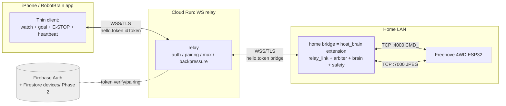

> **Note.** Some setup snippets below predate the shipped code. The authoritative implementation is [`relay/server.py`](relay/server.py) + [`host_brain/`](host_brain/): the relay gates on Firebase-token validity + a matching uid room (no email/password, no allowlist), the bridge authenticates with a **service-account custom token**, and the bridge entry point is `bridge_main.py`.

# Cloud Remote-Control Addendum (v1.2)

- **Addendum date**: 2026-07-24
- **Scope**: Adds remote (off-site) control of the car body. Existing LAN operation (addendum v1.1) is left completely intact.
- **Positioning**: This document is a **Remote-only addendum** to `REQUIREMENTS.md` and `DESIGN.md`. To avoid numbering collisions with the LAN requirements, functional requirements use `RFR-*`, non-functional requirements `RNFR-*`, assumptions `RAS-*`, and out-of-scope items `ROS-*`.
- **Cloud platform**: GCP project `YOUR-GCP-PROJECT` (number YOUR-PROJECT-NUMBER, account you@example.com) + Firebase Auth. Recommended region `asia-northeast1` (Tokyo).
- **Baseline code**: `host_brain/` — `car_link.py` (`CommandLink`/`VideoLink`), `safety.py` (`SafetyMonitor`), `dispatcher.py`, `brain.py` (`Brain.decide`), `main.py` (the `brain_loop`/`goal_loop`/`arbiter_loop` arbiter). These are **reused as-is** and form the foundation of the home bridge. The iOS side is built on `ios_app/` (`CarLink`/`RobotController`/`ContentView`/`Brain`/`Dispatcher`/`Discovery`, plus `project.yml`, `Info.plist`).

## Adopted topology (assumption)

`iPhone ⇔WSS(TLS)⇔ Cloud Run WebSocket relay ⇔WSS(TLS)⇔ home bridge (host_brain extension, Python) ⇔LAN TCP⇔ car body`.

**The ESP32 never connects directly to the cloud**, because TLS/WS/camera handling would overload it. Terminating TLS/WS and reusing the existing LAN code is the job of the **home bridge**. The relay authenticates both the phone and the bridge with Firebase Auth and, being an opaque forwarder, relays traffic **only between an already-paired pair**. Because the latency budget assumes concept B (the deliberative loop), the extra delay of a single relay hop is acceptable.

> **Firmware note.** The ESP32 car firmware — which terminates the LAN TCP protocol (`CMD_*` on :4000, JPEG stream on :7000) and provides the onboard deadman / stop-and-hold used as the last-resort backstop below — is a Freenove-derived sketch (CC BY-NC-SA) and is **not included in this repository**. Firmware paths and behavior are referenced here descriptively only.

## Terminology (added by this addendum)

- **Home bridge (bridge)**: A long-running `host_brain` extension process on the home LAN. It holds the LAN TCP connection to the car and keeps a persistent WSS connection to the relay. It is the **sole writer** to the car (inheriting the responsibilities of the LAN-side `RobotController`).
- **Relay**: A WebSocket forwarder on Cloud Run. It performs only authentication, pairing verification, and frame forwarding; it is an opaque forwarder that does not understand the meaning of `CMD_*`.
- **LAN mode / Remote mode**: The app's connection method. LAN = the existing direct TCP path; Remote = via the relay. **The toggle switches both the "transport" and the "location of the brain" at once** (see §2-C). LAN = the app's in-process `Brain` (onDevice) directly connected to the car; Remote = via the bridge (the brain runs on the bridge, onBridge).

---

# 1. Requirements

## F1. Connection modes and topology (functional)

- **RFR-1**: The app shall support two methods — **LAN mode** (direct TCP to the car / the existing `CarLink` + mDNS path) and **Remote mode** (WSS via the relay) — and provide a mode toggle in the settings screen. The selected mode shall be persisted (`UserDefaults` key `linkMode`, default `lan`). On switching, the existing connection shall be closed safely (send a stop command, then close) before reconnecting with the new method.
- **RFR-2**: The Remote-mode path shall be `iPhone ⇔WSS⇔ relay ⇔WSS⇔ bridge ⇔LAN TCP⇔ car`. **The ESP32 shall never connect directly to the cloud** (no TLS/WS/camera-send load on the car body). `CMD_*` and camera frames shall be exchanged directly only over the LAN TCP between the bridge and the car; the relay carries only the layer above that (bridge⇔phone).
- **RFR-3**: The home bridge shall be implemented by extending the existing `host_brain/` (the CarLink equivalent that connects to the car over LAN TCP), and shall (a) hold the LAN TCP :4000/:7000 to the car, (b) hold a WSS to the relay authenticated with a Firebase token and auto-reconnect, (c) lower the phone's remote commands/goals into LAN-side `CMD_*` and send them to the car, and (d) return car telemetry and a video preview to the phone via the relay. The bridge shall reuse the existing LAN-side `CMD_*` translation, clamping, and safety-reflex logic (`dispatcher`/`safety`).
- **RFR-4**: The relay shall relay only a phone and a bridge that are authenticated with Firebase Auth and, in the current MVP, share the same `uid`. It shall never expose the car protocol (`CMD_*`/camera) to unauthenticated connections. Firestore `devices` claim/unpair is Phase 2.

## F2. Pairing (app ⇔ one home bridge / car)

- **RFR-5**: In the MVP, the app and the home bridge shall be authenticated with the same Firebase `uid`, and shall connect through the relay's `uid -> {phone, bridge}` room to a single bridge (= a single car).
- **RFR-6**: claim / unpair / Firestore `devices/{deviceId}` / multi-device viewing / an operator exclusive lock are Phase-2 production hardening and shall be separated from the MVP's required acceptance criteria.

## F3. Remote live video, commands, and AI goals

- **RFR-7**: Remote mode shall provide the same piloting UX as LAN mode (full-screen live video, observation display, goal input, STOP). Video shall be shown as a preview stream that the bridge sends to the phone via the relay (frame format/resolution follow the bandwidth budget of §1-N, and may be dropped to lower fps/quality than the real LAN video as needed).
- **RFR-8**: In Remote mode, text/voice goal input (FR-13–17) and the main commands (head `look`, expression, STOP, manual `drive`, etc.) shall be delivered to the bridge via the relay, and the bridge shall translate them into the car's `CMD_*` and execute them. A structure in which raw `CMD_*` cannot be sent directly from the phone or the relay shall be maintained (only semantic commands are relayed; translation to `CMD_*` and clamping are handled solely by the bridge).
- **RFR-9**: The AI cortex in Remote mode (the VLM vision → `Intent` loop) shall **run on the home bridge** (the design decision of §2-C). In this configuration the perception-loop video stays on the home LAN, and the phone is a thin client used to "watch the preview / give goals / receive observations, state, and telemetry / stop immediately." The bridge calls the VLM provider and returns `observation` / `task_state` / effective pan/tilt, etc. to the phone via the relay.

## F4. Remote emergency stop and safety for "driving blind"

- **RFR-10**: Remote mode shall provide an always-visible STOP, and pressing it shall execute an immediate stop via the relay (the bridge sends `CMD_MOTOR#0#0#0`). In addition, STOP shall be guaranteed by multiple safety nets that do not depend on the relay round-trip or on any AI decision: (a) a **deadman** on the bridge (stop the car if the phone's heartbeat / intent updates lapse for a set time), and (b) the car's onboard deadman and disconnect-time stop-and-hold (HC-6). Loss of the relay itself shall lead to the bridge-side deadman firing → the car stopping.
- **RFR-11**: In Remote mode, dry-run shall be ON by default, and executing motion shall require an explicit dry-run OFF / arm confirmation. Arming only "turns dry-run OFF"; the relay/operator/cmd/video/deadman/low-batt safety continue to hold stop authority above it. On disconnect, STOP, mode switch, or app stop, the system shall automatically disarm (dry-run ON).

## F5. Graceful fallback and reconnection

- **RFR-12**: The MVP's reachability decision shall be the user-selected LAN/Remote toggle. Automatic LAN preference and off-site detection are Phase 2. Mode transitions shall always insert a stop (clamp/stop the current drive) and shall be performed without any runaway. The effective mode during and after switching shall be made explicit in the UI.
- **RFR-13**: The states of the relay connection, bridge connection, and car connection (phone⇔relay, relay⇔bridge, bridge⇔car) shall be visualized in the UI, and if any of them drops, auto-reconnect shall be attempted. When the phone⇔relay link drops, the bridge-side deadman shall safely stop the car (RFR-10). When the bridge⇔car link drops, it shall be left to the car's onboard safety mechanism (HC-6), and the app/bridge shall calmly reconnect. It is a design requirement that drive never continues through a disconnect.

## N1. Non-functional requirements (NFR)

### Security (required)

- **RNFR-1**: The entire phone⇔relay and relay⇔bridge path shall be encrypted with **WSS/TLS**. Plaintext WS / plaintext TCP shall never be used on the cloud path. Cloud Run's managed certificates (HTTPS/WSS) shall be used, and certificate verification shall not be disabled.
- **RNFR-2**: The relay shall authenticate **both** the phone and the bridge with a **Firebase Auth token**. The current MVP verifies the `token` included in the first JSON hello after the WS connection, and rejects invalid/expired tokens with close code 4003. A future hardening may move to an `Authorization: Bearer` header on the WS upgrade.
- **RNFR-3**: **Per-user pairing** shall be enforced, and in the MVP frames shall be forwarded only to a peer with the same `uid`. The car protocol shall not be exposed unauthenticated. The relay shall not persist media such as video or commands (transparent relay only). Firebase Auth tokens and pairing credentials shall not appear in URL queries or logs.
- **RNFR-4**: Writing to the car shall be **the bridge only** (single writer), and the relay shall remain an opaque forwarder that does not understand the meaning of `CMD_*`. The relay/bridge service-account permissions shall be least-privilege (only the Firebase/Run permissions needed within GCP project `YOUR-GCP-PROJECT`).

### Safety (driving blind)

- **RNFR-5**: On the premise that remote driving without direct line-of-sight is higher-risk than LAN-supervised operation, the UI and defaults shall not undermine that premise (dry-run ON by default in Remote, a more conservative speed cap, an always-visible STOP, stop on video lapse). Stopping shall not depend on a network round-trip or an AI decision, and shall be ultimately guaranteed by the car's onboard deadman + the bridge's deadman (extending NFR-5 into a multi-tier remote configuration).

### Latency and bandwidth

- **RNFR-6**: The bandwidth budget of the relayed preview video shall have an upper target of **about 4 KB/frame × 12 fps ≈ 48 KB/s ≈ 384 kbps (downlink, toward the phone)**. Goals, commands, and telemetry (both uplink and downlink) shall be small compared to this. Because of RFR-9 (brain on the bridge), **the cognition-loop frames do not pass through the relay**, so the video flowing through the relay is limited to a single human-supervision preview, and its fps/quality may be dropped to stay within budget (in practice, a design recommendation is to thin it further to about 2–5 fps and 0.1–0.2 Mbps).
- **RNFR-7**: The remote path shall tolerate the extra delay of a single relay hop (acceptable because of the deliberative concept-B loop). However, STOP and the deadman shall be guaranteed by local safety mechanisms on the bridge/car side so that they are not affected by round-trip delay (RNFR-5), and the design shall keep stopping from being delayed even when relay latency grows.

### Cost

- **RNFR-8**: The Cloud Run relay shall run at low cost (a small single instance, scale-down when idle, minimized egress). Assuming personal use with one pair, it shall choose a configuration that keeps monthly cost minimal while maintaining an always-on WSS (properly tuned min-instances and concurrency). By RFR-9, the VLM API-call egress shall be pushed to the home broadband side, keeping cloud transfer cost down.

### Availability

- **RNFR-9**: The relay may run in a single region (assuming personal use). If the relay or the bridge goes down, Remote operation becomes impossible, but (a) on the same LAN, LAN mode is unaffected and usable, and (b) on loss of the remote path, the car safely stops via the bridge/onboard deadman. It is a requirement that reduced availability falls to the fail-safe (stop) side.

## Constraints / assumptions (this addendum)

- **RAS-1**: The home bridge runs on the home LAN (`host_brain` extension, Python) and is connected to the same LAN as the car and to the upstream internet.
- **RAS-2**: The phone and the bridge authenticate with the same Firebase `uid`, and the relay is deployed in GCP project `YOUR-GCP-PROJECT`.
- **ROS-1 (out of scope)**: Multiple cars / multiple bridges / multi-user sharing, multi-region redundancy of the relay, and high-resolution / high-fps video on the Remote path are out of scope for this addendum.

---

# 2. Architecture (relay + home bridge)

## Topology (text/ASCII)

```
   ┌─────────────────────────────────────────────┐
   │  iPhone / RobotBrain app         (off-site/WWAN)│
   │  Thin client:                                │
   │  watch(preview) + goal + E-STOP + heartbeat  │
   └───────────────────┬─────────────────────────┘
                       │  WSS / TLS
                       │  WSS + hello.token (Firebase ID token)
                       ▼
   ┌─────────────────────────────────────────────┐
   │  Cloud Run: WebSocket relay (robot-relay)     │  asia-northeast1
   │  auth / pairing check / mux / pass-through    │  --max-instances 1
   │  → opaque forwarder that never parses CMD_    │  --timeout 3600
   └───────────────────┬─────────────────────────┘
                       │  WSS / TLS
                       │  hello.token (bridge ID token)
                       ▼
   ┌─────────────────────────────────────────────┐
   │  Home bridge = host_brain extension (Python)  │  (home LAN)
   │  relay_link + arbiter + brain + safety         │
   │  = sole writer to the car + location of brain  │
   └───────────────────┬─────────────────────────┘
                       │  plaintext TCP :4000 (CMD_)  ← never leaves the LAN
                       │  plaintext TCP :7000 (JPEG)  ← never leaves the LAN
                       ▼
   ┌─────────────────────────────────────────────┐
   │  Freenove 4WD ESP32 car body                   │
   └─────────────────────────────────────────────┘

   Firebase Auth (+ Firestore devices/ in Phase 2)
        └── token verification / pairing check ──▶ relay
```

The same structure with annotations (mermaid):



## A. Cloud Run WebSocket relay

Its role is strictly a **dumb pipe**: it matches up one phone (or phones) and one bridge belonging to the same authenticated owner, and shuttles frames from one side to the other. It does not interpret the car protocol (`CMD_*`) and does not expose it in plaintext. The shipped implementation is Python (plain `websockets`) + `firebase-admin` — `relay/server.py`. Rationale: the same language as the home bridge unifies maintenance, and `verify_id_token` is fully handled by the Admin SDK. (An early sketch in FastAPI + `uvicorn` was superseded — see §4-C.1.)

### A.1 Connection / auth handshake (Firebase ID token verification)

- **How the token is carried in the current MVP**: After the WSS connection, the first JSON frame is sent as a hello and includes `{"role":"phone"|"bridge","token":"<Firebase ID token>","room":"<dev room>"}`. It is **never** placed in the URL/query. `room` is used only during local verification with `AUTH_DISABLED=1`; in production the verified `uid` is the room.
  - phone: `RelayClient` obtains a fresh ID token immediately on connect and places it in the hello's `token`.
  - bridge: `relay_link.py` obtains a fresh ID token from `BridgeAuth.id_token()` and places it in the hello's `token`.
- **Verification**: On receiving the first hello, the relay runs `auth.verify_id_token(token)`. On failure it rejects with close code `4003` and bridges nothing unauthenticated. On success it extracts the `uid` and registers into `uid -> {phone, bridge}`. Other close codes the relay uses: `4000` (no/malformed hello), `4001` (bad role), and `4009` (an existing socket of the same role is displaced by a newer connection).
- **Future hardening**: `Authorization: Bearer <Firebase ID token>` header verification on the WS upgrade, and upgrade rejection with 401/4401, are treated as Phase-2 robustness. The current MVP's acceptance criterion is `hello.token` and close `4003`.
- **Role**: `role="phone"` or `role="bridge"` is declared in the hello. In the MVP, the same `uid` is the pairing key. In production it extends to `deviceId` / `ownerUid` / `allowedUids` claims.
- **Token lifetime**: A Firebase ID token expires in about 1 hour. The phone obtains a fresh token on every reconnect, and the bridge re-mints about 1 minute before expiry. Pre-emptive reconnection 55 minutes out, exponential backoff, and jitter are Phase-2 robustness.

### A.2 Pairing model (owner/room association)

Two stages depending on maturity (MVP → production in the §6 implementation plan).

**MVP (same-uid pairing)**: Sign the bridge in with the **same Firebase account as the phone** (see §B.3 — the bridge does this headlessly via a service-account custom token for the same uid), and the relay auto-pairs sockets that share the same `uid`. The relay's in-memory registry is `uid -> {phone:ws, bridge:ws}`. There is **no allowlist** — the relay gates purely on Firebase-token validity plus a matching uid room.

**Production (Firestore registry)**: Keep a minimal registry in Firestore (the relay itself is stateful only for the duration of a connection).

| Collection/document | Fields | Purpose |
|---|---|---|
| `devices/{deviceId}` | `ownerUid`, `roomName`, `pairedAt`, `lastSeen`, `status`, `allowedUids[]` (optional family sharing) | 1 bridge = 1 device. Holds the owner and room name |
| `users/{uid}` | `defaultDeviceId`, etc. | The phone's default pair |

- **Matching rule**: The phone declares a `deviceId` → the relay checks `devices/{deviceId}.ownerUid == phone.uid` (or `uid ∈ allowedUids`). Only when it matches the bridge's claimed `deviceId`/`ownerUid` does it **bridge the two into the same room**.
- Relay in-memory registry: `deviceId -> {bridgeConn, phoneConns:set}`. The bridge is a single connection; the phone may be multiple (if view-only family devices are allowed). However, **motion authority (goal/intent/heartbeat) is exclusively locked to one device** (an "operator" token), and the others are view-only (to prevent runaway from dual piloting).
- **The room = the pairing key**. Future multi-site naturally scales with per-deviceId routing (OS-9).

### A.3 Message multiplexing and framing spec (WebSocket)

Multiplexing over a single WS uses WebSocket's native **text/binary frame types**.

**Text frame = control / commands / telemetry (JSON, small)**. Tagged by type (the canonical key in this spec is `t`; the `type` used in the app-side code is an alias of the same field):

| `t` (=`type`) | Direction | Payload | Notes |
|---|---|---|---|
| `hello` | phone→relay | `{deviceId, kind}` | Declaration right after connect (for production deviceId routing; can be omitted in the MVP since it uses the same uid) |
| `goal` | phone→…→bridge | `{text}` | Concept-B goal (voice is STT'd to text in the app) |
| `intent` | phone→…→bridge | `{throttle, steer, duration_ms, look?}` | Optional manual nudge. **Semantic values only** (raw `CMD_` cannot be sent) |
| `estop` | phone→…→bridge | `{on?}` | Remote emergency stop (highest priority). If `on` is omitted, stop immediately |
| `arm` / `disarm` | phone→…→bridge | — | Dry-run release / re-arm (per session, default disarm). Equivalent to `dryrun {on:false/true}` |
| `dryrun` | phone→…→bridge | `{on}` | Dry-run flag toggle (the explicit form of `arm`/`disarm`) |
| `speedcap` | phone→…→bridge | `{v}` | Remote speed cap (a lower default than LAN) |
| `heartbeat` (alias `deadman`) | phone→…→bridge | `{seq}` or `{ts}` | Operator deadman. ~2–10 Hz (the app sends supervisory at ~2 Hz; the spec allows up to 5–10 Hz). On lapse the bridge STOPs |
| `status` (shipped) | bridge→…→phone | `{cmd, cam, goal, estop, dry_run, voltage, distance, safety, task_state, observation, pan, tilt}` | A single status/telemetry message the shipped bridge sends (folds telemetry + observation together) |
| `ready` / `peer` | relay→one/both | `{type:"ready", role, peer}` / `{type:"peer", role, up}` | The relay tells the connecting side it's ready, and tells the other side when a peer appears/disappears |

> The spec above lists separate `telemetry` and `observation` frames as a design target; the shipped bridge instead sends one `status` message (see the fields above and §4-C.6).

**Binary frame = camera (raw JPEG)**. Since WS has message boundaries, the **4-byte length prefix of TCP :7000 is stripped at the home bridge** (§B.4). In the canonical form a small 5-byte header is prepended:

```
byte0      : channel   (0x01 = video JPEG)
byte1..4   : uint32 LE  frame seq (or low bits of send-ms) — for latency/staleness checks
byte5..    : JPEG payload (raw bytes, not re-encoded)
```

- The phone side can judge and discard old frames by seq, preserving the "latest frame only" semantics of `VideoLink` end-to-end. If another stream is added later (e.g. a depth overlay), it can be multiplexed by channel.
- The phone strips these 5 bytes before decoding and passes the rest to `UIImage(data:)`. **In the MVP, a simplified form that omits the 5-byte header and sends only the raw JPEG** is used (the shipped `preview_loop` sends the raw JPEG with no header; seq-based staleness checking is skipped). In production the 5-byte header is the standard.

### A.4 Backpressure, reconnection, keepalive

- **Backpressure (drop video, never drop control)**:
  - Video (bridge→phone) is **latest-wins**. Both relay and bridge keep a send-queue length of 1. If the `transport` write buffer is high-water (e.g. > 256 KB), **skip that frame** so the read side is never blocked. Same philosophy as `host_brain`'s `VideoLink` (which by design holds no backlog).
  - Commands / estop / heartbeat (small, ordering-critical) are treated as **separate-direction or priority**. In practice video is downlink and commands are uplink, so **direction separation alone almost eliminates head-of-line blocking**. If strict separation is ever needed, extend to a "control WS" + "media WS" two-connection setup (Cloud Run billing increases; a single connection is recommended for now).
- **keepalive**: The relay sends WS pings to both peers at ~20 s. A missing pong detects the peer drop early → notifies the other side with `peer{up:false}`. **When the bridge detects an uplink drop / heartbeat lapse, it immediately STOPs + disarms** (remote deadman).
- **Reconnection**: In the MVP, the phone reconnects 2 seconds after a disconnect and re-fetches a fresh token on each reconnect. The bridge re-mints its token about 1 minute before expiry and reconnects. Exponential backoff + jitter, seq-tagged goal/estop retransmission, and Firestore state reconstruction are Phase-2 robustness.

### A.5 Cloud Run specifics

- **WebSocket support**: Cloud Run supports WS via HTTP/1.1 Upgrade (streaming responses). Ingress is "all" (public), but **authentication is at the app layer (Firebase)**. The MVP authenticates in the hello after upgrade and immediately closes if unauthenticated.
- **Request timeout = the upper bound on WS lifetime**: A long-lived WS is treated as a single request, with a **maximum of 60 minutes** (`--timeout=3600`). The MVP recovers via reconnection on disconnect. **Pre-emptive graceful reconnect at ~55 minutes** is Phase-2 robustness.
- **Same-instance co-location (most important)**: Because the relay matches the two peers within a single process, the phone and the bridge **must land on the same instance**. For a single household / single bridge, **pin `--max-instances=1`** so all connections consolidate on one instance and co-location is guaranteed (no session affinity needed).
- **scale-to-zero vs min-instances**:
  - Recommended initial values: **`min-instances=0` + `max-instances=1`**. Zero when idle for minimal billing, and max=1 also guarantees co-location. The first connection incurs a cold start (~1–3 s).
  - If you dislike the cold-start feel or the deadman recovery, move to **`min-instances=1`**. That adds the cost of one always-on instance (a WS is a continuous request, so CPU is allocated and billed while connected). Because **the safety STOP is fully handled on the bridge**, a cold start never compromises safety (min=0 is fine).
  - Future multi-site / HA: if `max>1` becomes necessary, **externalize the in-process matching** (Memorystore (Redis) pub/sub or Pub/Sub, or per-deviceId routing + session affinity). v1.2 assumes a single household and uses max=1 (OS-9).
- Others: `--concurrency` is fine at the default (one household; run at the actual value 80). CPU/memory small (256–512 MiB). TLS is terminated by Cloud Run's managed certificates (WSS on both phone↔relay and bridge↔relay).

## B. Home bridge (`host_brain` extension)

### B.1 Reuse map of existing modules

| Module (host_brain) | Handling in v1.2 | Changes |
|---|---|---|
| `car_link.py` `CommandLink` | **Reused as-is**. The sole writer to :4000 | None |
| `car_link.py` `VideoLink` | **Reused + minor tweak** | A field holding the raw JPEG bytes was added (§B.4) |
| `safety.py` `SafetyMonitor` | **Reused + extended** | Adds remote-origin stop reasons (§D) |
| `dispatcher.py` | **Completely unchanged (the clamping fortress)** | None. Remote commands must also pass through here |
| `brain.py` `Brain.decide` | **Reused** (in Remote the bridge is the brain, §C) | None (prompt/JSON contract shared with the app) |
| `main.py` `arbiter_loop` | **Reused + extended**. Keeps the single writer | Relay-origin intent is lowered via the safety path |

### B.2 New module `relay_link.py` (outbound WSS client)

- Opens **a single WSS** to the relay with Python `websockets` (or `aiohttp`) and auto-reconnects (following the retry structure of `CommandLink.run()`).
- Processes received text `goal`/`intent`/`estop`/`arm`/`dryrun`/`speedcap`/`heartbeat` **as semantics** and injects them into the same path as `goal_loop`/`brain_loop`/`arbiter_loop`. **Raw `CMD_` is not accepted** (dropped even if received). This guarantees "even authenticated, never expose the car protocol on the wire raw."
- `intent` (a manual nudge) goes through `dispatcher.drive/look`, so `speed_cap`, dead-zone, and tilt clamps always apply.
- Sending: `status` (voltage, taskState, pan/tilt, observation, safetyReason, etc.) and **binary video** (§B.4).
- Integration is as simple as adding `relay_link.run()` and the video-forward task to `main.py`'s `asyncio.gather` (co-resident in the existing event loop). The entry point can be either the extended `main.py` or the thin `bridge_main.py` (§4-C.6).

### B.3 Authenticating as a device (the bridge's identity)

The shipped bridge authenticates with a **service-account custom token** (§6: MVP → production).

**MVP (service-account custom token)**: A headless bridge cannot do the interactive Apple sign-in, so it authenticates as the **same uid as the phone** using a service-account custom token. `firebase_auth.py` (`BridgeAuth`) calls the Admin SDK `create_custom_token(owner_uid)` — a local RS256 signature with the service-account key, no network — and exchanges it for an **ID token + refresh via Identity Toolkit REST** `signInWithCustomToken`. The token is cached and re-minted about 1 minute before expiry. This ID token is placed in the hello's `token` on the WS handshake. Config lives in `[remote]` of `config.toml`: `auth = "firebase"`, `owner_uid`, `service_account` (path to the SA JSON key), `api_key` (a Firebase Web API key for the exchange).

**Production (custom token + deviceId claim)**:
- **Provisioning** (once): The owner's device (signed in) calls a Callable Cloud Function `provisionDevice` → creates `devices/{deviceId}` with `ownerUid` and issues a **Firebase custom token** (claims `{role:"bridge", deviceId, ownerUid}`).
- **Bridge side**: Exchanges the custom token for an **ID token + refresh token** via Identity Toolkit REST (`signInWithCustomToken`) and saves it. Thereafter it refreshes the ID token with the refresh token and attaches it to the WS handshake.
- **Handling of secrets**: The service-account JSON key stays a git-ignored file on the home side and is never checked into the repo; `owner_uid` and `api_key` (a public Web API key) live in `config.toml`. This is consistent with the existing "API keys go in env, never hard-code" policy.
- **Config**:
  ```toml
  [remote]
  relay_url        = "wss://<your-relay>.asia-northeast1.run.app"  # pathless Cloud Run relay (role via hello)
  room             = "dev"                    # only used when auth = "dev" (AUTH_DISABLED local relay)
  token            = ""                        # unused when auth = "firebase"
  preview_hz       = 4                         # JPEG preview frames/sec sent to the phone
  status_hz        = 2                         # telemetry/status messages/sec sent to the phone
  auth             = "firebase"                # "firebase" (prod wss relay) | "dev" (local AUTH_DISABLED room)
  owner_uid        = ""                        # the uid the iOS app shows after Sign in with Apple
  service_account  = "service-account.json"    # bridge's service-account JSON key (git-ignored)
  api_key          = ""                        # a Firebase Web API key (Identity Toolkit token exchange)
  # device_id / remote_speed_cap: Phase 2 (per-device routing, a distinct remote cap) — not yet implemented.
  ```
  Secrets (the service-account JSON file, the VLM provider key) stay in a git-ignored file / env; non-secret settings (relay_url / owner_uid / preview_hz / …) live in `config.toml`.

### B.4 Video forwarding (no re-encode)

- Currently `VideoLink` decodes to BGR with `cv2.imdecode` and **discards the original JPEG bytes**. For forwarding, add a single line to **keep the pre-decode `buf` as `jpeg` (+ ts)**.
- The forward task sends `jpeg` to the relay as the binary frame of §A.3 (5-byte header + JPEG in production; raw JPEG in the MVP). It **does not re-encode** (saving CPU, preserving quality).
- Since in Remote the brain is on the bridge, the BGR decode is still needed by `brain.decide` and continues. In a brain-on-app configuration (not recommended, §C) the decode could be skipped for a pure forward, saving even more CPU (switchable by a config flag).
- The viewing stream can be **thinned independently of the perception rate** (e.g. cap the send fps / JPEG quality on the relay/bridge side; in practice 2–5 fps). This is a key point for protecting the home uplink and the user's mobile data (RNFR-6).

### B.5 Keeping the arbiter as the single writer

`arbiter_loop` remains **the sole writer to :4000**. Remote-origin `goal`/`intent` also pass through `SafetyMonitor.want_stop()`, `dry_run`, `speed_cap`, and pulse self-expiry exactly like the local `brain_loop`/`goal_loop` before being lowered. Being remote does not create a bypass path (minimizing the runaway surface).

## C. Design decision: in Remote, where does the brain run?

**Conclusion: In Remote mode, run the brain on the home bridge (option B). The app becomes a thin client (supervisor).** LAN mode stays as the in-app `Brain` (option A = onDevice).

| Aspect | Option A: brain in the app (video round-trips phone↔cloud) | **Option B: brain on the bridge (recommended)** |
|---|---|---|
| **Bandwidth** | Streams **every perception-rate frame** (240×176 JPEG ≈ 5–15 KB × 10–15 fps ≈ 0.5–1.5 Mbps) car→bridge→cloud→phone (downlink), continuously loading the home uplink + phone downlink. Decision frames also round-trip uplink. | Perception frames stay **inside the car↔bridge LAN (ms)**. Only a **thinned viewing preview** (2–5 fps ≈ 0.1–0.2 Mbps, within the RNFR-6 budget) + small text leaves for the cloud. The VLM call is bridge→provider directly (over the home fixed line, not metered mobile). |
| **Latency / safety** | The perceive→decide→drive closed loop crosses WWAN twice (+150–600 ms). Every 0.7 Hz decision sends a frame down + `Intent` up across the cloud twice. It eats into the `vision_stale_ms=800` / `deadman_ms=500` budgets and easily falls into constant safety stops. A momentary phone/line drop leaves a moving car dangling. | **The tight control loop is entirely LAN-local** (car↔bridge↔provider; fast and deterministic). Only the loose "human supervision loop" (preview + e-stop + heartbeat) crosses WWAN. Stop authority (deadman / estop / vision-stale) is co-located **nearest the car** → high certainty of stopping a car you cannot see. A supervisory-link drop fails safe (the bridge deadman stops). |
| **Cost** | Cloud Run downlink egress balloons to the full video (higher billing). Every frame goes home-uplink + mobile-downlink. | Preview only → minimal egress. One VLM provider key on the bridge (not bundled in the app). API calls go from home broadband. |
| **Simplicity / reuse** | Reuses the in-app `Brain.swift` (no RobotController change), but the brain must be **maintained twice** in Swift and Python. | **Reuses `host_brain`'s `brain.py` + `safety.py` + arbiter wholesale**. The existing, validated control code becomes the remote path as-is. Implementation, prompt, and provider config are unified. Porting the cognition loop to Python is an upfront cost (but `host_brain` is already Python). |

Option B aligns completely with this project's premises: "never connect the ESP32 directly to the cloud / reuse `host_brain` on the bridge." Option A satisfies "no change to Brain/RobotController" but is disadvantaged on bandwidth and safety.

**Consequence and trade-off**: This leaves **two implementations** coexisting — LAN = app brain (Swift), Remote = bridge brain (Python). The two share the **same `SYSTEM_PROMPT` and `Intent` JSON schema** so the contract stays consistent. Option A is preserved as a future fallback inside the transport abstraction (§3-B-2). Ideally, in the future the app would always be a bridge client even on LAN, unifying the brain onto the bridge (removing `Brain.swift`), but that is a large change and out of scope for v1.2. v1.2 keeps the LAN/Remote toggle switching "transport + location of the brain."

---

# 3. App changes

**Existing LAN operation (addendum v1.1) is left completely intact.** Keep `CarLink`'s public API and make the internals transport-swappable; `RobotController`/`Brain`'s control loop, arbiter, and safety logic are **unchanged** except for the `brainSite` gate of §B-4.

## B-1. Mode enum + Settings toggle + status

```swift
enum LinkMode: String, Codable { case lan, remote }   // the Settings toggle
enum BrainSite { case onDevice, onBridge }            // lan→onDevice, remote→onBridge (default)
```

- Add `@Published var linkMode: LinkMode { didSet { save(...) } }` (default `.lan`) to `RobotController`. Add `Picker("settings.linkMode", selection: $ctl.linkMode)` (LAN / Remote) to the car section of `ConfigView`.
- Add a mode badge to the status pill (`statusPill`): `LAN` / `REMOTE`. In Remote, change the color and, together with the `DRY` badge, make it always explicit that "you are moving a car you cannot see."
- New localization keys (in pairs in both `.strings`): `settings.linkMode` / `mode.lan` / `mode.remote` / `settings.section.account` / `account.signIn` / `account.signOut` / `account.signedInAs` / `status.remoteConnecting` / `status.remoteLinkDown` / `safety.operatorLinkLost`.

## B-2. Transport abstraction (CarLink's public API unchanged)

Keep `CarLink`'s current public surface — `connect(host:)` / `stop()` / `send(_:)` / `onCommandReady` / `@Published image, lastFrameAt, cmdConnected, camConnected, voltage` — and make the internals transport-swappable.

```swift
protocol CarTransport: AnyObject {
    func start()
    func stop()
    func send(_ line: String)           // CMD_ string (LAN/option A) or control JSON (option B)
    var onReady: (() -> Void)? { get set }         // → bridged to CarLink.onCommandReady
    var onFrame: ((UIImage) -> Void)? { get set }  // → CarLink.image
    var onReply: ((String) -> Void)? { get set }   // → parseReplies (CMD_POWER etc / telemetry)
    var cmdUp: Bool { get }
    var camUp: Bool { get }
}
```

- **`LANTransport`**: Port the current `CarLink` TCP :4000/:7000 implementation as-is (identical behavior; the mDNS discovery of addendum v1.1 is preserved).
- **`RelayTransport`**: Open a single WSS to the relay with `URLSessionWebSocketTask`. Demux by WS message type —
  - `.string` (JSON) = control plane / telemetry / observation
  - `.data` (binary) = preview JPEG frame (strip the 5-byte header, then `UIImage(data:)`)
  - The current MVP authenticates by including `token` in the hello JSON right after connect. A future hardening can move to an `Authorization: Bearer <FirebaseIDToken>` header. In either case the token is never placed in the URL query.
- `CarLink` takes `linkMode` (and a Firebase token provider) and creates the appropriate transport in `connect()`. `send/image/cmdConnected/...` behave identically for either. → This makes **option A (tunnel CMD_ as-is) essentially zero additional cost**, a no-change RobotController fallback.

## B-3. Firebase Auth sign-in + token storage

- Add `AuthStore` (ObservableObject) to SwiftUI. **Prefer Sign in with Apple (native `ASAuthorizationController` + Firebase `OAuthProvider`/nonce); Email/Password is secondary.** Restore sign-in state on `RobotBrainApp` launch with `FirebaseApp.configure()`.
- **Store the ID token in the Keychain** (stronger than the plaintext UserDefaults of §8; a token is a credential, so the Keychain is mandatory). `Auth.auth().currentUser?.getIDToken()` auto-refreshes before expiry (1h) → `RelayClient` re-fetches the token right before connecting and places it in the hello. Periodic pre-emptive reconnection is Phase 2.
- When not signed in, Remote mode cannot be selected/connected (never expose the car protocol unauthenticated). Add an Account section to `ConfigView` (sign in/out, `account.signedInAs`).
- XcodeGen (`project.yml`) additions:
  ```yaml
  packages:
    Firebase: { url: https://github.com/firebase/firebase-ios-sdk, from: "11.0.0" }
  targets:
    RobotBrain:
      dependencies:
        - { package: Firebase, product: FirebaseAuth }
      entitlements:
        path: RobotBrain.entitlements
        properties:
          com.apple.developer.applesignin: [Default]
  ```
  Place `GoogleService-Info.plist` (obtained by registering bundle id `com.example.robotbrainai` in the Firebase console) into `ios_app/`. **Add it to `.gitignore`** (it contains API info).

## B-4. Option-B thin-client behavior (limited RobotController change)

Only when `brainSite == .onBridge` (= Remote):
- `maybeDecide()` returns immediately (stop the in-app brain; the brain is on the bridge).
- The motor arbiter emits no `CMD_` (motor authority is on the bridge). Instead, `setGoal`/`emergencyStop`/`dryRun`/`speedCap` are sent as **control messages**. `car.image` is the preview, and `car.voltage`/`curPan`/`report`/`taskState`/`statusKey` are updated from the bridge's telemetry/observation.
- **Supervisory deadman**: The phone sends `heartbeat` (= `deadman`) at ~2 Hz. The bridge does not permit drive while there is no "fresh operator heartbeat" (`safety.operatorLinkLost`). The existing local deadman/vision-stale/low-batt (`safety.py`) continue to work on the bridge as before.

**Phone↔bridge protocol (over WSS, the relay passes through)** — conforms to the canonical framing of §2-A.3. The shipped minimal set:

```
Phone → Bridge : {"t":"goal","text":...} | {"t":"estop","on":bool}
                 {"t":"dryrun","on":bool} | {"t":"speedcap","v":int}
                 {"t":"heartbeat","seq":...}  (~2Hz, alias deadman)
Bridge → Phone : <binary JPEG preview>  (2–5fps; raw JPEG in the MVP, 5-byte header in production)
                 {"t":"status","voltage":..,"pan":..,"tilt":..,"safety":..,
                  "task_state":..,"observation":..,"cmd":..,"cam":..,"goal":..,
                  "estop":..,"dry_run":..,"distance":..}
```

## B-5. Gracefulness of mode switching

- On switch: `stop()` the current transport (always stop the car with the `CMD_MOTOR#0#0#0` equivalent) → force dry-run back ON (FR-39/47, the same safety default as at launch) → `connect()` with the new transport.
- Remote connection status display: `status.remoteConnecting` → connection established → `status.driving/hold`. A WSS drop shows `status.remoteLinkDown` (and the bridge-side deadman autonomously stops the car).
- Switching back to LAN restores the standalone behavior (in-app brain) with no bridge needed.

## B-6. Safety of remote operation (required; moving a car you cannot see)

Dry-run ON by default (reset every launch) / a permanent remote e-stop (immediate control message + bridge autonomous stop on WSS drop) / twin deadman (operator heartbeat + local intent freshness) / vision-stale and low-batt as bridge-local reflexes / a lower `speedCap` default in Remote / dry-run release requires an explicit action every session / the REMOTE+DRY badge always visible.

---

# 4. GCP deploy procedure (`YOUR-GCP-PROJECT`)

## C-1. Relay container (Cloud Run, Python)

Role: authenticate both peers with a Firebase ID token and byte-forward **only between the same `uid` (= pair)**. Raw `CMD_` TCP never leaves for the cloud (terminated at the bridge). A tokenless connection is immediately rejected → the car protocol is never exposed unauthenticated.

The shipped relay is `relay/server.py` — **plain `websockets` + `firebase-admin`** (no FastAPI/uvicorn). It is **pathless**: the role comes from the `role` field in the hello JSON, and the URL path is ignored. Auth is via `hello.token`, verified with `verify_id_token`; close codes are `4000` (no hello), `4001` (bad role), `4003` (auth failed), `4009` (a same-role socket replaced by a newer connection). There is **no allowlist** — the room is the verified `uid`, and only a phone and a bridge sharing that uid are bridged. `AUTH_DISABLED=1` skips Firebase auth and uses `hello.room` (local dev only).

Shape of `relay/server.py` (essentials):
```python
import asyncio, json, os
import websockets

AUTH_DISABLED = os.environ.get("AUTH_DISABLED") == "1"
PORT = int(os.environ.get("PORT", "8080"))
if not AUTH_DISABLED:
    import firebase_admin
    from firebase_admin import auth as fb_auth
    firebase_admin.initialize_app()          # ADC on Cloud Run (project auto-detected)

rooms: dict[str, dict] = {}                   # uid -> {"phone": ws, "bridge": ws}

async def handler(ws):
    hello = json.loads(await asyncio.wait_for(ws.recv(), timeout=10))   # first frame = hello
    role = hello.get("role")
    if role not in ("bridge", "phone"):
        return await ws.close(code=4001, reason="bad role")
    if AUTH_DISABLED:
        uid = str(hello.get("room", "dev"))
    else:
        try:
            uid = fb_auth.verify_id_token(hello.get("token", ""))["uid"]
        except Exception:
            return await ws.close(code=4003, reason="auth failed")
    room = rooms.setdefault(uid, {}); room[role] = ws          # register; peer = the other role
    peer_role = "phone" if role == "bridge" else "bridge"
    async for msg in ws:
        peer = rooms.get(uid, {}).get(peer_role)
        if peer is not None:
            await peer.send(msg)              # opaque forward (str or bytes)

async def main():
    async with websockets.serve(handler, "0.0.0.0", PORT,
                                max_size=8 * 1024 * 1024,      # allow ~JPEG frames
                                ping_interval=20, ping_timeout=20):
        await asyncio.Future()
```
`relay/requirements.txt`: `websockets`, `firebase-admin`. Start: `python server.py` (Cloud Run sets `$PORT`; the server reads it — see `relay/Dockerfile`).

**Important:** With multiple Cloud Run instances the two peers could land on different instances. For personal use (a single pair), **`--max-instances 1`** guarantees co-location (no session affinity needed). Token verification works via ADC (project auto-detected) as long as it's the same GCP project, so **the relay needs no secret key file**.

## C-2. gcloud deploy procedure

```bash
gcloud config set project YOUR-GCP-PROJECT
gcloud services enable run.googleapis.com cloudbuild.googleapis.com \
  artifactregistry.googleapis.com identitytoolkit.googleapis.com

# Deploy directly from source (Cloud Build builds automatically). Tokyo region.
gcloud run deploy robot-relay \
  --source ./relay --region asia-northeast1 --port 8080 \
  --allow-unauthenticated \        # ← IAM layer open. Auth is the Firebase token (app layer)
  --timeout 3600 \                 # WS is a long-lived request. Max 60 min
  --min-instances 0 --max-instances 1 --concurrency 80 \
  --cpu 1 --memory 256Mi
```
- `--allow-unauthenticated` is required (the phone/bridge cannot hold IAM credentials). Instead, **always gate at the app layer with Firebase verification**. The relay needs **no environment variables or secrets** (token verification uses ADC); `AUTH_DISABLED=1` is only for local dev.
- Returned URL example `https://robot-relay-xxxx.a.run.app` → the app/bridge connect to `wss://robot-relay-xxxx.a.run.app` (pathless; the role is declared in the hello, not in the path).
- Deploy via the cloud-run MCP or the `gcloud run deploy` above (the container bundles `firebase-admin`).

## C-3. Firebase Auth setup

1. In the Firebase console, "Add Firebase to" the existing GCP project `YOUR-GCP-PROJECT`.
2. Enable Authentication. Provider:
   - **Apple** (for the phone; in Apple Developer create a Services ID, Team ID, Key ID, and .p8 private key and register them in the console. Native Sign in with Apple requires a nonce).
   - The bridge does **not** need an interactive provider: it authenticates as the same uid via a **service-account custom token** (Admin SDK), so no Email/Password account is required. (Email/Password may still be enabled as a secondary phone sign-in if desired.)
3. Register the iOS app (bundle `com.example.robotbrainai`) and obtain `GoogleService-Info.plist`.
4. **Pairing (minimal = MVP)**: The bridge signs in as the **same `uid` as the phone** via a service-account custom token → the relay auto-pairs the same `uid`. In production, migrate to `devices/{deviceId}` + a Callable `provisionDevice` (custom token) and add `deviceId`/a pairing code to the messages.

## C-4. Environment variables / secrets

| Location | Value | Storage |
|---|---|---|
| Relay (Cloud Run) | none — no secrets | Token verification uses ADC (the Cloud Run service's default credentials); **no key file**. `AUTH_DISABLED=1` only for local dev |
| Bridge (home) | VLM provider API key (env var named by `[brain].api_key_env`, e.g. `GEMINI_API_KEY`) | `.env`/Keychain, `chmod 600`. Never in the repo or the app |
| Bridge (home) | Firebase service-account JSON key + `owner_uid` + Firebase Web API key | The service-account JSON is a **git-ignored file** referenced by `[remote].service_account`; `owner_uid` and `api_key` live in `config.toml`. The bridge mints a custom token for `owner_uid` and exchanges it for an ID token |
| Bridge (home) | `relay_url` | `config.toml` `[remote].relay_url` (pathless, `wss://robot-relay-xxxx.a.run.app`) — not an env var |
| App | Firebase config | `GoogleService-Info.plist` (git-ignored). ID token in the Keychain |

The Firebase Web API key is a public value baked into the app; it is not a secret. **The only truly secret items are the bridge's service-account JSON key and the VLM provider key** → keep them on the home side only.

## C-5. Rough cost (personal use)

Cloud Run free tier (monthly): 180,000 vCPU-seconds / 360,000 GiB-seconds / 2 million requests. Firebase Auth (Spark) free. Artifact Registry / Cloud Build are negligible (<$0.1).

| Usage pattern | Monthly estimate |
|---|---|
| **On-demand** (the bridge connects WSS only during remote driving, e.g. ~20h/month) | vCPU ≈ 72,000 s → **within the free tier**. Preview egress ~1–2 GB ≈ $0.1–0.2. → **effectively $0–1** |
| Always-on (the bridge holds WSS 24/7) | 1 vCPU always-on ≈ 2.59M s − free tier → **about $55–65/month** (~$29 with `--cpu 0.5`). Not recommended |

**Recommendation: connect the bridge only during remote sessions** (holding a WS continuously means always-on single-instance billing). On-demand mostly stays within the free tier. VLM provider usage is billed separately (as before, incurred on the bridge side).

## C-6. Implementing, registering, and running the home bridge

**Implementation**: Add `bridge_main.py` to `host_brain/` (or extend `main.py`). **Reuse as-is** the existing `car_link.py`/`brain.py`/`safety.py`/`dispatcher.py` and `main.py`'s `brain_loop`/`arbiter_loop`, and just add a WSS I/O layer (`relay_link.py`) on top:
- Open `wss://<relay-host>` to the relay (pathless; obtain the token via `firebase_auth.BridgeAuth` → the hello JSON `token`).
- Receive: `goal`→`st.goal`, `estop`→`st.estop`, `dryrun`→the dry-run flag, `heartbeat`/`deadman`→update the operator heartbeat.
- Send: the raw JPEG (`video.jpeg`) as a binary preview at `preview_hz` (default 4), and `safety.want_stop()`/voltage/pan/tilt/`observation` as a single `status` message at `status_hz` (default 2).
- Add **operator-heartbeat monitoring** to `safety.py` (`operator link lost`) → drive is disallowed on a supervisory-link drop. Dry-run defaults ON; the local reflexes (deadman/vision-stale/low-batt) are unchanged.
- Dependency additions (`requirements.txt`): `websockets` + `firebase-admin` (the token exchange in `firebase_auth.py` uses the standard-library `urllib`, so no extra HTTP client is required).

**Mac auto-start (launchd)** — `~/Library/LaunchAgents/com.example.robotbrain-bridge.plist`:
```xml
<?xml version="1.0" encoding="UTF-8"?>
<!DOCTYPE plist PUBLIC "-//Apple//DTD PLIST 1.0//EN" "http://www.apple.com/DTDs/PropertyList-1.0.dtd">
<plist version="1.0"><dict>
  <key>Label</key><string>com.example.robotbrain-bridge</string>
  <key>ProgramArguments</key>
  <array>
    <string>~/esp32-ai-robot/host_brain/.venv/bin/python3</string>
    <string>~/esp32-ai-robot/host_brain/bridge_main.py</string>
  </array>
  <key>EnvironmentVariables</key><dict>
    <key>GEMINI_API_KEY</key><string>...</string>   <!-- only the VLM provider key lives in env -->
  </dict>
  <key>RunAtLoad</key><true/>
  <key>KeepAlive</key><true/>   <!-- for on-demand operation, false + a manual launchctl kickstart -->
  <key>StandardOutPath</key><string>/tmp/robotbrain-bridge.log</string>
  <key>StandardErrorPath</key><string>/tmp/robotbrain-bridge.err</string>
</dict></plist>
```
`launchctl load ~/Library/LaunchAgents/com.example.robotbrain-bridge.plist`. For on-demand operation set `KeepAlive=false` and start before remote driving with `launchctl kickstart -k gui/$(id -u)/com.example.robotbrain-bridge` (cost minimization). Everything else (relay_url, owner_uid, api_key, and the path to the service-account JSON) lives in `config.toml`; keep `config.toml` and the service-account file at 600 permissions since they carry credentials.

**Raspberry Pi auto-start (systemd)** — `/etc/systemd/system/robotbrain-bridge.service`:
```ini
[Unit]
Description=RobotBrain home bridge
After=network-online.target
[Service]
WorkingDirectory=/home/pi/esp32-ai-robot/host_brain
EnvironmentFile=/home/pi/esp32-ai-robot/host_brain/.env   # 600; holds the VLM provider key (e.g. GEMINI_API_KEY)
ExecStart=/home/pi/esp32-ai-robot/host_brain/.venv/bin/python3 bridge_main.py
Restart=always
RestartSec=3
[Install]
WantedBy=multi-user.target
```
`sudo systemctl enable --now robotbrain-bridge`. If you prefer pm2, `pm2 start bridge_main.py --interpreter python3 --name robotbrain-bridge && pm2 save && pm2 startup` (though since this bridge is Python, launchd/systemd is the natural fit).

---

# 5. Security (inherits and extends §8)

- **WSS/TLS end to end** (RNFR-1): phone↔Cloud Run (TLS terminated by Google) / Cloud Run↔bridge (WSS). The raw `CMD_` TCP :4000/:7000 **never leaves the home LAN** (terminated at the bridge). Use Cloud Run managed certificates and do not disable certificate verification.
- **Never expose the car unauthenticated** (RNFR-2/3): The relay rejects connections whose Firebase ID token is unverified with close 4003. Both peers (phone and bridge) are verified with the Admin SDK `verify_id_token`. The MVP bridges **only the same `uid` (pair)**; production extends to `devices/{deviceId}.ownerUid == phone.uid` or `allowedUids`. IAM is open, but the gate is at the app layer. There is **no allowlist**.
- **Never put the token in the URL** (RNFR-3): The MVP uses the `token` in the hello JSON; future, an `Authorization: Bearer` header on the WS handshake. Neither goes in a URL query. iOS stores it in the Keychain; the bridge keeps the service-account JSON key + Firebase Web API key at 600-permission config/Keychain. Redact the token in logs.
- **Non-exposure of the car protocol** (RNFR-4): The relay is an opaque forwarder that does not interpret `CMD_*`. The bridge accepts **semantic messages only** and always passes them through `dispatcher`'s clamps (even authenticated, no raw wire). Writing to the car is the bridge only (single writer). The relay does not persist media (transparent relay only).
- **Locality of secrets**: The VLM provider key and the bridge credentials (the service-account JSON key) stay on the home side only (600 permission, env/Keychain/git-ignored file). The relay needs no key file (ADC verification). `GoogleService-Info.plist` is git-ignored. Service-account permissions are least-privilege (only the Firebase/Run permissions needed within `YOUR-GCP-PROJECT`).
- **Minimize logging**: Production logs do not emit token / uid / room / goal / observation / full JSON payload. If needed, only under DEBUG, with the uid shortened or hashed and goal/observation/message bodies redacted. Full-text logging of `bad message` is disabled in production.
- **Safety (remote driving, moving a car you cannot see; RNFR-5 / extending the §3 reflexes to remote)**:
  - **Keep dry-run ON by default in Remote too**, reset every launch. Additionally, **Remote forbids motion until an explicit `arm` per session** (default disarm). Auto-disarm on disconnect.
  - **Remote E-STOP**: The phone's `{"t":"estop"}` has top priority. In addition, **an uplink WSS drop / heartbeat lapse makes the bridge STOP immediately** (remote deadman). Because no one is watching, this is stronger than local.
  - **Twin deadman**: A heartbeat from the phone (~2–10 Hz) is the precondition for motion authority. A lapse > `deadman_ms` → STOP (operator heartbeat + local intent freshness).
  - **Vision-stale / low voltage**: Because the bridge sees the LAN frames directly, the `vision_stale_ms` and low-batt reflexes remain effective bridge-locally as-is.
  - **Speed**: Set `speedcap`/the remote speed cap lower than LAN.
  - Provide a session idle timeout and an explicit arm gesture at arm time in the UI. Keep the REMOTE+DRY badge always visible. Supervisory-link drop = autonomous stop.

### Remote failure modes

| Event | Implementation reason name | Car behavior | UI / session |
|---|---|---|---|
| Phone⇔Relay drop, or phone leaves | `operator link lost` / `peer up=false` | Bridge STOPs, dry-run ON, E-STOP latched | Show "Remote link down / operator lost." Re-arm is required even on reconnect |
| Relay⇔Bridge drop | `relay link down` | Bridge STOPs | RelayClient reconnects after 2 s; the bridge reconnects too |
| Bridge⇔Car command drop | `command-link down` | The bridge cannot drive; the car-side deadman / stop-and-hold stops it | UI shows linkDown |
| Camera/preview stale | `vision stale (blind)` | AI/Remote drive stops | UI shows visionStale |
| Brain/intent stale | `deadman (no fresh intent)` | Drive stops | If goal is empty, show hold |
| Low battery | `low battery (<V>V)` | Drive stops | voltage badge / low battery shown |

---

# 6. Phased implementation plan (MVP → production)

## Phase 0 — Prerequisites

- In the Firebase console, "Add Firebase to" `YOUR-GCP-PROJECT`, enable Authentication (Apple for the phone; the bridge uses a service-account custom token, so no Email/Password account is needed).
- Register the iOS app (bundle `com.example.robotbrainai`) → obtain `GoogleService-Info.plist` → place it in `ios_app/` and **add it to `.gitignore`**.
- `gcloud services enable` (run / cloudbuild / artifactregistry / identitytoolkit).

## Phase 1 — MVP (minimal end-to-end, same-uid pairing)

> **Implementation status** — The relay, the home bridge, and the app-side Remote thin client are implemented. End-to-end verification on the production Cloud Run WSS with Firebase auth is to be re-confirmed in a real-device environment.
> Implementation notes (equivalent to the spec): the relay is **plain `websockets`** rather than FastAPI (allowed by §A); the bridge entry point is **`bridge_main.py`** (a thin entry alongside `main.py`, superseding the earlier `/ws/{role}` FastAPI sketch); `VideoLink`'s raw-JPEG field is **`jpeg`** rather than the spec's `latest_jpeg`; `safety.py`'s stop reasons are **`relay link down` / `operator link lost`**; the phone↔bridge keys accept the canonical `t` plus the `type` alias. Auth is the relay verifying the `token` in the first hello JSON, not a WS-upgrade header.

- **Relay (new, Cloud Run)**: **plain `websockets`** + `firebase-admin`, role=phone|bridge (declared in the hello), **same-uid pairing**, text/binary pass-through. `--region asia-northeast1 --timeout 3600 --min-instances 0 --max-instances 1 --cpu 1 --memory 256Mi --allow-unauthenticated`. Source deploy (§4-C.2). **[implemented: `relay/server.py`]**
- **Bridge (new)**: `bridge_main.py` + `relay_link.py` in `host_brain/`. Reuses the existing `brain.py`/`safety.py`/`dispatcher.py`/`arbiter_loop` (equivalent). Adds `VideoLink.jpeg` (§B.4), raw-JPEG forwarding, an **operator/relay liveness reflex** in `safety.py` (`operator link lost`/`relay link down`), and **forces dry-run ON at startup** (ignoring config) + auto-disarm on disconnect, with all loops monitored by `supervise()`. **[implemented]** Remaining: real-world daemonization and log-redaction confirmation.
- **App**: `LinkMode` toggle, `RelayClient` (`URLSessionWebSocketTask`), thin-client behavior (§3-B-4), REMOTE/DRY badge, graceful stop on mode switch, ~2 Hz heartbeat, a remote-arm confirmation gate, a local E-STOP latch, and `AuthStore`. **[implemented]** Calibration is LAN-only.
- **Messages**: phone→bridge `goal`/`estop{on}`/`go`/`arm`/`disarm`/`dryrun{on}`/`speedcap{v}`/`heartbeat`/`look{pan,tilt}`/`face{mode}`/`leds{mode}`/`drive{throttle,steer,duration_ms}` (keys: `t` canonical, `type` alias, both accepted). bridge→phone `status{cmd,cam,goal,estop,dry_run,voltage,distance,safety,task_state,observation,pan,tilt}` + binary JPEG preview.
- **Reachability (interim)**: The user manually selects LAN/Remote via the toggle.

## Phase 2 — Production hardening

- **Pairing**: Firestore `devices/{deviceId}` (ownerUid/roomName/allowedUids) + a Callable Function `provisionDevice` (issues a custom token, claims `{role, deviceId, ownerUid}`). Migrate bridge auth from the same-uid custom token to a **provisioned custom-token-derived ID token** with a deviceId claim. Move the relay room to **per-deviceId**. Add the app's claim (code/QR) flow and unpair (RFR-6).
- **Full framing**: extend the `t` tags (`hello`/`intent`/`arm`/`disarm`/`status`), and add the binary 5-byte header (channel + seq) to make the latest-frame staleness check end-to-end.
- **Operator exclusive lock on motion authority** (allowing multiple viewer devices; preventing dual piloting).
- **Graceful fallback**: automatic LAN-reachability detection + automatic mode switching (RFR-12); visualization and auto-reconnect of the three segments (phone⇔relay / relay⇔bridge / bridge⇔car) (RFR-13).
- **Stricter backpressure**: latest-wins send-queue length 1, high-water (>256 KB) skip, ~55-min pre-emptive graceful reconnect, exponential backoff + jitter, WS ping/pong ~20–30 s, and `Authorization`-header auth on upgrade.
- **Future (out of scope, OS-9)**: if `max-instances > 1` becomes necessary, externalize the in-process matching (Memorystore (Redis) pub/sub / Pub/Sub + session affinity). Multi-site / multi-user sharing, multi-region HA, and high-resolution / high-fps video.

## Implementation-diff summary (reference)

1. **relay** (Cloud Run, Python `websockets` + `firebase-admin`): hello.token auth, same-uid pairing, text/binary multiplexing, ping/pong.
2. **`relay_link.py`** (new, bridge): outbound WSS, device auth, semantic messages ⇄ arbiter/brain, video forwarding. Adds 2 tasks to `main.py`'s `gather` (or the `bridge_main.py` entry).
3. **`car_link.py` minor tweak**: keep the raw JPEG (`jpeg` + ts) in `VideoLink` (avoid re-encode).
4. **`safety.py` extension**: add `note_operator()` / `operator link lost` and the stop reason `relay link down`, wired into `want_stop()`.
5. **`config.toml`**: add the `[remote]` section (relay_url / room / token / preview_hz / status_hz / auth / owner_uid / service_account / api_key; device_id / remote_speed_cap are Phase 2). Credentials go in env/Keychain / a git-ignored file.
6. **Firestore** (production): `devices/{deviceId}` + a Callable `provisionDevice`.
7. **App**: LAN/Remote toggle, `CarTransport`/`RelayTransport`, `AuthStore` + Keychain, thin-client behavior. Keep the `dispatcher`/`Intent` schema common with LAN.

---

# 7. Risks

| # | Risk | Impact | Mitigation |
|---|---|---|---|
| R1 | **Double-maintaining the brain** (LAN = Swift `Brain`, Remote = Python `brain.py`) | Prompt/behavior drift | Share the same `SYSTEM_PROMPT` and `Intent` JSON schema. Unify onto the bridge brain in the future (out of scope for v1.2) |
| R2 | **Always-on billing** (24/7 WSS ≈ $55–65/month) | Cost overrun | Recommend on-demand connection (launchd `KeepAlive=false`/kickstart). `min-instances=0` + `max-instances=1` |
| R3 | **Cold start** (~1–3 s) | First-connection perceived delay | No safety issue (STOP is handled on the bridge). For a snappier feel, `min-instances=1` (higher billing) |
| R4 | **Single-instance constraint** (`max-instances=1`) | Only a single pair; no scaling | v1.2 assumes a single household. Multi-site needs external matching (Redis/Pub/Sub) = OS-9 |
| R5 | **60-min WS limit** (`--timeout=3600`) | Forced disconnect | Pre-emptive graceful reconnect at ~55 min. Since the brain is on the bridge, control is uninterrupted; only a momentary video blip |
| R6 | **HOL blocking** (video stalls control) | STOP/command delay | Direction separation (downlink video / uplink commands) + latest-wins. Strictly, two WS for control/media (higher billing) |
| R7 | **Token expiry** (ID token 1h) | Auth drop / reconnect failure | Auto-refresh before expiry (app: getIDToken, bridge: refresh via REST). Re-fetch before reconnecting |
| R8 | **Runaway while driving blind** | Property damage / safety | Multi-tier safety net: dry-run ON by default, explicit arm every session, twin deadman, vision-stale/low-batt bridge reflexes, low `speedCap`, an always-visible REMOTE+DRY badge, link drop = autonomous stop |
| R9 | **Secret leakage** | Credential exposure | The VLM provider key / bridge credentials stay home-side only (600, env/keychain, git-ignored file), `GoogleService-Info.plist` git-ignored, tokens not in URLs and redacted in logs, the relay needs no key file (ADC) |
| R10 | **Bandwidth overrun** (mobile / home uplink) | Data usage / delay | Thin the preview to 2–5 fps / low quality, staying within RNFR-6 (≈384 kbps cap). Cognition frames never pass through the relay (option B) |
| R11 | **Single-region outage** (`asia-northeast1`) | Remote unavailable | LAN mode continues unaffected; the car fail-safe stops (RNFR-9). Reduced availability falls to the stop side |
| R12 | **Sign in with Apple constraint** (no headless) | Bridge cannot authenticate | The bridge uses a service-account custom token; Apple is phone-only |
